# UF2213 - Modelos de datos y visión conceptual de una base de datos

----

| **Tema** | **Título** | **Versión** |
| :---: | :---: | ---: |
| **UF2213** | ***Visión conceptual.*** | *v 1.0*|

----

  1. Introducción

  2. Elementos del modelo ER

  3. Elementos del modelo EER

  4. Guía de desarrollo del esquema ER

  5. Opciones de diseño

# 1. Introducción

Una de las dificultades que existían a la hora de diseñar una BD es que el diseñador, a partir de las necesidades descritas por su cliente (quien ha pedido que le hagan una BD) se ponía a crear tablas sin pensar las posibles relaciones entre ellas , etc. Y luego no podía preguntarle al cliente si era eso lo que realmente quería, ya que el cliente no entiende de tablas.

Por ejemplo, una bibliotecaria le dice al diseñador que le haga una BD y, entre otras cosas le dice:

**"Cuando un usuario se lleva un libro a casa se anota la fecha de préstamo y la de devolución".**

El diseñador, al llegar a su puesto de trabajo, crea todas las tablas pensando que un usuario puede llevarse sólo un único libro y, por tanto, diseña las tablas de acuerdo con esto. Después de realizar todo el trabajo, cuando lo instala en la biblioteca, la bibliotecaria se da cuenta de que la aplicación no deja que un usuario pueda llevarse 2 o más libros.

¿Qué ha pasado? Un malentendido. Para evitar este tipo de cosas, debería hacerse como un esquema (como un dibujo) que refleje de forma clara los diferentes datos que se quieren guardar y cómo están relacionados. Así, a partir de ese dibujo que hace el diseñador, podrá preguntar a la bibliotecaria si son esas las relaciones o son otras. Es decir, le saldrá la pregunta de: "¿un usuario puede llevarse sólo 1 libro? ¿O muchos?".

Es decir: el diseñador de la BD debe concebir a la BD a un nivel superior: en lugar de centrarse en la implementación física de las tablas, debe trabajar con las diferentes entidades que habrá y de las **relaciones **entre **ellas **.

Con este propósito nace el **Modelo Entidad-Relación** (**ER**), propuesto por Peter Pin-Shan Chen en 1976. El modelo Entidad-Relación permite representar la realidad en términos de **entidades**, **atributos** y **relaciones** entre estas entidades.

Con este modelo se pretende tener una visión abstracta de los datos, independientemente de consideraciones de tipo físico. Como su nombre indica, el Modelo Entidad/Relación se basa en **entidades** (cualquier objeto de interés para el mundo real que se pretende moldear) que se **relacionan**entre sí.

Conclusión :

- El **usuario** conoce bien cómo funciona su empresa pero a menudo no sabe expresarlo de forma correcta y/o precisa para ser informatizado.

- El **diseñador** sabe crear tablas pero no conoce bien el negocio para el que debe crear la base de datos.

En este sentido, el uso del modelo ER facilita el diálogo entre diseñador informático y usuario. Es decir: como el modelo ER es sencillo pero potente, el diseñador realizará un primer esquema ER y, con él, aclarará posibles dudas con el usuario.

Para saber dónde estamos, volvemos a mostrar el ciclo de vida del software con el ejemplo de diseño de una BD para una biblioteca. En este tema veremos la fase de **Análisis Conceptual**. Partiremos de unos requerimientos ya hechos y, siguiendo las normas del *modelo conceptual*, obtendremos un *esquema relacional* ER y unas posibles *restricciones de integridad* (condiciones que deben cumplir los datos pero no se han podido reflejar en el ER).

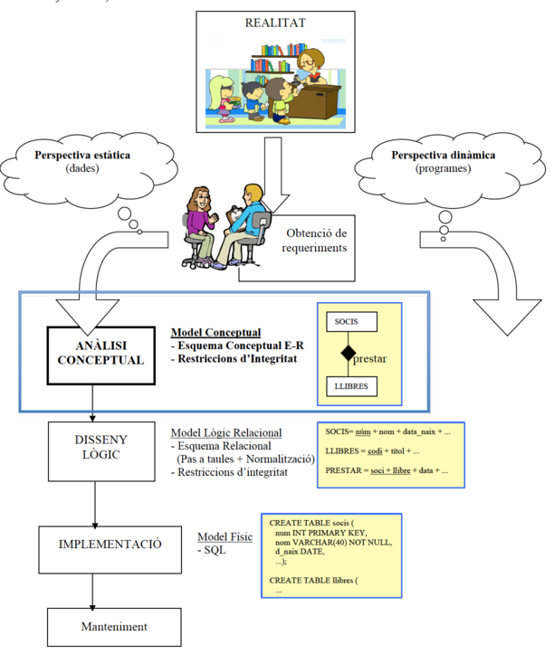

# 2. Elementos del modelo ER <!-- punto 2 -->

## Entidades <!-- punto 2.1 -->

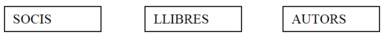

Una entidad representa un conjunto de "*personas, lugares, cosas, conceptos o sucesos (reales o abstractos), de interés para la organización*". Es ese objeto sobre el que queremos almacenar información en la BD.

Hay que diferenciar entre entidad y ocurrencias de la entidad: **entidad** es la estructura genérica y **ocurrencia de entidad** es cada uno de los objetos que representa esa entidad (pero que no se pone en el esquema ER, claro). Así, por ejemplo:

- La **entidad LIBROS** se refiere a la estructura que nos describe las características de los libros.

- Las **ocurrencias de LIBROS** serán cada uno de los libros, como por ejemplo el del Nombre de la Rosa, el del Tirant lo Blanc, el de Nosotros los valencianos...

*Representación de las entidades*

Una entidad se representa con un rectángulo etiquetado con el nombre de la entidad en mayúsculas. Un nombre de entidad sólo puede aparecer una vez en el esquema. Los nombres de las entidades son sustantivos (ya veremos que el nombre de las relaciones son verbos) y es aconsejable ponerlos en plural ("PAISES" y no "PAÍS").

Pero existen 2 tipos de entidades: débiles y fuertes. Las débiles se representarán con doble recuadro. Lo veremos más adelante ya que primero es necesario explicar el concepto de relación entre entidades. Por el momento, para tener una idea, vemos un ejemplo:

## Atributos <!-- punto 2.2 -->

*Definición de atributo*

Es cada una de las **propiedades** que tiene una entidad (o una relación , ya veremos). El atributo se representa mediante elipses con un nombre, unidas con un arco en la entidad (o relación) que describe.

En el ejemplo anterior, código, nombre y tipos son los atributos de la entidad LIBROS.

*Dominio del atributo*

El conjunto de posibles valores que puede tomar un atributo recibe el nombre de **dominio**. Algunos autores ponen el dominio en cada atributo y después describen el dominio indicando los posibles valores. Por ejemplo:

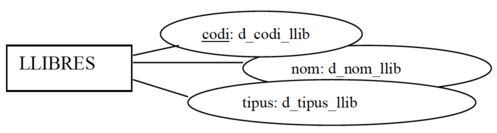

Dominios:

- d_código_lib: número

- d_nombre_lib: combinación de 50 caracteres alfabéticos

- d_tipo_lib: una de las siguientes letras: P, F, I, H, A 
  - (correspondientes a Miedo, Ficción, Infantil, Humor, Ensayo)

Pero por simplicidad, en el ER no pondremos el dominio de cada atributo, sino que sólo indicaremos los posibles valores en aquellos campos donde lo indique el análisis de requerimientos de forma explícita. Por ejemplo:

 - "*Los empleados tendrán un DNI, un nombre y un estado civil, que sólo podrá tener los valores S, C, D o V*"

*Tipo de atributos*

Los atributos pueden clasificarse desde dos puntos de vista: *funcionalidad* y *estructura*.

1. Según su **funcionalidad **podemos distinguir:

- **Atributo identificador**: permite distinguir entre las distintas ocurrencias de una entidad. Se representa subrayando el nombre del atributo. También se le llama " **la clave **" de la entidad. Dos ocurrencias de una entidad no pueden tener el mismo valor en el atributo identificador.
  
  

    Posibles ocurrencias de la entidad CLIENTES:
    
  | DNI |
  | :--- |
  | 76.333.333H |
  | 87.333.445A |
  | **~~76.333.333H~~** |
  | 54.233.567C |

**Nota:** conviene que toda entidad tenga un atributo identificador.

- **Atributo descriptor**: describe las ocurrencias de una entidad o relación. Es decir: son los atributos "que no son clave". Se representa simplemente con la elipse, sin subrayar el nombre. Además de esto, un atributo descriptor puede ser "no nulo" y esto se simboliza mediante un pequeño círculo entre el arco y la elipse. Serán atributos que consideremos que deben tener un valor obligatoriamente para cada ocurrencia de la entidad. *Los atributos claves son no nulos pero no se pone el círculo.*

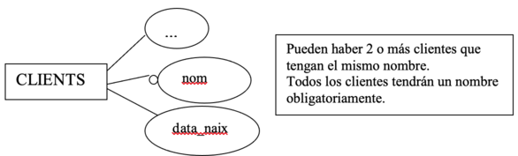

  Posibles ocurrencias de la entidad CLIENTES:

| DNI | Nombre | Data_naix |
| ---: | :--- | :---: |
| 76333333H | Pep | **08/07/1970**
| 87333445A | Abdón | **08/07/1970**
| 54233567C | **Nieves** | 01/12/1998
| 45654322N | **Nieves** | 12/12/2002
| 77654432D | Pepa | --|
|  -- | --- | --- |

**Nota:** Pueden haber 2 o más clientes que han nacido el mismo día. Puede ser que haya un cliente del que no conocemos la fecha de nacimiento.
Poden haver 2 o més clients que hagen nascut el mateix dia.

2. Según su **estructura** podemos distinguir:

- **Atributo simple**: para cada ocurrencia de la entidad o relación que califican, el atributo toma un único valor atómico. Es decir, es el caso de atributo "normal". En el ejemplo siguiente, "DNI", " *Data_naix*" y "*Dirección*" son atributos simples.

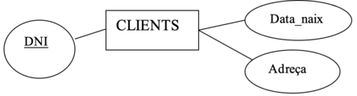

Posibles ocurrencias de la entidad CLIENTES:

| DNI | Data_naix | Dirección |
| :---: | :---: | :---- | 
| 76333333H  | 08/07/1970 | C/Moro, 13 (Sueca)
| 87333445A  | 04/03/1970 | C/Sequial, 45 (Algemesí)
| 54233567C  | 01/12/1998 | C/Moro, 13 (Alginet)
|  -- | --- | --- |

- **Atributo multivalente**: para cada ocurrencia de la entidad que califica, el atributo puede tomar varios valores. Se pone una "n" sobre el arco del atributo.

Posibles ocurrencias de la entidad CLIENTES:

| DNI | Teléfonos |
| :---: | :--- |
| 76333333H  | 96-170-33-44
| 87333445A  | 96-171-33-46 96-171-33-47 636-092-555
| 54233567C  | 
| 67437567G  | 96-170-44-64 699-076-433
|  -- | --- |

- **Atributo compuesto**: está formado por un conjunto de otros atributos. Una ocurrencia de un atributo compuesto estará formada por una ocurrencia de cada uno de sus "sub-atributos".

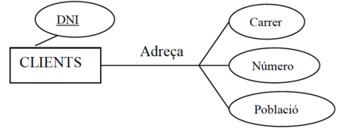

Posibles ocurrencias de la entidad CLIENTES:

Dirección = Calle + Número + Población

|DNI | Dirección  | | |
| :---: | :--- | :--- | :--- | 
| -- | **Calle** | **Número** | **Población**
| 76333333H | C/Moro | 13 | Sueca
| 54233567C | C/Sequial | 45 | Algemesí
| 67437567G | C/Moro | 13 | Alginet
| --| --| -- | --

**Nota:** el atributo compuesto parece que no sea necesario, ya que podríamos descomponerlo en atributos simples. Pero no podríamos hacerlo en el caso de tener un atributo compuesto **multivalente** (por ejemplo, n direcciones). Además se ve más claro si lo ponemos en forma de atributo compuesto.

- **Atributo compuesto multivalente**: para cada ocurrencia de la entidad que califica, el atributo puede tomar varios valores, y cada uno de estos valores está formado por un conjunto de otros atributos.

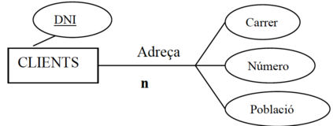

Posibles ocurrencias:

### Ejercicios sobre Entidades y Atributos

1. De los siguientes elementos hay 3 que son entidades. Piensa cuáles son y ponles los atributos correspondientes con los símbolos del ER. Indica también las claves respectivas (atributos identificadores), los campos que no deberían admitir nulos, y si puede haber algún atributo multivalente.

| datos | datos | datos | datos |
| :--- | :--- | :--- | :--- |  
| edad | ordenadores | metros_cuadrados | apellidos |
| cantidad_ventanas | aulas | alumnos | planta |
| mem_disco_duro| teléfonos | dni | código_ordenador |
| num_aula | velocidad_cpu | nombre | RAM |
| -- | -- | -- | -- |  

                       
1. Identifica en cada apartado, cuál sería la entidad débil y cuál la fuerte.

- a) Facturas / Clientes
- b) Notas / Alumnos
- c) Ciudades / Países

3. Buscar entidades y atributos.

- a) En un hipermercado quieren tener información de los productos que tienen a la venta.

  - Piensa todos los atributos posibles que podría tener la entidad "productos" y ponlos en la entidad siguiendo el modelo ER para indicar si son atributos: identificadores o descriptores; no nulos; simples o multivalentes; compuestos; o compuesto multivalente.

  - Piensa qué otra información se podría informatizar en el hipermercado, obteniendo otras entidades y sus respectivos atributos.

  - Indica 2 o 3 posibles ocurrencias de cada entidad.

- b) Haz lo mismo (buscar entidades, atributos de distintos tipos y posibles ocurrencias) para distintas bases de datos: videoclub, equipo de fútbol, clínica dental, hospital...

## Relaciones   <!-- punto 2.3 -->

Definimos la relación como la asociación o correspondencia entre entidades. Llamamos **relación** a la estructura que relaciona 2 o más entidades. Mientras que **ocurrencia de una relación **es la relación existente entre una ocurrencia de una entidad y otra ocurrencia de la otra entidad.

Así, por ejemplo:

- Relación ESCRIBIR: 
  - estructura que describe la relación entre la entidad AUTORS y la entidad LIBROS.
  

- Ocurrencias de la relación ESCRIBIR:    
  - "*Joanot Martorell*" - "*Tirant lo Blanch*".
  - "*Cervantes*" - "*Don Quijote de la Mancha*"

Representamos la relación mediante un rombo etiquetado con el nombre de la relación, unido mediante arcos a las entidades asociadas. Aquí, vemos que la relación *Escribir *asocia a un autor con un libro.

Una relación se caracteriza por su nombre, sus atributos, el grado y la conectividad:

### El nombre de la relación <!-- Punto 2.3.1 -->
Identifica la relación (etiqueta del rombo). En un diagrama ER no puede haber 2 relaciones con el mismo nombre (tampoco puede haber 2 entidades con el mismo nombre). En el siguiente ejemplo, el nombre es "*Estar_casado*":

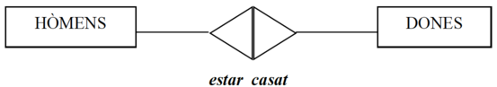

### Los atributos de la relación. <!-- Punto 2.3.2 -->
La relación puede tener 0, 1 o varios atributos propios. Éstos se representan como hemos dicho antes (con elipses) pero "colgando" de la relación. Estos atributos no son de ninguna de las entidades sino de la propia relación. Por ejemplo, para indicar la fecha de boda de un hombre y una mujer, este atributo no depende de la entidad HOMBRES ni de la entidad MUJERES, sino de la relación entre las 2 entidades. Es decir, el atributo " *Data*" es de la relación "*Estar_casado*":

### El grado radica en la relación <!-- Punto 2.3.3 -->
Cantidad de entidades que participan en ella. Puede ser de grado 1, 2, 3 donde:

**Nota:**  A veces no ponemos los atributos por simplicidad de los ejemplos. Pero sí que los pondremos en la E-R.a vegades no posarem els atributs per simplicitat dels exemples, però sí que es posen en la E-R.

- **Unarias** (grado 1), cuando una entidad se relaciona consigo misma

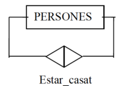

      Posibles ocurrencias de la relación "Estar_casado":

| Persona | Persona |
| :--- | :--- |  
| Pep | Pepa |
| Maria | Albert |
| Marco | Juana |
| -- | -- |                

- **Binarias**(grado 2), cuando asocian dos entidades

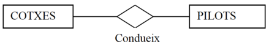

Posibles ocurrencias de la relación "Conduce":

| Coche | Piloto |
| :--- | :--- |
| Ferrari | Carlos Sainz |
| Aston Martin | Fernando Alonso |
| -- | -- |

**Nota:** Los símbolos de las relaciones (rombos y triángulos) "se pintan" de una forma u otra pero eso lo veremos en el apartado siguiente.

- **Ternarias** (grado 3), cuando asocian tres entidades

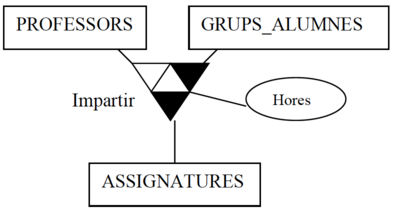

      Posibles ocurrencias de la relación "impartir":

| Profesor | Grupo | Asignatura | Horas |
| :--- | :---: | :---: | :---:|
| María | 1DAM-SP | BD | 5 |
| Alfredo | 1DAM | BD | 5 |
| Abdó | 1DAM | PRG | 8 |
| Joan Gerard| 1DAM-SP | PRG | 8 |
| --- | --- | --- | --- | 

- **N-aria** (grado n), cuando se asocian más de 3 entidades, pero no suele darse (no veremos).

***¡Cuidado! atributo o relación?***

**NO** podemos poner un atributo en una entidad que haga referencia a otra entidad existente. Es decir:

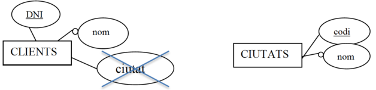

Si no tuviéramos la entidad CIUDADES en nuestro ER estaría bien poner el atributo *ciudad* en la entidad CLIENTES. Pero si ya tenemos la entidad CIUDADES, es necesario quitar ese atributo y relacionar CLIENTES con CIUDADES:

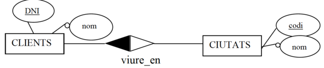

#### Ejercicios sobre relaciones

- 4. Tenemos las entidades EQUIPOS, JUGADORES y TEMPORADAS. Invéntate 2 o 3 atributos de cada una (uno de ellos deberá ser la clave) y dibuja las relaciones necesarias (con nombre y posibles atributos) para poder guardar la siguiente información:

- Partidos jugados con el correspondiente resultado de goles.
- Los jugadores que ha tenido cada equipo en cada temporada y el sueldo que cobraba cada uno.
- Cuántos minutos ha jugado cada jugador en cada temporada y cuántos goles ha marcado (independientemente del equipo en el que jugará).

- 5. Invéntate posibles relaciones (de diferentes grados) entre las entidades que han salido en ejercicios anteriores. Recuerda poner nombres coherentes y ponles también algún atributo.

### La conectividad de la relación <!-- 2.3.4 -->

Cantidad máxima de ocurrencias con que puede estar relacionada una ocurrencia en una relación.

Por decirlo de una manera de ir por casa, la conectividad de una relación es la forma en que pintaremos los triángulos de la relación.

¿Cómo pintar una relación binaria?

Ejemplo:

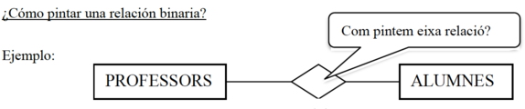

Suponiendo que tenemos las siguientes ocurencias:

{width=50%}

Para pintar los triángulos de la relación debemos hacer dos preguntas sobre si una ocurrencia de una entidad puede estar relacionada con más de una ocurrencias de la otra entidad. Preguntaremos esto usando el verbo de la relación: una en activa y otra en pasiva ("en sentido contrario"). Es decir:

| Pregunta | Respuesta | Acción |
| :--- | :---: | :--- |
| ¿Dado 1 profesor, de cuantos alumnos **puede ser tutor**?| De muchos |triángulo negro en la parte de alumnos.|
| ¿Dado 1 alumno , por cuántos profesores **puede ser tutorizado**?| Sólo 1 |triángulo blanco en la parte de profesores.|
| --- | --- | --- |

Por tanto, la conectividad de la relación ser_tutor es 1:M (uno a muchos). "Uno" (triángulo blanco) en la parte de PROFESORES y "Muchos" (triángulo negro) en la parte de ALUMNOS:

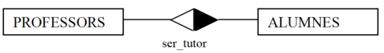

**Cuidado en NO hacer la pregunta así**: "*Dados ~~muchos ~~profesores, ¿cuántos alumnos...?*". Siempre la haremos a partir de una ocurrencia: "Dado 1 profesor, cuántos..."

**Tipo de conectividades en relaciones binarias:**

Los tipos de conectividades de una relación binaria son "de 1 a 1" (1:1), "de 1 a muchos" (1:N) y "de muchos a muchos" (N:M). Como hemos dicho antes, esta conectividad, se representa pintando de negro la parte del rombo que haga referencia al "muchos". Y en blanco, la parte que hace referencia a la entidad con conectividad "1".

- **De 1 a muchos:** cada ocurrencia de la entidad A puede estar relacionada con muchas ocurrencias de B. Pero cada ocurrencia de B sólo puede estar relacionada con una ocurrencia de A.

  - Un profesor puede ser tutor de **muchos** alumnos
  - Un alumno puede ser tutorizado por **un** profesor

- **De 1 a 1:** por cada ocurrencia de A sólo tenemos una de B, y viceversa.
  
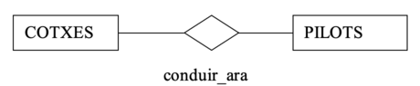

  - Un coche solo puede ser conducido por un piloto (en un momento determinado)
  - Un piloto solo puede conducir un coche (en un momento determinado)

- **De muchos a muchos** si por cada ocurrencia de A podemos tener cualquier número de ocurrencias de B, y viceversa.
  
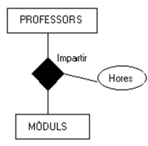

  - Un profesor puede impartir muchos módulos
  - Un módulo puede ser impartido por muchos profesores

**Nota:** entre dos entidades puede existir más de una relación (con igual o distinta conectividad):

**¿Cómo pintar una relación unaria?**

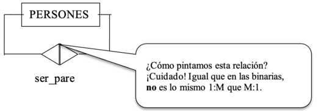

Supongamos que la entidad PERSONAS tiene 4 ocurrencias (Pep, Pepet, Pepeta y Pepiquet). La relación ser_padre guardará parejas de ocurrencias de PERSONAS donde, en cada pareja, se cumple que uno es padre del otro.

Supongamos que Pep es padre de Pepet y Pepeta; y que Pepet es padre de Pepiquet.

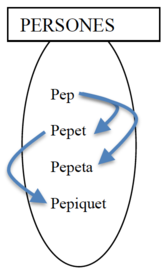

Para saber cómo pintar la relación unaria (es decir, saber cuál es su conectividad) debemos hacer las mismas preguntas que en las relaciones binarias. Lo que ocurre es que ahora tenemos la misma entidad en las 2 partes de la relación. Es como si tuviéramos la siguiente situación (pero NO se hace así, ya que en un ER no pueden haber 2 entidades con el mismo nombre):

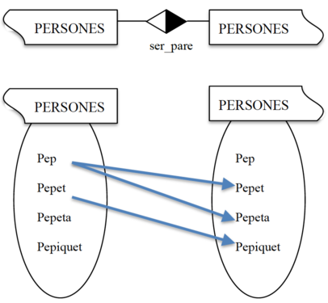{width=50%}

Para saber si pintamos o no la parte derecha, hacemos la pregunta de izquierda a derecha, con el nombre de la relación. 
- 1 persona puede ser padre... ¿de cuántas personas? De muchas.

Para saber si pintamos o no la parte izquierda, hacemos la pregunta de derecha a izquierda, con el "contrario" del nombre de la relación.

- 1 persona puede ser hija... ¿de cuántas personas (como padre)?
Sólo de 1

Vemos que de una ocurrencia del conjunto de la izquierda pueden salir MUCHAS flechas, pero a una ocurrencia del conjunto de la derecha sólo le puede llegar UNA flecha.

~~~
Los tipos de conectividades en las relaciones unarias son los mismos que las binarias: 1:1, 1:M y M:M
~~~

**¿Cómo pintar una relación ternaria?**

Las conectividades de las relaciones ternarias se expresarán con 3 datos, correspondientes a las conectividades de las respectivas 3 entidades de esa relación. Por ejemplo: (1:1:M) (1:M:M), etc.

Por ejemplo, la siguiente relación ternaria tiene conectividad (1:M:M):

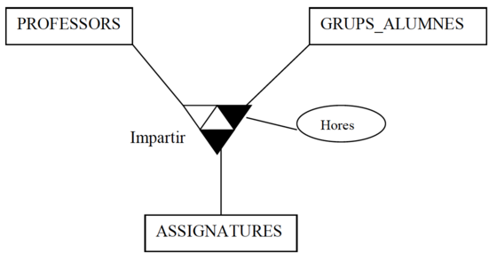

Para saber cómo hemos pintado la relación "impartir" hemos tenido que hacer 3 preguntas en la relación. **En cada pregunta se parte de una pareja de ocurrencias de dos entidades y se pregunta con cuántas ocurrencias de la 3ª de las entidades puede estar relacionada** (como máximo, claro). Consejo: *si nos inventamos ocurrencias para hacer las preguntas, quizás lo encontraremos más fácil.*

- El profesor Abdó, en el grupo 1DAM... -> ¿cuántas **asignaturas** puede impartir? **Muchas** (BD y PRG por ejemplo)

- El profesor Abdó, la asignatura de BD... -> ¿a cuántos **grupos** la puede impartir? **Muchos** (1DAM y 1DAM-SP por ejemplo)

- La asignatura BD en el grupo 1DAM-SP... -> ¿cuántos **profesores** pueden impartirlo? **Sólo 1** ( Abdó por ejemplo)

Es decir:

-Dada una ocurrencia de *PROFESORES* y una ocurrencia de *GRUPOS_ALUMNOS*, pueden tener asociadas muchas ocurrencias de *ASIGNATURAS*. Es decir, un profesor puede impartir a un grupo de alumnas **muchas** asignaturas. (1 prof., 1 grupo) -> M asignaturas

-Dada una ocurrencia de *PROFESORES* y una ocurrencia de *ASIGNATURAS*, pueden tener asociadas muchas ocurrencias de *GRUPOS_ALUMNOS*. Es decir, un profesor puede impartir una asignatura en **muchos** grupos de alumnos. (1 prof, 1 asignatura) -> M grupos

-Dada una ocurrencia de *ASIGNATURAS* y una ocurrencia de *GRUPOS_ALUMNOS*, pueden tener asociadas sólo una ocurrencia de *PROFESORES*. Es decir, una asignatura puede ser impartida en un grupo de alumnos sólo por **un** profesor. (1 asignatura, 1 grupo) -> sólo 1 profesor

Las posibles conectividades de las ternarías son: 1:1:1, M:M:M, 1:M:M, 1:1:M

Ejemplos de posibles ocurrencias de la relación "impartir" anterior:

Las relaciones ternarias representan tríos de ocurrencias (uno de cada entidad que relacionan). Por tanto, vamos a suponer que queremos introducir esas ocurrencias (una vuelta tuvimos la correspondiente tabla creada):

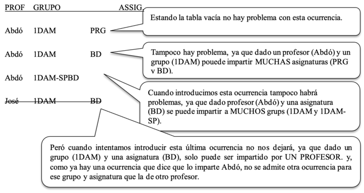

**Otra notación para representar la conectividad**

La conectividad es "pintar o no los triángulos". También se le llama la *cardinalidad máxima*. Algunos autores representan la cardinalidad máxima y la mínima con parejas de datos (mín, máx):

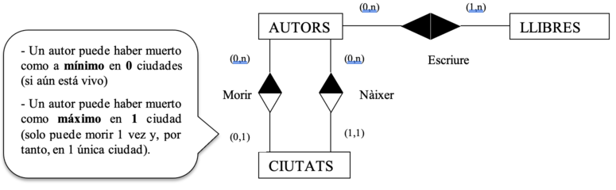

En el ejemplo anterior están representadas, entre paréntesis, las cardinalidades (mínima, máxima) de las relaciones.

Explicación de las cardinalidades del ejemplo anterior:

Cardinalidades respecto a la relación " Escribir ":

- Un autor puede escribir como mínimo 1 libro y, como máximo, muchos libros (1,n).

- Un libro puede ser escrito como mínimo por 0 autores (anónimo) y como máximo por muchos (0,n).

Cardinalidades respecto a la relación *"Nacer"*:

- Un autor ha nacido únicamente en una ciudad: mínimo y máximo es 1. Por tanto, (1,1).

- En una ciudad puede no haber nacido nadie y pueden haber nacido muchos: (0,n)

Cardinalidades respecto a la relación *"Morir":*

- Un autor todavía no ha muerto o ha muerto en una única ciudad. Por tanto, (0,1).

- En una ciudad puede no haber muerto nadie y pueden haber muerto muchos: (0,n)

**Nota:** no suele usarse esta notación, ya que la cardinalidad máxima se puede representar con la conectividad (el color del rombo), y la cardinalidad mínima se puede representar con las restricciones de existencia (lo veremos más adelante). Es decir:

|En lugar de indicar | Usaremos |
| :---: | :---: |
| ( 0, | ( Nada. Es decir, por defecto el mínimo es 0) |
| ( 1, | La restricción de existencia : E (lo veremos más adelante) |
| , 1) | Triángulo correspondiente del rombo: blanco |
| , n) | Triángulo correspondiente del rombo: negro |
| --- | --- |
---

### Ejercicios sobre relaciones con conectividad

6. Pon la conectividad a las relaciones de los ejercicios anteriores.

7. Invéntate relaciones de diferentes tipos:

   - Diferente grado: unarias / binarias / ternarias
   - Diferente conectividad: 1:1 / 1:M / M:M / M:M:M / ...

Aunque no se ponga en el ER, invéntate también algunas ocurrencias de las entidades y, sobre todo, ocurrencias de las relaciones.

8. Invéntate 2 entidades con más de una relación entre ellas.

9. Pone la conectividad a estas relaciones matrimoniales :

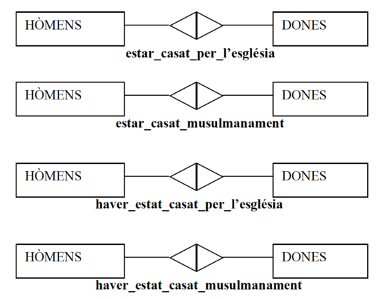

¿Cómo harías para representar la relación *estar_casado_por_lo_civil*?

10. **Diseña un esquema ER para un pequeño aeropuerto, con los siguientes requerimientos.**

- Control de cada avión registrado en el aeropuerto (Número, matrícula, antigüedad, fecha registro, ...).
- Cada avión es de un tipo determinado, recogiendo de cada tipo su modelo, capacidad y peso. Puede haber muchos aviones del mismo tipo.
- Control de los hangares (Código hangar, capacidad y localización) donde se estacionan los aviones. Cada avión tiene designado un hangar pero en un hangar pueden estacionar muchos aviones.
- Control de las aerolíneas (nombre, dirección, teléfono). Hay que guardar a qué compañía pertenece cada avión y en qué fecha se realizó la compra.
- Control de pilotos (número de licencia, nombre...). Cada piloto está calificado para pilotar determinados tipos de aviones. Es necesario anotar cuántas horas de vuelo tiene cada piloto en cada tipo de avión.
- Control de empleados de mantenimiento (código, nombre, salario y turno).
- Tipo de mantenimientos (código, descripción, horas requeridas). Por ejemplo: limpieza, revisión de motores, revisión de ruedas...
- Es necesario guardar los mantenimientos que hace cada empleado de mantenimiento en cada avión y de qué tipo de mantenimiento se trata. Además, para cada uno de esos mantenimientos es necesario registrar la fecha obligatoriamente y unas observaciones opcionales.

11. **Realiza el esquema ER para una base de datos en la que se desea guardar la información relativa a algunos aspectos de un campeonato mundial de fútbol, considerando los siguientes supuestos:**

- Un jugador (código, nombre) pertenece a un único equipo.
- Un jugador puede actuar en distintos puestos, pero en un determinado partido sólo puede jugar en un puesto.
- De los colegiados queremos saber código y nombre
- En cada partido queremos saber el código del partido, el equipo de casa, el de afuera, el resultado de goles, la fecha y 3 colegiados: un juez de línea para la banda derecha, otro para la izquierda y un árbitro (un colegiado puede realizar una función en un partido y otra distinta en otro partido).

12. **Consellería quiere tener información de institutos (código, nombre), profesores (código, nombre) y tipos de enseñanza (código, nombre). Vamos a ver diferentes supuestos para reflejar que entre determinadas entidades no siempre se dan las mismas relaciones ni tienen las mismas conectividades, sino que dependerá de las necesidades de los usuarios de la BD y/o de los requerimientos del sistema. Identifica las relaciones en cada uno de los siguientes supuestos:**

- a) A la Consejería le interesa saber cosas como:

  - ¿Qué tipos de enseñanza se da en cada instituto
  - Qué profesores trabajan en cada instituto y en qué institutos trabaja un profesor.
  - Qué tipos de enseñanza da cada profesor.
  - La cantidad de horas semanales que un profesor realiza en un instituto.
  - La cantidad de horas semanales que un profesor imparte un tipo de enseñanza determinada.

- b) A la Consejería le interesa saber cosas como:

 - Qué profesores dan un tipo de enseñanza determinada en un instituto determinado (por ejemplo, quiere saber qué profesores dan ciclos ASI en el instituto St. Vicent Ferrer de Algemesí)
 - Qué tipos de enseñanza da un profesor determinado en un instituto determinado (por ejemplo, quiere saber qué tipos de enseñanza da el profesor Abdó Garcia en el instituto St. Vicent Ferrer de Algemesí)
 - En qué institutos da un profesor determinado un determinado tipo de enseñanza.
 - La cantidad de horas semanales que un profesor imparte un tipo de enseñanza determinada en un instituto determinado.

- c) Se cumplen las siguientes condiciones:
 - En un instituto, un mismo profesor no puede dar más de un tipo de enseñanza.
 - En un instituto, un tipo de enseñanza puede ser impartido por distintos profesores.
 - Un profesor no puede impartir un tipo de enseñanza en más de un instituto.

## 2.4. Entidades débiles <!-- punto 2.4 -->

Ahora que ya sabemos qué es una relación, podemos hablar de definir qué es una entidad débil y una fuerte.

- **Entidad fuerte**: Sus ocurrencias no necesitan estar relacionadas con ocurrencias de otras entidades.
- **Entidad débil**: Sus ocurrencias necesitan estar relacionadas con ocurrencias de alguna entidad.

Si una entidad es débil, se dice tener una restricción de existencia (E). Además puede tener restricción de identificación (ID). Vamos a ver estas restricciones y cómo se representan.

**Restricción de existencia (E)**

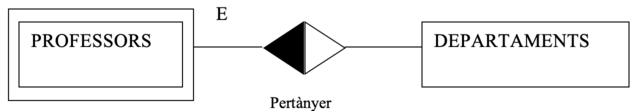

Definición:

Una entidad tiene una restricción de existencia respecto a una relación si cada ocurrencia de esa entidad no puede existir sin estar relacionada con alguna otra ocurrencia de la otra entidad. Dicho de otra forma: si desaparece una ocurrencia de una entidad fuerte, todas las ocurrencias de la entidad débil que dependen en existencia de la misma desaparecen con ella

Representación:

*Se representan con el doble recuadro y una **E** en el arco de la relación correspondiente.*

**Restricción de identificación (ID)**

La entidad EJEMPLARES tiene una restricción de identificación (ID) respecto a la relación pertenecer ya que para identificar un ejemplar en concreto, además del número de copia, es necesario decir a qué libro pertenece (el código del libro de la entidad LIBROS).

Es decir: realmente, la clave de los ejemplares está compuesta: **código_libro + núm_copia**

Definición:

Una entidad tiene una restricción de identificación respecto a una relación cuando, además de la restricción de existencia, sus ocurrencias no pueden identificarse sólo mediante su clave, sino que también necesitan la clave de la entidad fuerte de la que depende.

Representación :

Se representan con el doble recuadro y un **ID** en el arco de la relación correspondiente.

**Nota:** si una entidad tiene una R.ID, también tendrá una RE pero no a la inversa.

## Otras restricciones de integridad <!-- punt 2.5 -->

Las restricciones de integridad (o simplemente "restricciones") son limitaciones a los datos, como por ejemplo, las que ya hemos visto:

- **Restricciones en un atributo:**

  - Si el atributo dni de personas es **clave **, significa que existe la restricción de que dos personas no puedan tener el mismo dni.

  - Si el atributo estado_civil de una persona tiene un **dominio **(Soltera, Casada, Divorciada, Viuda) significa que existe la restricción de que los valores de ese atributo no pueden ser otros.

- **Restricciones en una relación:**

  - Si la relación usar (entre alumnos y ordenadores) tiene la **conectividad **de M:1, ese "1" significa que existe la restricción de que un alumno/a no puede usar más de 1 ordenador.

- **Restricciones en una entidad:**

  - Si la entidad profesores tiene una **E **sobre la relación pertenecer (hacia departamentos) significa que existe la restricción de que no podrá haber un profesor que no pertenezca a ningún departamento.

  - Si la entidad ejemplares tiene un **ID **sobre la relación pertenecer (hacia libros) significa que existe la restricción de que el número de ejemplar no es suficiente para identificarlo entre todos los ejemplares (es necesario también el código del libro ).

Pues bien, en ocasiones en los requerimientos de una base de datos aparecen **otras restricciones** pero que no pueden ser captadas en el ER. En esos casos se especificarán en lenguaje natural, a continuación del esquema ER, en un apartado de "Otras restricciones". Por ejemplo:

---
~~~~
**Otras restricciones:**
  - Un alumno no puede matricularse de 2º si no tiene terminado el 1er curso.
  - La suma de las horas que cada profesor imparte en cada asignatura no puede superar 20 horas.
  - Un profesor no podrá ser jefe de departamento y tutor al mismo tiempo.
~~~~
---

### Ejercicios sobre entidades débiles

13. Supongamos las entidades ALUMNOS y ORDENADORES (con los atributos que creas convenientes) y la relación asignar, que asigna ordenadores a los alumnos. Un alumno sólo puede tener un ordenador pero un ordenador puede asignarse a diferentes alumnos. Haz un esquema ER para cada uno de los siguientes supuestos:

- a) No puede haber ningún alumno sin ordenador
- b) No puede haber ningún ordenador sin asignarlo.
- c) Todos los alumnos deben tener un ordenador asignado y cada ordenador debe estar asignado obligatoriamente a un alumno al menos.

14. En el instituto quieren tener información de las aulas (ubicación y metros cuadrados), de los ordenadores (cpu, ramo y dd) y en qué aula está cada ordenador. En la puerta de cada aula existe un cartel donde indica el código del aula. Y los ordenadores tienen una etiqueta que les identifica. Piensa cómo harías el ER en cada uno de estos dos supuestos

- a) En la etiqueta de los ordenadores existe un código diferente a cada ordenador del instituto.
- b) En la etiqueta de los ordenadores consta el código del aula y un código distinto en cada ordenador del aula.

### Ejercicios ER completos

Hasta aquí hemos visto ejercicios parciales de una organización. Ha llegado la hora de realizar ejercicios completos de los requerimientos para una base de datos de una organización. Realice los ejercicios del fichero anexo sobre "Ejercicios ER completos".

[Ejercicios completos](../../ejercicios/T02%20ER/T02_Ej_EER.html)

# 3. El modelo EER

El modelo Entidad Relación Extenso es una ampliación del modelo ER para poder reflejar otros aspectos de la realidad. Concretamente, veremos los conceptos de:

- Especializaciones (también llamadas generalizaciones)

- Agregaciones

## Especializaciones o generalizaciones**

Veámoslo a partir de un ejemplo:

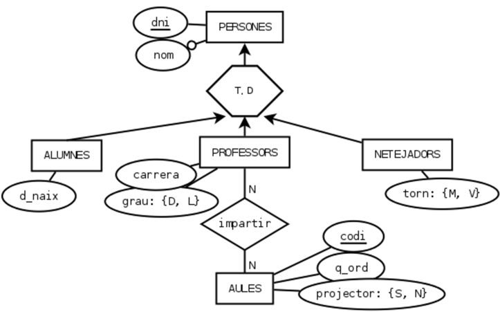

La entidad PERSONAS es una generalización de las entidades ALUMNOS, PROFESORES y LIMPIADORES: cada alumno, profesor o limpiador ES también una persona. Las ocurrencias de las 3 entidades hijas están representadas también en la entidad madre.

**¿Cuándo usar la especialización/generalización?**

Es lo mismo una especialización y una generalización. Cambia el momento de crearla:

- Especialización: cuando tenemos varias entidades y les creamos una entidad madre.

- Generalización: cuando tenemos una entidad y le creamos entidades hijas.

*¿Cuándo especializaremos una entidad?*

Cuando tenemos una entidad en la que algunas ocurrencias tienen atributos diferentes y/o sólo algunas ocurrencias pueden estar implicadas en alguna relación. En ese caso haremos una especialización en la entidad: le pondremos hijas y "bajaremos" los atributos y/o relaciones diferentes en cada hija.

*¿Cuándo generalizaremos entidades?*

Cuando tenemos 2 o más entidades en las que las ocurrencias de una de ellas representan el mismo objeto que en otra y, además, esas entidades tienen algún atributo en común y/o están implicadas en una misma relación. En ese caso haremos una generalización de esas entidades: les pondremos una madre y "subiremos" atributos y/o relaciones en común.

*Definición formal de generalización*

~~~
Una entidad **E** es una generalización de un grupo de entidades **E1, E2, ... En** sí cada instancia de cada una de esas entidades **es** también una instancia de **E**.
~~~

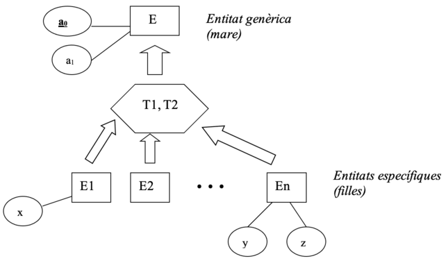

Todos los atributos de la entidad genérica serán heredados por las entidades específicas. Es decir, que las entidades E~1~, E~2~, ..., E~n~, además de sus respectivos atributos (x, y, z), también tienen los atributos de la entidad E (a~0~ y a~1~). Y, por tanto, la clave de E~1~, de E~2~, ...y de En será a~0~ (sólo hay que indicar la clave de E).

Los símbolos T1 y T2 del polígono representan los tipos de especialización. Puede ser de diferentes **tipos**:

- **Total o Parcial**:

  - Total: si **todas** las ocurrencias de la entidad madre están en alguna hija *.*

  - Parcial: si **sólo algunas** ocurrencias de la entidad madre están en las hijas.

- **Disjunta o Superpuesta**:

  - Disjunta: si las ocurrencias de una hija **no** están en ninguna otra hija

  - Superpuesta: si las ocurrencias de una hija **sí** están en otra hija.

Vamos a ver ejemplos de todos estos tipos de especializaciones:

- a) Total y Disjunta

  - **Total** porque todo autor o está vivo o está muerto.

Poniendo a T estamos diciendo que toda ocurrencia que esté en la entidad padre seguro que también estará en alguna entidad hija. Es decir: cada ocurrencia de AUTORES también estará en alguna de las entidades hijas: en la entidad VIVOS o en la entidad MUERTOS

  - **Disjunta** porque un autor vivo no puede estar muerto y viceversa.

Poniendo la D estamos diciendo que toda ocurrencia que esté en una entidad hija no estará en ninguna otra entidad hija. Es decir: las ocurrencias de VIVOS no están en MUERTOS (y las de MUERTOS no están en VIVOS).

- b) Parcial y Disjunta
  
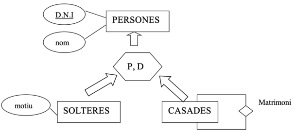

  - **Parcial** porque hay personas que no están solteras ni casadas (faltan las personas separadas y viudas). Es decir: puede darse el caso de que alguna ocurrencia de PERSONAS no esté ni en SOLTERAS ni en CASADES.

  - **Disjunta** porque una persona soltera no puede estar casada y viceversa.

- c) Parcial y Superpuesta

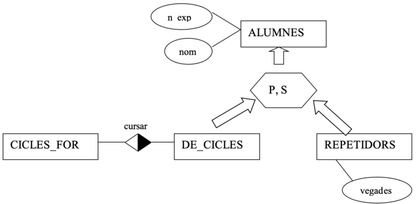

  - **Parcial** porque algún alumno puede ser de bachillerato y no repetidor. Por tanto, las ocurrencias de ALUMNOS que cumplan esto no estarán en la entidad DE_CICLES ni en la de REPETIDORES

  - **Superpuesta** porque algún alumno de ciclo puede ser también un repetidor.

- d) Total y Superpuesta

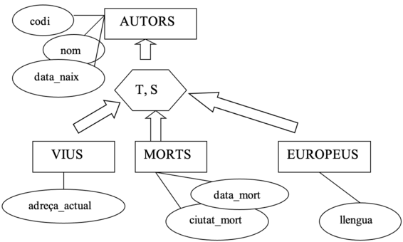

  - **Total**, porque todo autor o está vivo o está muerto. Por tanto, seguro que toda ocurrencia de AUTORES estará en alguna de las hijas (al menos en VIVOS o en MUERTOS).

  - **Superpuesta** porque algún autor vivo (o muerte) puede ser europeo.

**Notas:**            

- Una entidad hija puede ser madre de otra especialización (jerarquía hijas, nietas, ...)
-  Una entidad puede ser madre de distintos "grupos de hermanas". Es decir: una entidad puede ser genérica de diversas especializaciones (3 hijas por un lado, 2 por otro...)
- Puede haber relaciones entre las entidades hijas o entre una madre y una hija, etc.

**Esto ***NO*** es una especialización:**

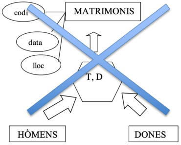{width=50%}

¿Por qué no?

Porque, recordemos, en una especialización, cada instancia de una entidad hija **ES** también una instancia de la entidad madre.

En los ejemplos anteriores tenemos que:

- AUTORES es una generalización de VIVOS y MUERTOS porque un autor vive **ES** un autor. Y un autor muerto **ES** un autor.
- PERSONAS es una generalización de SOLTERAS y CASADAS porque una persona soltera **ES** una persona. Y una persona casada **ES** una persona.
- ALUMNOS es una especialización de DE_CICLOS y de REPETIDORES porque un alumno de ciclos **ES** un alumno. Y un repetidor **ES** un alumno.

Pero, en cambio, un hombre **NO ES** un matrimonio. Y una mujer **NO ES** un matrimonio. Sino que un matrimonio **ESTÁ FORMADO POR** un hombre y una mujer. Por eso la entidad MATRIMONIOS no puede ser una generalización de HOMBRES y MUJERES.

En caso de querer expresar que una ocurrencia de una entidad ESTÁ FORMADA POR ocurrencias de otras entidades no usaremos la especialización sino la agregación, que lo veremos en el punto siguiente.

## Ejercicios generalizaciones

15. Invéntate varios escenarios para buscar ejemplos de generalizaciones de todos los tipos. Piensa que, para que tenga sentido una generalización, es necesario que algunas entidades específicas tengan algún atributo diferente y/o estén implicadas en alguna relación y otras no.

- a) Total y Disjunta
- b) Total y Superpuesta
- c) Parcial y Disjunta
- d) Parcial y Superpuesta

16. Realiza el esquema ER para el siguiente análisis de requerimientos:

En un instituto queremos saber el dni, nombre y fecha de nacimiento de todos los alumnos. De cada profesor se debe guardar su dni, nombre, si es diplomado o licenciado, y el nombre de la carrera que han hecho. Del personal de limpieza se debe guardar dni, nombre y turno (mañana o tarde). De las aulas se debe saber el código del aula, cuántos ordenadores hay en cada una, si tiene proyector o no y qué profesores dan clase en cada una, teniendo en cuenta que un profesor puede impartir clase en distintas aulas.

17. Amplía el anterior ER para añadir los siguientes requerimientos:

Se quiere guardar el departamento al que pertenece cada profesor, del que queremos saber el código, el nombre, quién es el jefe del departamento y quién es el secretario (ambos son profesores que pertenecen al departamento. Un profesor no puede tener dos cargos (secretario y jefe).

## Agregaciones <!-- punto 3.2 -->
 
La agregación es cuando una relación entre entidades pasa a considerarse como una nueva entidad más compleja, con existencia independiente. Por ejemplo, COCHES sería una agregación de las entidades chasis y motores relacionadas por la relación *incorporar*.

**Otras formas de decirlo:**

Si unas determinadas entidades relacionadas (E~1~, E~2~, ... E~n~)FORMAN PARTE de una entidad que las engloba (E), diremos que esa nueva entidad es una **agregación** de aquéllas.

Diremos que una entidad E es una agregación de entidades si una ocurrencia de E está formada por una ocurrencia de cada una de las entidades que agrega. En el ejemplo anterior, una ocurrencia de MOTORS (el motor de código "ABC") incorporado a una ocurrencia de *CHASIS* (el chasis de código *"555"*) forman una ocurrencia de la entidad COCHES. La relación "ha conducido" relaciona una ocurrencia de PILOTES con una pareja de ocurrencias de CHASIS y MOTORES que ya está en la relación "incorporar".

**¿Cuándo realizaremos una agregación?**

Normalmente, crearemos una agregación cuando necesitamos una relación de una **entidad** con **otra relación**. Es decir, en el caso anterior, necesitábamos una relación entre la entidad *PILOTOS* y la entidad *COCHES*. Como la entidad COCHES no existía, la hemos formado a partir de la agregación entre *chasis* y *motores*.

**Diferencia entre generalización y agregación:**

La generalización que hemos visto anteriormente era una relación de jerarquía , es decir, del tipo "A~1~ **es** A". Por ejemplo: "un *soltero* **es** una *persona*". En cambio, la agregación es una relación de participación ,es decir, es del tipo "A~1~ y A~2~ **forman parte** de A". Por ejemplo: "un motor y un chasis **forman parte** de un coche ".

## Ejercicios Agregaciones

Realiza el esquema ER para cada uno de los siguientes análisis de requerimientos:

18. En una fábrica de Almussafes se fabrican piezas para la Ford. De cada máquina queremos guardar el código y el nombre. De los operarios: código y nombre. Y de cada tipo de prenda fabricada, el código y nombre. Queremos saber el total de horas acumuladas que cada operario ha trabajado en cada máquina, así como qué tipos de piezas y en qué cantidad ha fabricado cada operario en cada máquina.

19. Una agencia matrimonial quiere guardar de cada persona: dni, nombre, sexo (m/f), y un histórico de la gente a la que ha emparejado la agencia y en qué fecha. La empresa dispone de unos lugares de encuentro de las parejas (bar tal, biblioteca, jardín...), de los que quiere guardar un código, dirección, qué parejas se han citado allí y si les ha ido bien o no .

20. Un estudio de rodaje quiere guardar información de los actores (dny, nombre) y de las escenas de una película (código, lugar, fecha, hora, descripción). Queremos guardar qué actores actúan en qué escenas y si hablan o no en cada escena en la que actúan. El estudio también dispone de un fondo de armario para el vestuario, en el que tiene etiquetada cada prenda con un código identificativo. De cada prenda queremos saber el tipo (pantalón, camisa...), color, talla y época. Queremos saber qué prendas vestirá cada actor en cada escena.

# 4. Guía de desarrollo del esquema ER <!-- Punto 4 -->

En el punto anterior hemos visto los distintos elementos del esquema ER. Ahora veremos cómo confeccionar este esquema. Es decir, veremos una guía para desarrollar el esquema ER a partir de los requerimientos (que hemos obtenido entrevistándonos con el futuro usuario de la BD, etc.).

Los pasos a seguir para confeccionar el esquema ER son:

---

1.	Construir el esquema E-R propiamente dicho.

  - 1.1. Identificar entidades y atributos
  - 1.2. Identificar las especialitzaciones
  - 1.3. Identificar las relaciones
  - 1.4. Identificar las agregaciones

2.	Anotar "Otras Restricciones de Integridad"
3.	Anotar "Suposiciones"

---

Cabe decir que esta guía es un proceso:

- **Iterativo**: una vez hechos esos puntos, habrá que volver a empezar para ver si nos salen nuevas entidades, etc.

- **Creativo**: no es un proceso automático, sino que depende mucho de la creatividad, la imaginación y la experiencia del diseñador.

Pero no es necesario documentar todas y cada una de las fases. Por ejemplo, resulta una pérdida de tiempo realizar una enumeración de las entidades, después otra de las especializaciones, otra de las relaciones... Lo que haremos será ir dibujando todos los elementos en un único esquema.

**¿Por qué buscar especializaciones antes que las relaciones?**

En la guía anterior, vemos que debemos buscar las especializaciones antes de detectar las relaciones. Esto se debe a que una relación quizás relacione una entidad específica y no a toda la entidad genérica.

Por ejemplo, en una agencia de viajes, si buscamos primero las relaciones antes de las especializaciones, podríamos tener:

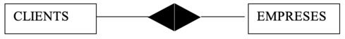

Pero si buscamos ahora las especializaciones, podría darse el caso de que esa relación no sea para todos los clientes sino sólo para quienes hacen viaje de negocios:

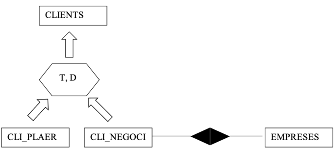

**¿Por qué buscar relaciones antes que las agregaciones?**

Una agregación NO está compuesta por un conjunto de entidades. **Una agregación está formada por una relación** (y por las entidades participantes en la relación). Por tanto, habrá que encontrar primero las relaciones. Si encontramos que es necesario relacionar, por ejemplo, una entidad pilotos con una pareja chasis-motor, como no podemos relacionar 1 entidad con 1 relación, deberemos crear una *"entidadota"* (agregación de la relación "incorporar" y sus entidades):

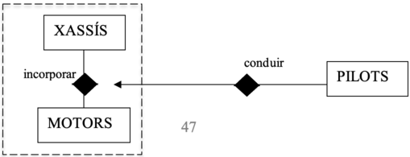

**Anotar otras restricciones de integridad:**

Ya hemos dicho anteriormente que el propio esquema ER puede captar directamente algunas restricciones de integridad (como las restricciones de existencia, las de identificación, las claves, dominios, conectividad a 1...) pero que pueden existir otras restricciones en la propia documentación del análisis, como por ejemplo: "La edad media de todas las ocurrencias de la entidad PERSONES debe superar 20 años". Esto lo expresaremos en lenguaje natural a continuación del esquema ER, en un apartado llamado "Otras restricciones".

**Anotar las suposiciones:**

Así como en el apartado anterior pondremos lo que decía el análisis de requerimientos (enunciado) que no hemos podido captar en el ER, en este apartado pondremos lo contrario: aquellos aspectos que hemos reflejado en el ER de los que no decía nada el análisis de requerimientos y que, por tanto, hemos tenido que suponer. Por ejemplo, si el enunciado dice: "Habrá que guardar los coches que tiene cada persona", haremos una relación binaria entre COCHES y PERSONAS llamada "ser_propietario", pero para pintar la conectividad no sabremos si un coche puede tener muchos propietarios o sólo uno. En un caso real, el diseñador de la BD preguntaría a quién le ha mandado el proyecto si es uno o muchos, pero para la resolución de los ejercicios, lo pondremos en el apartado de suposiciones.

---

~~~

Esquema ER:

            (aquí estaría el esquema ER)

Otras restricciones:

    - La edad media de todas las personas no debe superar los 20 años.

    - ...

Suposiciones:

    - Un coche sólo podrá tener un propietario

    - ...

~~~

---

# 5. Opciones de diseño <!-- Punto 5 -->

A la hora de realizar el esquema ER debemos tener en cuenta que, según el caso, será más conveniente representar la realidad con unos elementos del ER que en otros. Veamos algunas de estas consideraciones:

- ¿Atributo, entidad o relación?

Por ejemplo, ¿cómo representamos las ciudades de cada país?

  - Si queremos guardar datos de cada ciudad: código, nombre, país...:

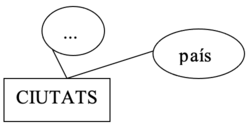

  - Si queremos guardar datos de cada país: código, nombre, sus ciudades...:

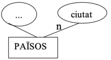

  - Si queremos guardar información de cada país y de cada ciudad y, además, saber cuáles son las ciudades de cada país (o, dicho de otro modo, cuál es el país de cada ciudad):

- Cómo relacionamos 3 entidades?

  - Relación ternaria

Optaremos por esta solución, si por ejemplo, queremos guardar las horas que imparte un profesor de una signatura a un grupo.

  - Relaciones binarias

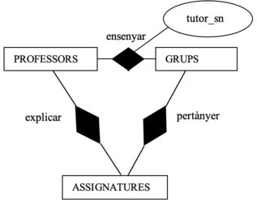

Optaremos por esta solución si, por ejemplo:
    - Queremos guardar las horas que imparte un profesor a un grupo, indpendientemente de la asignatura.
    - Queremos saber qué asignaturas imparte un profesor, independientemente de a qué grupo 

  - Agregaciones

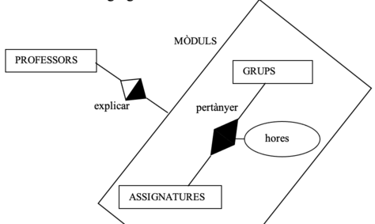

Optaremos por esta solución si, por ejemplo:

 - hay algún atributo que depende solo de 2 entidades (grupos y asignaturas) y, por tanto hay que hacer una relación entre les 2.

 - Además, queremos saber información que involucra a las 3 entidades a la vez.

- ¿Relación con muchos atributos ,u otra entidad?

Supongamos que queremos saber qué artículos se piden a cada proveedor. Y, además, la fecha en que se piden, la dirección de envío y la cantidad pedida de ese artículo:

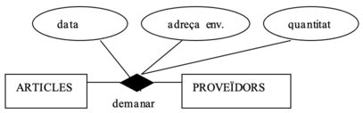

Pero nos damos cuenta de que dada una ocurrencia de la relación (por ejemplo, dado el artículo *tomates *pedido a la *Cooperativa del Mareny *), podemos tener muchos pedidos. Es decir: que esa pareja *tomates-Cooperativa del Mareny *tiene asociados muchos conjuntos de fechas, direcciones de envío y cantidades. Por tanto, realmente no sería el esquema anterior sino éste:

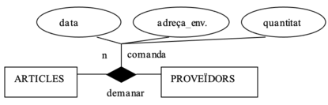

Por experiencia sabemos que cada pedido debe tener un código único. Como las relaciones no tienen clave, ¿cómo indicamos que ese código no se pueda repetir? La solución es hacer que los pedidos sean una entidad y, por tanto, replanteemos las relaciones y atributos correspondientes:

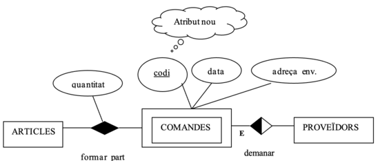

- ¿Generalización o atributo discriminador?

Supongamos que queremos representar los datos de hombres y mujeres.

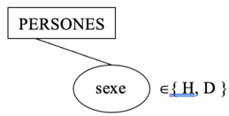

- a) Atribut discriminador

  - Optaremos per esta opción cuando sólo queremos saber el sexo de las personas.

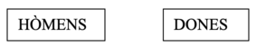

- b) Diverses entitats

  - Optaremos per esta opción cuando hombres y/o mujeres tienen atributos y/o relaciones diferentes.

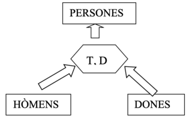
- c) Generalització

  - Optaremos por esta opción cuando se cumplan estas 2 condiciones:
    - hombres y mujeres tienen atributos y/o relaciones diferentes.
    - hombres y mujeres tienen atributos y/o relaciones en común.

- Eliminar relaciones redundantes

Supongamos que nos ha salido el siguiente ER:

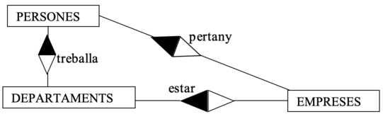

En este caso, si una persona trabaja en un departamento, y un departamento está en una empresa, se obvio que esa persona " *pertenece*" a esa empresa. Es decir:

- A partir de la relación " *trabaja*", sabremos en qué departamento trabaja una persona.

- A partir de la relación " *estar*", sabremos en qué empresa está ese departamento.

- Por tanto, sabremos a qué empresa pertenece aquella persona **sin hacer falta la relación "*pertenece*"**. Por tanto, **habrá que quitar esa relación del esquema ER para ser redundante**:

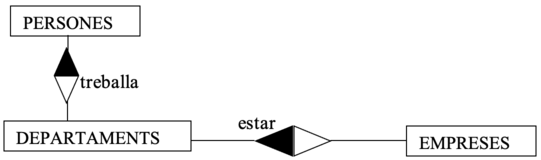

Pero no siempre que existe un "circuito de relaciones" hay alguna redundante, sino que depende del significado de las relaciones. Ejemplos:

- Si esa relación no se dijera " *pertenece *" sino " *empresa donde querría trabajar *", la información de esa relación no la podríamos obtener a partir de las relaciones " *trabaja *" y " *estar *", de forma que no sería una relación redundante.

- ¿De las 3 relaciones anteriores podríamos haber quitado la relación " *trabaja *" en lugar de " *pertenece *"? No, puesto que si un empleado pertenece a una empresa y en esa empresa están muchos departamentos, a partir de esa información no podemos deducir en qué departamento trabaja cada empleado.

## Ejercicios completos EER

Ahora que ya hemos visto todos los elementos de un esquema ER y de su ampliación EER, así como los pasos para resolverlos y las posibles opciones de diseño, ya puede realizar los ejercicios del fichero anexo sobre "Ejercicios EER completos" .
