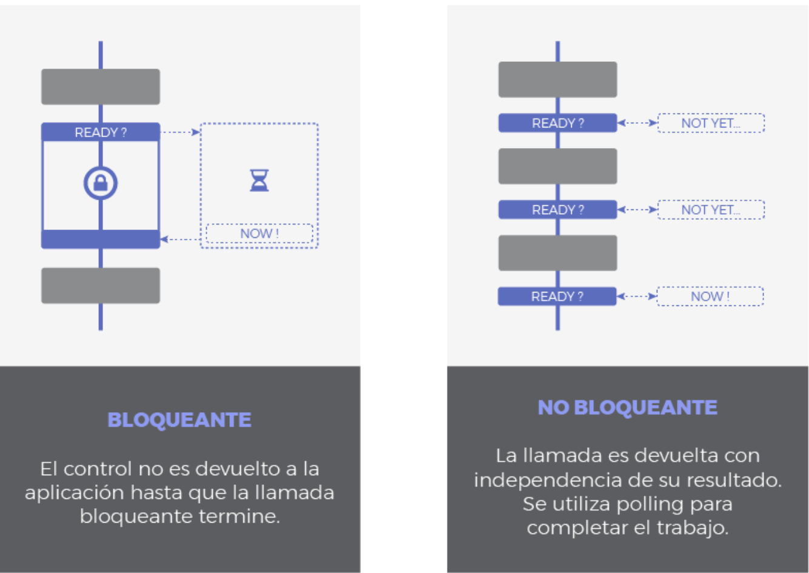
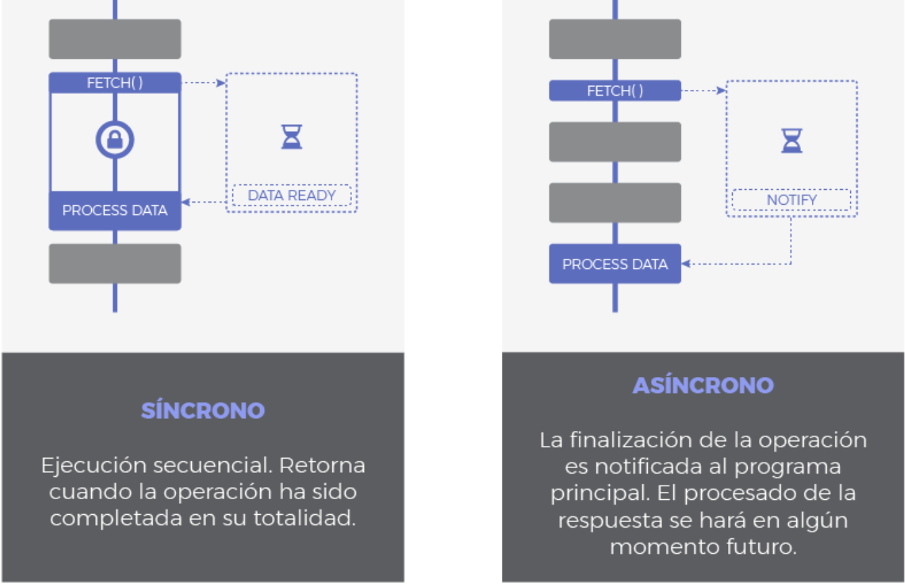
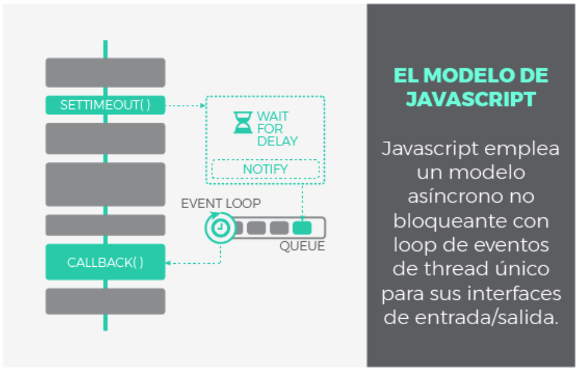
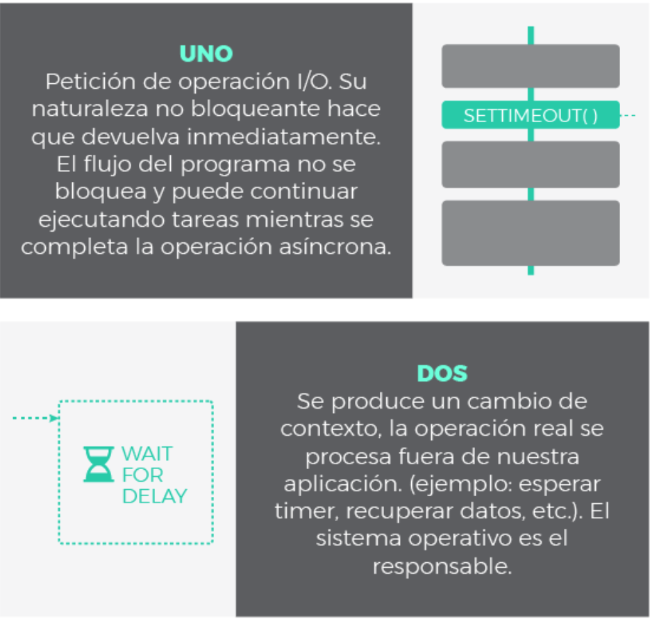
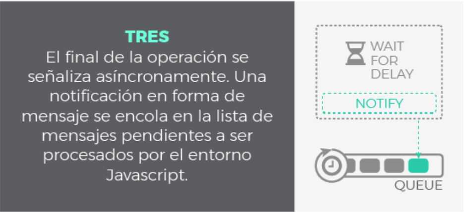
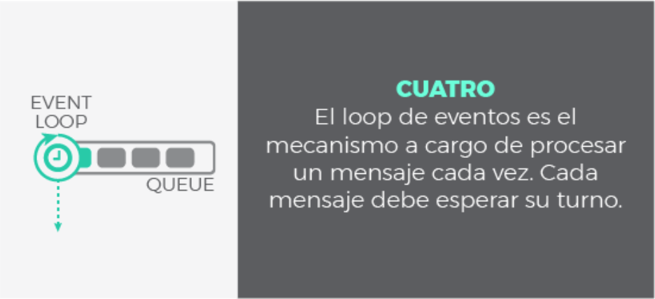
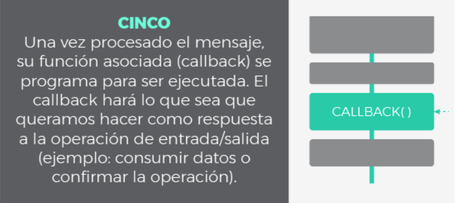

# **Unidad 3: Funciones y Manejo de Errores**

## **3.3 Asincronía en JavaScript**

JavaScript es un lenguaje de programación **monohilo**, lo que significa que ejecuta una sola operación a la vez en su hilo principal. Sin embargo, permite manejar tareas **asincrónicas** mediante **callbacks, promesas y `async/await`**, evitando bloqueos en la ejecución del código.


### **3.3.1 Concurrencia y Paralelismo en JavaScript**

En programación, **concurrencia** y **paralelismo** son dos conceptos clave cuando se trabaja con tareas asíncronas:

- **Concurrencia**: Es la capacidad de manejar múltiples tareas a la vez, pero no necesariamente ejecutándolas simultáneamente.
- **Paralelismo**: Implica la ejecución de múltiples tareas al mismo tiempo en diferentes hilos o núcleos de procesamiento.

Nótese la diferencia: que varias tareas **progresen** simultáneamente no tiene porque significar que sucedan al mismo tiempo. Mientras que la concurrencia aborda un problema más general, el paralelismo es un sub-caso de la concurrencia donde las cosas suceden exactamente al mismo tiempo.

Mucha gente aún sigue creyendo que la concurrencia implica necesariamente más de un *thread*. **Esto no es cierto**. El entrelazado (o multiplexado), por ejemplo, es un mecanismo común para implementar concurrencia en escenarios donde los recursos son limitados. Piensa en cualquier sistema operativo moderno haciendo multitarea con un único *core*. Simplemente trocea las tareas en tareas más pequeñas y las entrelaza, de modo que cada una de ellas se ejecutará durante un breve instante. Sin embargo, a largo plazo, la impresión es que todas progresan a la vez.

JavaScript utiliza un **modelo basado en eventos** con un **bucle de eventos (Event Loop)** para manejar la concurrencia, en lugar de múltiples hilos de ejecución como otros lenguajes.


-   **Escenario 1**: no es ni concurrente ni paralelo. Es simplemente una ejecución secuencial, primero una tarea, después la siguiente.
-   **Escenario 2**, **3** y **4**: son escenarios donde se ilustra la concurrencia bajo distintas técnicas:

    1.  **Escenario 3**: muestra como la concurrencia puede conseguirse con un único *thread*. Pequeñas porciones de cada tarea se entrelazan para que ambas mantengan un progreso constante. Esto es posible siempre y cuando las tareas puedan descompuestas en subtareas mas simples.
    2.  **Escenario 2** y **4**: ilustran paralelismo, utilizando multiples *threads* donde las tareas o subtareas corren en paralelo exactamente al mismo tiempo. A nivel de *thread*, el escenario **2** es secuencial, mientras que **4** aplica entrelazado.

---

### **Naturaleza de I/O Bloqueante vs No Bloqueante**

Cuando un programa interactúa con operaciones de entrada/salida (I/O), puede hacerlo de dos maneras:

- **I/O Bloqueante**: La ejecución del programa se detiene hasta que la operación de I/O finaliza.
- **I/O No Bloqueante**: Permite que el programa siga ejecutando otras tareas mientras la operación de I/O se completa en segundo plano.

JavaScript implementa **I/O no bloqueante**, lo que significa que puede manejar múltiples operaciones asíncronas sin detener la ejecución del programa.



Síncrono vs Asíncrono se refiere a cuando tendrá lugar la respuesta:

-   **Síncrono**: es frecuente emplear 'bloqueante' y 'síncrono' como sinónimos, dando a entender que toda la operación de entrada/salida se ejecuta de forma secuencial y, por tanto, debemos esperar a que se complete para procesar el resultado.
-   **Asíncrono**: la finalización de la operación *I/O* se señaliza más tarde, mediante un mecanismo específico como por ejemplo un *callback*, una promesa o un evento (se explicarán después), lo que hace posible que la respuesta sea procesada en diferido. Como se puede adivinar, su comportamiento es no bloqueante ya que la llamda *I/O* devuelve inmediatamente.



Según la clasificación anterior, podemos tener operaciones *I/O* de tipo:

-   Síncronas y Bloqueantes. Toda la operación se hace de una vez, bloqueando el flujo de ejecución:
         1.  El *thread* es bloqueado mientras espera.
         2.  La respuesta se procesa inmediatamente después de terminar la operación.
-   Síncronas y No-Bloqueantes. Similar a la anterior pero usando alguna técnica de *polling* para evitar el bloqueo en la primera fase:
         1.  La llamada devuelve inmediatamente, el *thread* no se bloquea. Se necesitarán sucesivos intentos hasta completar la operación.
         2.  La respuesta se procesa inmediatamente después de terminar la operación.
-   Asíncronas y No-Bloqueantes:
         1.  La petición devuelve inmediatamente para evitar el bloqueo.
         2.  Se envía una notificación una vez que la operación se ha completado. Es entonces cuando la función que procesará la respuesta (*callback*) se encola para ser ejecutada en algún momento en nuestra aplicación.

---

### **El Modelo de JavaScript: Event Loop y Paralelismo**

JavaScript usa un **bucle de eventos (Event Loop)** para gestionar la ejecución de código asíncrono.

Gracias a esta solución, Javascript es áltamente concurrente a pesar de emplear un único *thread*. Ya conocemos el significado de *asíncrono* y *no bloqueante*, pero ¿qué es el *loop* de eventos? Este mecanismo será explicado en el siguiente capítulo. Antes, a modo de repaso, veamos el aspecto de una operación *I/O* asíncrona en Javascript:

Modelo: 


Paso a paso:






#### El loop de eventos


1. **Heap**: Donde se almacenan los objetos y datos.
2. **Call Stack (Pila de llamadas)**: Donde se ejecuta el código de forma secuencial.
3. **Web APIs (para código asíncrono)**: Maneja operaciones como `setTimeout()`, eventos de usuario, o peticiones HTTP.
4. **Task Queue (Cola de tareas)**: Donde se encolan las funciones de callback hasta que el `Call Stack` esté libre.
5. **Event Loop**: Coordina el flujo de ejecución y mueve las tareas desde la `Task Queue` al `Call Stack` cuando este último está vacío.


De esta forma, podemos entender **la cola como el almacén de los mensajes (notificaciones) y sus *callbacks* asociados** mientras que **el *loop *de eventos es el mecanismo para despacharlos**. Este mecanismo sigue un comportamiento síncrono: cada mensaje debe ser procesado de forma completa para que pueda comenzar el siguiente.

Una de las implicaciones más relevantes de este bucle de eventos es que **los *callbacks* no serán despachados tan pronto como sean encolados**, sino que deben esperar su turno. Este tiempo de espera dependerá del numero de mensajes pendientes de procesar (por delante en la cola) así como del tiempo que se tardará en cada uno de ellos. Aunque pueda parecer obvio, esto explica la razón por la cual la finalización de una operación asíncrona no puede predecirse con seguridad, sino que se atiende en modo *best effort*.

El *loop* de eventos no está libre de problemas, y podrían darse situaciones comprometidas en los siguientes casos:

-   La pila de llamadas no se vacía ya que nuestra aplicación hace uso intensivo de ella. No habrá *tick* en el bucle de eventos y por tanto los mensajes no se procesan.
-   El flujo de mensajes que se van encolando es mayor que el de mensajes procesados. Demasiados eventos a la vez.
-   Un *callback* requiere procesamiento intensivo y acapara la pila. De nuevo bloqueamos los *ticks* del bucle de eventos y el resto de mensajes no se despachan.

Lo más probable es que un cuello de botella se produzca como consecuencia de una mezcla de factores. En cualquier caso, acabarían **retrasando el flujo de ejecución**. Y por tanto retrasando el renderizado, el procesado de eventos, etc. La experiencia de usuario se degradaría y la aplicación dejaría de responder de forma fluida. Para evitar esta situación, recuerda siempre **mantener los *callbacks* lo más ligeros posible**. En general, evita código que acapare la CPU y permite que el *loop* de eventos se ejecute a buen ritmo.


!!! example "Ejemplo de cómo funciona el Event Loop"
    ```javascript linenums="1" title="Ejemplo del Event Loop"
    console.log("Inicio");
    
    setTimeout(() => {
        console.log("Mensaje dentro de setTimeout");
    }, 0);
    
    console.log("Fin");
    ```

**Salida esperada:**
```
Inicio
Fin
Mensaje dentro de setTimeout
```

Incluso con un tiempo de espera de `0`, la función en `setTimeout` se ejecuta después porque se encola en la `Task Queue` y solo se ejecuta cuando el `Call Stack` está vacío.

### **Nota sobre Paralelismo en JavaScript**

Aunque JavaScript es monohilo, puede ejecutar tareas en paralelo a través de **Web Workers** o **módulos como `Worker Threads` en Node.js**, lo que permite aprovechar múltiples núcleos de CPU.

Esto no es lo mismo que el **Event Loop**, ya que los **Web Workers** ejecutan código en hilos separados sin acceso al `Call Stack` principal.

---


### **3.3.2 Callbacks**

Los *callbacks* son la pieza clave para que Javascript pueda funcionar de forma asíncrona. De hecho, el resto de patrones asíncronos en Javascript está basado en *callbacks* de un modo u otro, simplemente añaden azúcar sintáctico para trabajar con ellos más cómodamente.

Un *callback* no es más que **una función que se pasa como argumento de otra función**, y que será invocada para completar algún tipo de acción. En nuestro contexto asíncrono, un *callback* representa el '*¿Qué quieres hacer una vez que tu operación asíncrona termine?*'. Por tanto, es el trozo de código que será ejecutado una vez que una operación asíncrona notifique que ha terminado. Esta ejecución se hará en algún momento futuro, gracias al mecanismo que implementa el bucle de eventos.

Fíjate en el siguiente ejemplo sencillo utilizando un callback:

!!! example "Ejemplo de callback"
    ```javascript linenums="1" title="Uso de un callback"
    function operacion(a, b, callback) {
        let resultado = a + b;
        callback(resultado);
    }

    function mostrarResultado(resultado) {
        console.log("El resultado es:", resultado);
    }
    
    // Uso de un callback
    operacion(5, 3, mostrarResultado); 
    // callback anónimo, función flecha
    operacion(10, 20, resultado => console.log("El resultado es:", resultado)); 
    // callback anónimo, función tradicional
    operacion(15, 25, function(resultado) {
        console.log("El resultado es:", resultado);
    });
    ```

**Problema con los Callbacks: Callback Hell**

Cuando encadenamos múltiples callbacks, el código se vuelve difícil de leer y mantener. Esto se conoce como **callback hell**.

!!! example "Ejemplo de Callback Hell"
    ```javascript linenums="1" title="Callback Hell"
    function paso1(callback) {
        setTimeout(() => {
            console.log("Paso 1 completado");
            callback();
        }, 1000);
    }
    
    function paso2(callback) {
        setTimeout(() => {
            console.log("Paso 2 completado");
            callback();
        }, 1000);
    }
    
    function paso3() {
        setTimeout(() => {
            console.log("Paso 3 completado");
        }, 1000);
    }
    
    paso1(() => {
        paso2(() => {
            paso3();
        });
    });
    ```

Para evitar este problema, se introdujeron las **Promesas**.

---

### **3.3.3 Promesas en JavaScript**

Una promesa es un objeto que representa **el resultado de una operación asíncrona**. Este resultado podría estar disponible **ahora** o en el **futuro**. Las promesas se basan en ***callbacks** *pero añaden azúcar para un mejor manejo y sintaxis. Las promesas son especiales en términos de asincronía ya que añaden un nuevo nivel de prioridad que estudiaremos a continuación.

Cuando llamamos a una función asíncrona implementada con este patrón, nos devolverá inmediatamente una promesa como garantía de que la operación asíncrona finalizará en algún momento, ya sea con éxito o con fallo. Una vez que tengamos el objeto promesa en nuestro poder, registramos un par de *callbacks*: uno para indicarle a la promesa '*que debe hacer en caso de que todo vaya bien*' (resolución de la promesa o *resolve*) y otro para determinar '*que hacer en caso de fallo*' (rechazo de la promesa o *reject*).

A resumidas cuentas, una promesa es un objeto al que le **adjuntamos *callbacks*, en lugar de pasarlos directamente a la función asíncrona**. La forma en que registramos esos dos *callbacks* es mediante el método *.then(resolveCallback, rejectCallback)*. En terminología de promesas, decimos que una promesa se resuelve con éxito (*resolved*) o se rechaza con fallo (*rejected*). Echa un vistazo al siguiente ejemplo:

Una **promesa** es un objeto que representa un valor que puede estar disponible **ahora, en el futuro o nunca**. Las promesas tienen tres estados:

- **Pendiente (`pending`)**: La operación aún no ha finalizado.
- **Resuelta (`fulfilled`)**: La operación se completó con éxito.
- **Rechazada (`rejected`)**: Ocurrió un error.


!!! example "Sintaxis de la promesa"
    ```javascript linenums="1" title="Sintaxis de una Promesa"
    const currentURL = document.URL.toString();
    const promise = fetch(currentURL);
    
    promise.then(result => console.log(result), e => console.log(`Error capturado:  ${e}`));
    ```

Es más legible de esta manera:

!!! example "Sintaxis de la promesa más legible"
    ```javascript linenums="1" title="Sintaxis de una Promesa"
    fetch(document.URL.toString())
        .then(result => console.log(result),
            e => console.log(`Error capturado:  ${e}`));
    ```

En el ejemplo anterior, pedimos al servidor que nos provea una URL utilizando la función asíncrona fetch y nos devuelve una promesa. Configuramos la promesa con dos callbacks: uno para resolver la promesa, que mostrará la página por consola en caso de éxito, y otro para rechazarla en caso de fallo que mostrará el error asociado.

**Creando una Promesa**

!!! example "Ejemplo de Promesa"
    ```javascript linenums="1" title="Uso de Promesas"
    function operacionAsincrona() {
        return new Promise((resolve, reject) => {
            setTimeout(() => {
                let exito = true;
                if (exito) {
                    resolve("Operación completada");
                } else {
                    reject("Error en la operación");
                }
            }, 2000);
        });
    }
    
    operacionAsincrona()
        .then(mensaje => console.log(mensaje))
        .catch(error => console.log("Error:", error));
    ```

---

### **3.3.4 `async/await`: Manejo de Código Asíncrono de Forma Más Clara**

Las promesas supusieron un gran salto en Javascript al introducir una mejora sustancial sobre los *callbacks* y un manejo más elegante de nuestras tareas asíncronas. Sin embargo, también pueden llegar a ser tediosas y verbosas a medida que se requieren más y más *.then()*. **Las palabras clave *async *y *await *surgieron para simplificar el manejo de las promesas**. Son puro azúcar para hacer las promesas más amigables, escribir código más sencillo, reducir el anidamiento y mejorar la trazabilidad al depurar. Pero recuerda, *async *\ *await *y las promesas son lo mismo en el fondo.

La etiqueta *async* declara una función como asíncrona e indica que una promesa será automáticamente devuelta. Podemos declarar como *async *tanto funciones con nombre, anónimas, o funciones flecha. Por otro lado, *await *debe ser usado siempre dentro de una función declarada como *async *y esperará automáticamente (de forma asíncrona y no bloqueante) a que una promesa se resuelva.

`async/await` es una forma más sencilla y clara de manejar operaciones asincrónicas sin caer en la anidación de callbacks o el uso complejo de `.then()` y `.catch()`.

Para usarlo:
- Se define una función con la palabra clave `async`.
- Se usa `await` para esperar el resultado de una promesa.

!!! example "Sintaxis de `async/await` AJAX"
    ```javascript linenums="1" title="Uso de async/await"
    const checkServerWithSugar = async (url) => {
        try {
            const response = await fetch(url);
            return `Estado del servidor: ${response.status === 200 ? "OK" : "NOT OK"}`;
        } catch (e) {
            throw `Manejo intero del error. Error original: ${e}`;
        }
    }

    checkServerWithSugar(document.URL.toString())
        .then(result => console.log(result))
        .catch(e => console.log(`Error Capturado Fuera de la función async: ${e}`));
    ```

!!! example "Ejemplo con `async/await`"
    ```javascript linenums="1" title="Uso de async/await"
    function operacionAsincrona() {
        return new Promise(resolve => {
            setTimeout(() => resolve("Operación completada"), 2000);
        });
    }
    
    async function ejecutarOperacion() {
        console.log("Iniciando operación...");
        let resultado = await operacionAsincrona();
        console.log(resultado);
    }
    
    ejecutarOperacion();
    ```

Otro ejemplo de uso de `async/await` puede ser:
!!! example "Ejemplo con `async/await`"
    ```javascript linenums="1" title="Uso de async/await"
    async function myDisplay() {
        let myPromise = new Promise(function(resolve, reject) {
            resolve("I love You !!");
        });
        document.getElementById("demo").innerHTML = await myPromise;
    }
    
    myDisplay();
    ```

---

### **Comparación entre Callbacks, Promesas y `async/await`**

| Método          | Facilidad de lectura | Manejo de errores |
|---------------|-----------------|----------------|
| Callbacks     | Baja (callback hell) | Uso de múltiples `if` |
| Promesas      | Media | `.then()` y `.catch()` |
| async/await   | Alta (código más limpio) | Uso de `try...catch` |

Las promesas y `async/await` son la mejor opción en proyectos modernos para manejar código asincrónico de manera eficiente y legible.


---
