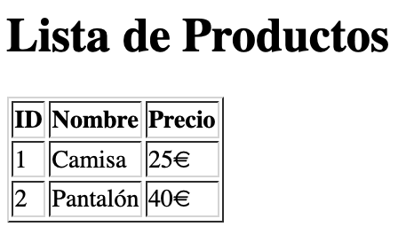

# **4. Integración de JS con HTML y DOM**

## **4.0 Aspectos previos** 

### **4.0.1 ¿Qué es un Servicio Web?**

Un **servicio web** es una aplicación que responde a **peticiones HTTP** realizadas por un cliente (normalmente un navegador) y devuelve información en forma de páginas web, datos JSON o cualquier otro contenido.

---

### **4.0.2 Estructura Básica de una `Petición Web`**

Cuando un usuario accede a una página web, el proceso que ocurre es el siguiente:

1. **El usuario introduce una URL en su navegador**.
2. **El navegador envía una petición HTTP** al servidor correspondiente.
3. **El servidor recibe la petición** y genera una respuesta (un archivo HTML, datos de una base de datos, etc.).
4. **El navegador recibe la respuesta**, interpreta el código HTML y ejecuta cualquier JavaScript incluido.

El servidor responde con un **código de estado HTTP** , estos son los más comunes:

| **Código** | **Descripción** |
| :----: | :---- |
| 200        | OK              |
| 404        | No encontrado   |
| 500        | Error interno   |


Este flujo es **sin memoria**: cada petición es independiente y el servidor no recuerda estados anteriores (a menos que se use almacenamiento en cookies o bases de datos).

[Vídeo explicativo](https://www.youtube.com/watch?v=inNR5enqRq0)

---

### **4.0.3 ¿Qué es una URL y cómo funciona HTTP?**

- **URL (Uniform Resource Locator):** Dirección única que identifica un recurso en la web (ejemplo: `https://www.ejemplo.com/productos`).
- **HTTP (HyperText Transfer Protocol):** Protocolo que define cómo se comunican los navegadores con los servidores web.
  - **Métodos HTTP más comunes:**
    - `GET`: Solicita información (ejemplo: cargar una página).
    - `POST`: Envía datos al servidor (ejemplo: un formulario).
    - `PUT`: Actualiza información en el servidor.
    - `DELETE`: Elimina datos en el servidor.
    - `HEAD`: Solicita solo los encabezados de una respuesta.

---

### **4.0.4 Frontend vs Backend**

La programación web se divide en **dos partes principales**:

| **Frontend (Cliente)** | **Backend (Servidor)** |
|------------------------|------------------------|
| Se ejecuta en el navegador del usuario. | Se ejecuta en el servidor web. |
| Usa HTML, CSS y JavaScript. | Usa lenguajes como PHP, Node.js, Python, etc. |
| Se encarga de la apariencia y la interacción con el usuario. | Se encarga de la lógica del negocio y la base de datos. |

JavaScript es el **único lenguaje que puede trabajar en ambos lados**:  
- En el **frontend** (en el navegador) para la interacción con el usuario.  
- En el **backend** (con Node.js) para la gestión de datos y lógica del servidor.

---

### **4.0.5 Caso de Uso: Carga de una Página Web con Código de Ejemplo**

Para entender mejor cómo funciona una petición HTTP en una aplicación web, veamos un **caso práctico** donde un usuario accede a una página de productos y el servidor responde generando un **HTML dinámico** con los datos de una base de datos.

#### **📌 Paso 1: Petición GET desde el Navegador**
Cuando el usuario escribe `www.ejemplo.com/productos` en la barra de direcciones, el navegador **envía una petición HTTP GET** al servidor:

```
GET /productos HTTP/1.1
Host: www.ejemplo.com
User-Agent: Mozilla/5.0
Accept: text/html
```

#### **📌 Paso 2: Servidor Node.js recibe la petición**
En el backend, el servidor **recoge la petición GET** y consulta la base de datos para obtener los productos:

!!! example "Servidor Node.js con Express"
    ```javascript linenums="1" title="Servidor Node.js que responde con HTML"
    const express = require('express');
    const mysql = require('mysql2');
    const app = express();

    // Conexión a la base de datos
    const conexion = mysql.createConnection({
        host: 'localhost',
        user: 'root',
        password: '',
        database: 'tienda'
    });

    // Ruta para manejar la petición GET /productos
    app.get('/productos', (req, res) => {
        conexion.query('SELECT * FROM productos', (error, resultados) => {
            if (error) {
                res.status(500).send("Error en la base de datos");
                return;
            }

            // Construcción del HTML con los datos de la BD
            let html = `
                <!DOCTYPE html>
                <html lang="es">
                <head>
                    <meta charset="UTF-8">
                    <meta name="viewport" content="width=device-width, initial-scale=1.0">
                    <title>Lista de Productos</title>
                </head>
                <body>
                    <h1>Lista de Productos</h1>
                    <table border="1">
                        <tr>
                            <th>ID</th>
                            <th>Nombre</th>
                            <th>Precio</th>
                        </tr>`;

            resultados.forEach(producto => {
                html += `
                        <tr>
                            <td>${producto.id}</td>
                            <td>${producto.nombre}</td>
                            <td>${producto.precio}€</td>
                        </tr>`;
            });

            html += `
                    </table>
                </body>
                </html>`;
            
            res.send(html);
        });
    });

    // Iniciar servidor
    app.listen(3000, () => {
        console.log('Servidor ejecutándose en http://localhost:3000');
    });
    ```

#### **📌 Paso 3: El servidor envía la respuesta al navegador**
Una vez que la base de datos devuelve los productos, el servidor genera un documento HTML y lo **envía como respuesta**:

```
HTTP/1.1 200 OK
Content-Type: text/html

<!DOCTYPE html>
<html lang="es">
<head>
    <meta charset="UTF-8">
    <meta name="viewport" content="width=device-width, initial-scale=1.0">
    <title>Lista de Productos</title>
</head>
<body>
    <h1>Lista de Productos</h1>
    <table border="1">
        <tr>
            <th>ID</th>
            <th>Nombre</th>
            <th>Precio</th>
        </tr>
        <tr>
            <td>1</td>
            <td>Camisa</td>
            <td>25€</td>
        </tr>
        <tr>
            <td>2</td>
            <td>Pantalón</td>
            <td>40€</td>
        </tr>
    </table>
</body>
</html>
```

#### **📌 Paso 4: El navegador renderiza la página**
El navegador recibe el HTML y lo interpreta para mostrar la lista de productos en pantalla.

Este flujo explica **cómo funciona una aplicación web desde la petición hasta la respuesta**. Una vez comprendido este proceso, podemos empezar a integrar **JavaScript en el navegador** para mejorar la interactividad de la página web.



[Enlace a la página de productos](./html/articulos.html)

