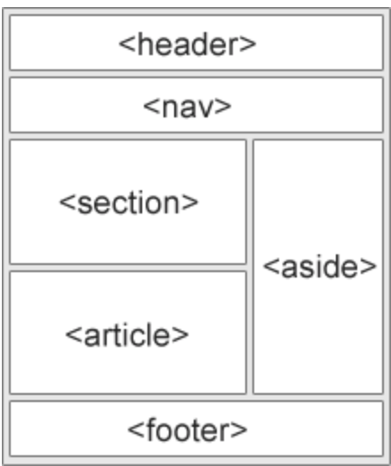

# **4. Integración de JS con HTML y DOM**

## **4.1. Introducción a HTML**

### **4.1.1 ¿Qué es HTML y para qué sirve?**

**HTML (HyperText Markup Language)** es el lenguaje estándar utilizado para la creación de páginas web. Define la estructura y el contenido de un documento web mediante etiquetas.

**Diferencias clave:**

- **HTML** define la estructura y contenido.
- **CSS** gestiona la apariencia.
- **JavaScript** controla la interactividad.

!!! example "Ejemplo mínimo de HTML"
    ```html linenums="1" title="Ejemplo básico"
    <!DOCTYPE html>
    <html>
    <head>
        <title>Mi primera página</title>
    </head>
    <body>
        <h1>Hola, mundo!</h1>
        <p>Este es un documento HTML básico.</p>
    </body>
    </html>
    ```

### **Ejercicio 1: Crear un documento HTML mínimo**

!!! question "Ejercicio"
    - Crea un archivo HTML desde cero.
    - Incluye un título en el `<head>`, `Mi primera página web`.
    - En el `<body>`, agrega un encabezado y un párrafo, con tu nombre y la fecha.
    ??? exemple "Ejemplo de HTML"
        ```html linenums="1" title="Ejemplo de HTML"
        <!DOCTYPE html>
        <html>
        <head>
            <title>Mi primera página web</title>
        </head>
        <body>
            <h1>Javier Beteta</h1>
            <p>20 de enero de 2025</p>
        </body>
        </html>
        ```

---

## **4.1.2 Estructura básica de un documento HTML**

Un documento HTML tiene una estructura fundamental:

📌 **Elementos esenciales:**

- `<!DOCTYPE html>` → Indica que el documento es HTML5.
- `<html>` → Contenedor principal.
- `<head>` → Información meta y enlaces a CSS.
- `<body>` → Contenido visible.

!!! example "Estructura básica HTML, lo mínimo necesario"
    ```html linenums="1" title="Estructura de HTML"
    <!DOCTYPE html>
    <html>
    <head>
        <meta charset="UTF-8">
        <title>Ejemplo de estructura</title>
    </head>
    <body>
        <h1>Encabezado Principal</h1>
        <p>Este es un párrafo de ejemplo.</p>
    </body>
    </html>
    ```

!!! note "VSCode Snippet"
    Para crear rápidamente la estructura básica de un documento HTML en Visual Studio Code, puedes usar el comando `!` seguido de la tecla `Tab`.
    `Pruebaló en tu editor de código.`

    - Crea un nuevo documento con extensión `.html`.
    - Escribe `!` y presiona la tecla `Tab`.
    - Se generará automáticamente la estructura básica de un documento HTML.

    ```html linenums="1" title="Estructura de HTML con Snippet"
    <!DOCTYPE html>
    <html lang="es">
    <head>
        <meta charset="UTF-8">
        <meta http-equiv="X-UA-Compatible" content="IE=edge">
        <meta name="viewport" content="width=device-width, initial-scale=1.0">
        <title>Document</title>
    </head>
    <body>

    </body>
    </html>
    ```

Si analizamos la estructura básica de un documento HTML, vemos que el contenedor principal es la etiqueta `<html>`, que contiene **dos** secciones principales: `<head>` y `<body>`. En `<head>` se colocan metadatos y enlaces a `CSS`, mientras que `<body>` contiene el contenido visible de la página.

Las etiquetas `<meta>` proporcionan información adicional al navegador sobre cómo se debe manejar la página. A continuación, se explica cada una:

1. `<meta charset="UTF-8">`
    - **`charset`**: Define el conjunto de caracteres que usará el documento HTML.
    - **`UTF-8`**: Es un estándar de codificación de caracteres que soporta prácticamente todos los caracteres y símbolos de todos los idiomas.
    - **¿Para qué sirve?**  
        Garantiza que los caracteres especiales (como tildes, ñ, caracteres chinos, árabes, etc.) se muestren correctamente.
2. `<meta http-equiv="X-UA-Compatible" content="IE=edge">`
    - **`http-equiv`**: Permite que la metaetiqueta actúe como un encabezado HTTP.
    - **`X-UA-Compatible`**: Indica a Internet Explorer cómo debe interpretar la página.
    - **`IE=edge`**: Le dice a Internet Explorer que use la última versión disponible de su motor de renderizado.
    - **¿Para qué sirve?**  
        Evita que versiones antiguas de IE usen modos de compatibilidad obsoletos, asegurando una mejor representación de la página.
3. `<meta name="viewport" content="width=device-width, initial-scale=1.0">`
    - **`name="viewport"`**: Define la configuración de la ventana gráfica (viewport) para dispositivos móviles.
    - **`content`**: Especifica cómo debe ajustarse la página en diferentes tamaños de pantalla.
    - **`width=device-width`**: Hace que el ancho del viewport sea igual al ancho del dispositivo.
    - **`initial-scale=1.0`**: Establece el nivel de zoom inicial en 1 (sin zoom por defecto).
    - **¿Para qué sirve?**  
        Hace que la página sea responsive, asegurando que se vea correctamente en dispositivos móviles y tabletas.

!!! note "Importancia de las metaetiquetas"
    Estas etiquetas `<meta>` mejoran la accesibilidad, compatibilidad y adaptación de la página en distintos navegadores y dispositivos. Son esenciales para cualquier página web moderna.

### **Ejercicio 2: Analizar la estructura de HTML**
!!! question "Ejercicio"
    - Crea una página nueva utilizando la estructura básica de HTML.
    - Agrega un título en el `<head>`, *Mi segunda página web* 
    - Y un encabezado en el `<body>`, con tu nombre y la fecha.
---

## **4.1.3 Etiquetas HTML Básicas**

El lenguaje HTML utiliza **etiquetas** para definir la estructura y el contenido de un documento web. Viene del lenguaje de marcado SGML (Standard Generalized Markup Language). Donde todos los elementos de un documento HTML están rodeados por etiquetas. 

Las etiquetas se defininen con el siguiente formato:
```html
<etiqueta>Contenido</etiqueta>
```

Donde tienes una etiqueta de apertura `<etiqueta>` y una de cierre `</etiqueta>`. El contenido es lo que se muestra en la página web (si está en el *body*). HTML5 permite que algunas etiquetas no tengan cierre, como `` o `<br>`.

Lo que sí que tenemos que tener en cuenta es que las etiquetas deben estar anidadas correctamente, es decir, no se pueden solapar. Por ejemplo, esto no sería correcto:
```html
<p>Este es un párrafo <b>con una palabra en negrita</p></b>
```

!!! note "Anidación de etiquetas"
    Las etiquetas deben cerrarse en el orden inverso al que se abrieron. Por ejemplo, si abrimos una etiqueta `<div>` y una etiqueta `<p>`, debemos cerrar `</p>` antes de cerrar la etiqueta `</div>`.

    ```html
    <div>
        <p>Este es un párrafo dentro de un div.</p>
    </div>
    ```

En la estructura básica ya vimos que la etiqueta `<html>` es el contenedor principal, y dentro de ella se encuentran `<head>` y `<body>`. Dentro de `<head>` se colocan metadatos y enlaces a CSS, mientras que `<body>` contiene el contenido visible de la página. 

Hay que manejarse con cuidado: aunque hoy en día la mayoría de editores de código nos ayudan a cerrar las etiquetas automáticamente, y detectan errores de anidación. Ten en cuenta que los navegadores también intentan corregir errores, pero es mejor evitarlos, ya que el rsultado puede ser inesperado.

**Principales etiquetas HTML:**

**Encabezados**

`<h1>` a `<h6>`: Títulos de mayor a menor tamaño.
Los encabezados son importantes para la **semántica** de la página, ya que indican la jerarquía de la información. Es recomendable usarlos de forma coherente. Normalmente utilizamos un solo `<h1>` por página, y luego los demás encabezados según la jerarquía de la información.

```html
<h1>Encabezado Principal</h1>
<h2>Subtítulo</h2>
<h3>Subtítulo 2</h3>
```

Si vemos el ejemplo de la estructura básica, el título de la página se coloca en un `<h1>`, ya que es el título principal de la página. Lo veremos con un tamaño de letra mayor y en negrita. El resto de encabezados se utilizan para jerarquizar la información, y sevisualizarán cada vez más pequeños.

**Párrafos**

`<p>`: Párrafos de texto.
Los párrafos son la forma más común de mostrar texto en una página web. Se utilizan para agrupar texto y darle formato.

```html
<p>Este es un párrafo de texto.</p>
```

!!! Note "VSCode snippet `etiqueta`"
    Para crear rápidamente una etiqueta de párrafo en Visual Studio Code, puedes usar el comando `p` seguido de la tecla `Tab`.
    `Pruebaló en tu editor de código.`
    - Escribe `p` y presiona la tecla `Tab`.
    - Se generará automáticamente la etiqueta de párrafo.
    - Esto es útil para crear rápidamente etiquetas HTML.

    ```html linenums="1" title="Ejemplo de etiqueta de párrafo"
    <p></p>
    ```

!!! Note "VSCode snippet `Lorem`"
    Si quieres escribir un párrafo de texto, puedes usar el comando `lorem` seguido de la tecla `Tab`, incluso si quieres indicar el número de palabras, pueds hacerlo de la siguiente manera `lorem5`.
    `Pruebaló en tu editor de código.`
    ```html linenums="1" title="Ejemplo de lorem ipsum"
    <p>Lorem ipsum dolor sit amet, consectetur adipiscing elit.</p>
    ```
    Por último, prueba a escribir `p*5>lorem5` y presiona la tecla `Tab` para ver qué sucede.

**Enlaces**

Se utilizan para enlazar a otras páginas web o a otros recursos. Se definen con la etiqueta `<a>` y el atributo `href` que indica la URL de destino. Las páginas o recursos enlazados pueden estar en la misma página, en la misma web o en cualquier otro sitio de Internet.

*__Los enlaces internos a la misma página__* se utilizan para navegar por la misma página o por otras páginas de la misma web. Se definen con la etiqueta `<a>` y el atributo `href` que indica la URL de destino. Un ejemplo de enlace interno sería:

```html
<a href="#seccion2">Ir a la sección 2</a>
```

Para ello debemos haber definido un identificador en la sección de destino, de la siguiente manera:

```html
<h2 id="seccion2">Sección 2</h2>
```

*__Los enlaces internos a otras páginas de la misma web__* se utilizan para navegar por otras páginas de la misma web. Se definen con la etiqueta `<a>` y el atributo `href` que indica la URL de destino. Un ejemplo de enlace interno sería:

```html
<a href="pagina2.html">Ir a la página 2</a>
```

Con estos enlaces utilizaremos siempre rutas relativas, es decir, la ruta desde la página actual a la página de destino. Si la página de destino está en la misma carpeta que la página actual, solo necesitamos el nombre del archivo. Si está en una carpeta diferente, necesitamos la ruta relativa a la página actual. Por ejemplo si tenemos esta estructura de web:

```text
web/
├── index.html
├── pagina2.html
└── carpeta/
    └── pagina3.html
```

Si de la página index creamos enlaces a las páginas 2 y 3, serían de la siguiente manera:

```html
<a href="pagina2.html">Ir a la página 2</a>
<a href="carpeta/pagina3.html">Ir a la página 3</a>
```

En el primer caso al estar en la misma página no necesitamos indicar la ruta, en el segundo caso al estar en una carpeta diferente, indicamos la ruta relativa a la página actual. Como es descender en una carpeta, indicamos el nombre de la carpeta y el archivo.

En cambio de la página 3 a la página index, sería de la siguiente manera:

```html
<a href="../index.html">Ir a la página principal</a>
```

En este caso tenemos que subir un nivel, por lo que utilizamos `../` para indicar que subimos un nivel y luego indicamos el nombre del archivo.

!!!note "sobre las *rutas relativas*"
    Es conveniente utilizar rutas relativas siempre que sea posible, ya que si cambiamos la estructura de la web, los enlaces seguirán funcionando correctamente. Si utilizamos rutas absolutas, si cambiamos la estructura de la web, los enlaces dejarán de funcionar.
    Por tanto debemos ser capaces de manejar las rutas relativas con soltura, debemos prácticar con ellas y estar seguros de saber movernos por la estructura de la web.
    Las rutas absolutas pueden dar al traste con la web si cambiamos la web de sitio, por lo que es mejor evitarlas. De esta manera nuestra web será más robusta y fácil de mantener.


*__Los enlaces externos__* se utilizan para enlazar a otras páginas web o a otros recursos. Se definen con la etiqueta `<a>` y el atributo `href` que indica la URL de destino. Un ejemplo de enlace externo sería:

```html
<a href="https://www.google.com">Ir a Google</a>
```

En este caso el enlace nos llevará a la página de Google. Aquí utilizamos una ruta absoluta, ya que no tenemos control sobre la página de destino. En este caso, la ruta absoluta es la única opción. A esta ruta se le denomina también FQDN (Fully Qualified Domain Name), y es única para cada página web. Puede ser un enlace a una web general como la anterior, o a una página concreta de una web, como por ejemplo:

```html
<a href="https://www.ejemlo.com/documents/docs.html">Documetación</a>
```
En este caso el enlace nos llevará a la página de documentación de la web de ejemplo, pero podría ser un recurso como una imagen, un archivo PDF, etc.

**Imágenes**

En una página web, las imágenes se insertan con la etiqueta ``. El atributo `src` indica la URL de la imagen y el atributo `alt` proporciona una descripción alternativa para la imagen. Hoy en día las imágenes son votales en una página web, ya que aportan información visual y atraen la atención del usuario. De momento vamos a ver solo como incluir de manera sencilla una imagen en nuestra página web, en módulos posteriores veremos cómo trabajar con ellas.

```html

```

El atributo `src` indica la URL de la imagen, que puede ser una ruta relativa o absoluta. Seguiremos el mismo criterio que con los enlaces, si la ruta in interna utilizaremos una ruta relativa, si es externa una ruta absoluta. El atributo `alt` proporciona una descripción alternativa para la imagen, que se mostrará si la imagen no se puede cargar o si el usuario utiliza un lector de pantalla.

**Listas**

*Listas no ordenadas* `<ul>`: Elementos sin orden específico.
Las listas no ordenadas se utilizan para agrupar elementos sin un orden específico. Se definen con la etiqueta `<ul>` y cada elemento de la lista se define con la etiqueta `<li>`. Un ejemplo de lista no ordenada sería:

```html
<ul>
    <li>Elemento 1</li>
    <li>Elemento 2</li>
    <li>Elemento 3</li>
</ul>
```

Hay que tener presente que por defecto las listas no ordenadas se muestran con viñetas y cada elemento en una línea diferente. Para cambiar el estilo de las viñetas utilizamos CSS que veremos en módulos posteriores.

*Listas ordenadas* `<ol>`: Elementos con un orden específico.
Las listas ordenadas se utilizan para agrupar elementos con un orden específico. Se definen con la etiqueta `<ol>` y cada elemento de la lista se define con la etiqueta `<li>`. Un ejemplo de lista ordenada sería:

```html
<ol>
    <li>Elemento 1</li>
    <li>Elemento 2</li>
    <li>Elemento 3</li>
</ol>
```

En este caso en vez de viñetas, se muestran los elementos con números, y cada elemento en una línea diferente. Lo mismo que en el caso de las listas no ordenadas, para cambiar el estilo de los números utilizamos CSS.

**Tablas**

Las tablas se utilizan para mostrar datos en forma de filas y columnas. Se definen con las etiquetas `<table>` para la tabla en sí, `<tr>` para las filas y `<td>` para las celdas. También se pueden utilizar las etiquetas `<th>` para las celdas de cabecera. Un ejemplo de tabla sería:

```html
<table>
    <tr>
        <th>Nombre</th>
        <th>Edad</th>
    </tr>
    <tr>
        <td>Javier</td>
        <td>30</td>
    </tr>
    <tr>
        <td>María</td>
        <td>25</td>
    </tr>
</table>
```

En este caso tenemos una tabla con dos filas y dos columnas, la primera fila es la cabecera de la tabla, y las siguientes filas son los datos de la tabla. Las celdas de cabecera se definen con la etiqueta `<th>`, y las celdas de datos con la etiqueta `<td>`. Las tablas son muy útiles para mostrar datos de forma ordenada y estructurada. 

**División de contenido**

`<div>` y `<span>`: Contenedores genéricos.
Las etiquetas `<div>` y `<span>` se utilizan para agrupar elementos y aplicar estilos. `<div>` se utiliza para agrupar elementos en bloques, mientras que `<span>` se utiliza para agrupar elementos en línea. Un ejemplo de uso sería:

```html
<div>
    <p>Este es un párrafo dentro de un div.</p>
</div>
<p>Hay un texto encerrado ... <span>Este es un texto en línea.</span> en esta línea </p>
``` 

EL primero me permite agrupar elementos en bloques, de esta manera y como veremos más adelante puedo aplicar estilos a todos los elementos que estén dentro del div.

El segundo me permite agrupar elementos en línea, de esta manera puedo aplicar estilos a un texto o a un enlace, por ejemplo.


??? example "Ejemplo de etiquetas HTML"
    ```html linenums="1" title="Ejemplo de etiquetas"
    <h1>Título Principal</h1>
    <p>Este es un párrafo de texto.</p>
    <a href="https://www.google.com">Ir a Google</a>
    
    ```

### **Ejercicio 3: Crear una página con etiquetas básicas**
!!! question "Ejercicio"
    - Crea una estructura de carpetas para un sitio web.
        - web/
            - index.html
            - about.html
            - contact.html
            - img/
                - logo.png
    - Crea un archivo `index.html` con:
        - Un título y subtítulo.
        - Un párrafo de texto.
        - Un enlace a `about.html`.
        - Una imagen de `logo.png`.
        - Una tabla con artículos, con 3 columnas: ID, Nombre y Precio.
    - Crea un archivo `about.html` con:
        - Un título 
        - Crea dos divs con un subtítulo y un párrafo de texto (de más de 200 palabras).
        - Un enlace a `contact.html`.
    - Crea un archivo `contact.html` con:
        - Un título y subtítulo.
        - Un párrafo de texto.
        - Un enlace a `index.html`.

---

## **4.1.4 Atributos en HTML**

Los **atributos** en HTML proporcionan información adicional a las etiquetas.

**Ejemplos de atributos comunes:**

- `id` → Identificador único.
- `class` → Agrupación de elementos.
- `style` → Estilos en línea.
- `alt` → Descripción de imágenes.
- `href` → URL en enlaces.

!!! example "Ejemplo de atributos en HTML"
    ```html linenums="1" title="Uso de atributos"
    <p id="intro">Este es un párrafo con un id.</p>
    <a href="https://www.example.com" title="Visita el sitio">Ir al sitio</a>
    
    ```

### **Ejercicio 4: Aplicar atributos en HTML**
!!! question "Ejercicio"
    - Agrega atributo `id` los `divs` y párrafos del ejercicio anterior .
    - Usa `style="color:red;"` en un div del ejercicio anterior.
    - Inserta una imagen con `alt`.

---

## **4.1.5 Formularios en HTML**

Los formularios permiten la interacción con el usuario. En este caso vamos a hacer una presentación básica de los formularios en HTML, ya que en módulos posteriores veremos cómo trabajar con ellos de manera más avanzada.

**Elementos fundamentales:**
- `<form>` → Contenedor del formulario.
- `<input>` → Campos de entrada.
- `<label>` → Etiquetas asociadas.
- `<button>` → Botón de envío.
- `<select>` → Listas desplegables.

!!! example "Ejemplo de formulario"
    ```html linenums="1" title="Formulario HTML"
    <form action="/submit" method="post">
        <label for="nombre">Nombre:</label>
        <input type="text" id="nombre" name="nombre">
        <button type="submit">Enviar</button>
    </form>
    ```

### **Ejercicio 5: Crear un formulario básico**
!!! question "Ejercicio"
    - Crea un formulario con nombre, email y botón de envío.

### Etiquetas estructurales en HTML5

Aquí tienes una lista de las etiquetas estructurales más comunes en HTML5 (recuerda que existen más etiquetas, pero estas son las más utilizadas) no es necesario usarlas todas en todas las páginas, pero es importante conocerlas y saber cuándo utilizarlas.:

- `<header>` → Encabezado de la página.
- `<nav>` → Navegación.
- `<main>` → Contenido principal.
- `<section>` → Sección de contenido.
- `<article>` → Artículo independiente.
- `<aside>` → Contenido relacionado.
- `<footer>` → Pie de página.



Estas etiquetas estructurales son importantes para la **semántica** de la página, ya que indican la estructura y jerarquía del contenido. Son útiles para la accesibilidad y el SEO, ya que ayudan a los motores de búsqueda a entender la estructura de la página. Antiguamente se utilizaban divs para todo, pero con HTML5 se introdujeron estas etiquetas para mejorar la estructura y la accesibilidad de la página.

### **Ejercicio 6: Crear una página con etiquetas estructurales**

!!! question "Ejercicio"
    - Crea una página con las etiquetas estructurales de HTML5.
    - Utiliza todas las etiquetas del listado.
    - Agrega contenido a cada sección.
    - Visauliza la página en el navegador ¿Qué ocurre? 
    - Modifica las etiquetas estructurales por `divs` ¿Qué ocurre?, ¿Se visualiza igual?
    

---

## **Ejercicio Final: Construcción de una Página Completa**
!!! question "Ejercicio Final"
    - Crea una página HTML completa que incluya:
      - Un título (Nombre del colegio) y subtítulo (1DAW). 
      - Una imagen (Imagen o logo del centro).
      - Una tabla con datos, como el horario de clases del grupo de estudiantes.
            - Programación 8h
            - Bases de Datos 5h
            - Lenguaje de Marcas 3h
            - Sistemas Informáticos 6h
            - Entornos de Desarrollo 5h
            - Inglés 3h
      - Un lista con los profesores de cada asignatura.
      - Un formulario (para que los alumnos puedan escribir sugerencias) con campos Nombre, apellidos, teléfono, un área de texto para escribir la sugerencia y un botón de envío.
    - Usa atributos correctamente (pon `id` a los elementos estructurales que utilices).

---

Este material proporciona una **base en HTML** antes de comenzar con **JavaScript y el DOM**. En el siguiente módulo trabajaremos la `programación en la parte del cliente` y dedicaremos más tiempo a la interacción con el usuario y la manipulación del contenido de la página web.


