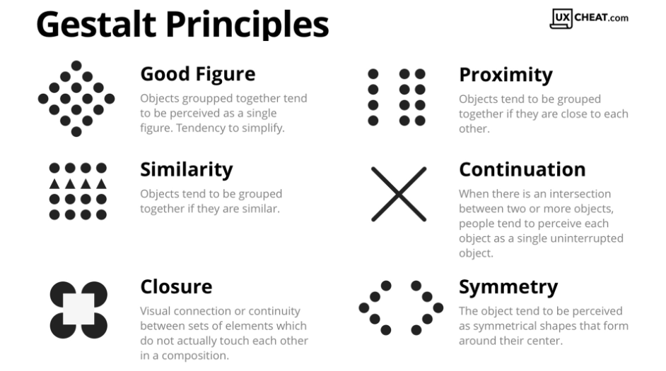
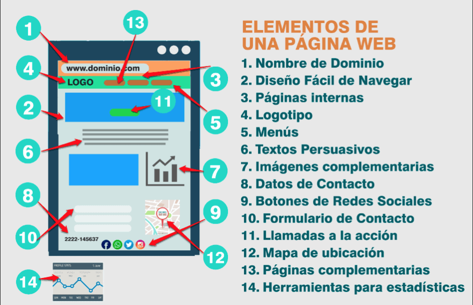

# **Introducción al Diseño Web**

Antes de sumergirnos en el mundo de **CSS**, es fundamental que los alumnos comprendan los principios básicos que rigen el diseño web y cómo estos principios impactan la experiencia del usuario. En esta sección abordaremos los **aspectos generales del diseño**, la **psicología del color**, la **tipografía**, y cómo estructuramos las páginas web de forma efectiva.

## **1. ¿Cómo percibe el usuario el diseño web?**

El diseño de una página web no es solo estéticamente atractivo, sino que también juega un papel crucial en **la experiencia del usuario**. Los usuarios suelen tomar decisiones rápidas sobre la **usabilidad** de un sitio web en los primeros segundos de interacción.

### **1.1 Principios de la psicología de la Gestalt aplicados al diseño web**

La **psicología de la Gestalt** estudia cómo los humanos organizan visualmente los elementos que perciben. Los principios básicos de esta teoría aplicados al diseño web son:

- **Proximidad**: Elementos cercanos entre sí se perciben como relacionados.
- **Similitud**: Elementos con características similares (color, forma, tamaño) se agrupan.
- **Cierre**: Tendemos a completar formas incompletas visualmente (por ejemplo, círculos o cuadrados).
- **Figura y fondo**: La forma principal es percibida como figura, mientras que el fondo es secundario.



### **1.2 La importancia de la estructura visual**

El diseño de la interfaz no solo depende de lo que se ve, sino también de cómo se organiza. Una correcta estructura facilita que los usuarios encuentren lo que necesitan. **Principales componentes de la interfaz**:  

- **Cabecera**: Contiene información de navegación esencial (logo, menú, etc.).  
- **Menú de navegación**: Un componente crucial para orientar al usuario dentro del sitio.  
- **Cuerpo de la página**: La parte donde se muestra la información principal.  
- **Pie de página**: Contiene información adicional o enlaces útiles (política de privacidad, contacto, etc.).


## **1.3 Elementos conceptuales del diseño web**

Los elementos conceptuales del diseño web son los principios que guían la creación de interfaces efectivas. No son visibles, no están de hecho, sino que parecen estar presentes.  


Algunos de los elementos más importantes son:

### 1.3.1 El punto

El punto es el elemento más simple del diseño. Puede ser **pequeño o grande, de color o neutro**. Los puntos pueden usarse para **llamar la atención, crear patrones o indicar direcciones**. Se define como el lugar donde se cruzan dos líneas.

### 1.3.2 La línea

Las líneas son uno de los elementos más básicos del diseño. Pueden ser **horizontales, verticales, diagonales o curvas**. Las líneas pueden usarse para **dividir espacios, crear patrones o guiar la mirada del usuario**. Se define como una sucesión de puntos. Forma el borde un un plano.

### 1.3.3 El plano

El plano es una superficie bidimensional que puede ser **rectangular, circular o irregular**. Los planos pueden usarse para **organizar información, crear jerarquías visuales o separar secciones**. Se define como una superficie plana que se extiende en dos dimensiones. Define los límites externos de un volumen.

### 1.3.4 El volumen

El volumen es un espacio tridimensional que puede ser **sólido, vacío o con textura**. Los volúmenes pueden usarse para **crear profundidad, realismo o sensación de espacio**. Se define como un espacio tridimensional que tiene longitud, anchura y altura.

## **1.4 Elementos visuales**

### 1.4.1 Forma

La forma es un elemento visual que puede ser **geométrica o orgánica**. Las formas pueden usarse para **crear patrones, estructurar información o destacar elementos**. Se define como la apariencia externa de un objeto.

### 1.4.2 medida

La medida es un elemento visual que se refiere al **tamaño de los elementos** en relación con otros elementos. La medida puede usarse para **crear jerarquías visuales, equilibrar el diseño o destacar elementos**. Se define como la dimensión de un objeto en relación con otra dimensión.

### 1.4.3 Textura

La textura es un elemento visual que se refiere a la **apariencia superficial de un objeto**. La textura puede ser **lisa, rugosa, brillante o mate**. Se define como la apariencia superficial de un objeto.

### 1.4.4 Color

El color es un elemento visual que se refiere a la **propiedad de los objetos de reflejar la luz**. El color puede usarse para **crear contraste, establecer jerarquías visuales o transmitir emociones**. Se define como la propiedad de los objetos de reflejar la luz en diferentes longitudes de onda.


## **1.5 Elementos de relación**

Los elementos de relación son los principios que guían la interacción entre los elementos de un diseño. Estos elementos se utilizan para **crear cohesión, equilibrio y flujo visual** en una interfaz.


### 1.5.1 Espacio

El espacio es un elemento de relación que se refiere a la **distancia entre los elementos**. El espacio puede usarse para **crear equilibrio, agrupar elementos o guiar la mirada del usuario**. Se define como la distancia entre los elementos en un diseño.


### 1.5.2 Dirección

La dirección es un elemento de relación que se refiere a la **orientación de los elementos**. La dirección puede usarse para **crear flujo visual, establecer jerarquías visuales o guiar la mirada del usuario**. Se define como la orientación de los elementos en un diseño.

### 1.5.3 Movimiento

El movimiento es un elemento de relación que se refiere al **cambio de posición de los elementos**. El movimiento puede usarse para **crear interés, destacar elementos o guiar la mirada del usuario**. Se define como el cambio de posición de los elementos en un diseño.

### 1.5.4 Proporción

La proporción es un elemento de relación que se refiere a la **relación entre los elementos**. La proporción puede usarse para **crear armonía, equilibrio o jerarquías visuales**. Se define como la relación entre los elementos en un diseño.

### 1.5.5 Gravedad

La gravedad es un elemento de relación que se refiere a la **sensación de peso de los elementos**. La gravedad puede usarse para **crear realismo, establecer jerarquías visuales o guiar la mirada del usuario**. Se define como la sensación de peso de los elementos en un diseño.

---

## **2. Principios básicos del diseño de interfaces web**

### **2.1 Mapa de navegación y prototipos**

Antes de comenzar a trabajar en el diseño visual, es importante crear un **mapa de navegación** para estructurar cómo el usuario se moverá por el sitio web. Los **prototipos** son representaciones visuales del sitio que muestran la jerarquía de los elementos.

En la imagen tenemos un ejemplo de cómo se organiza la información del sitio web y los pasos a seguir para realizar un proceso de compra. El mapa de navegación es una herramienta visual que muestra la estructura de un sitio web y cómo los usuarios pueden navegar por él.


En este otro ejemplo vemos de una página web principal de un sitio las opciones de navegación que se ofrecen al usuario.


### **2.2 Interacción persona-computadora**

La **interacción persona-computadora** es el estudio de cómo los usuarios interactúan con las interfaces digitales. Algunos principios básicos de interacción incluyen:

- **Retroalimentación**: Proporcionar información clara sobre las acciones del usuario.
- **Consistencia**: Mantener la interfaz coherente en todo el sitio.
- **Facilidad de uso**: Hacer que las tareas sean fáciles de realizar.


### **2.3 Cómo organizar la información**

Una interfaz debe ser organizada de manera **jerárquica**. Esto implica presentar la información de forma que los elementos más importantes se destaquen y los secundarios se ubiquen de manera coherente para evitar sobrecargar al usuario.

### **2.4 Componentes de una interfaz web**

Algunos de los componentes más comunes de una interfaz web son:

- Elementos de indentificación: Logo, nombre de la empresa.
- Elementos de navegación: Para acceder a las diferentes secciones del sitio.
- Elementos de contenido: Texto, imágenes, videos.
- Elementos de interacción: Botones, formularios, enlaces.



Los elementos de identificación y navegación suelen ubicarse en la **cabecera** de la página, mientras que el contenido principal se encuentra en el **cuerpo**. El **pie de página** suele contener información adicional y enlaces útiles.

Los elementos de navegación deben ser **claros y fáciles de usar**. Se recom
ienda utilizar **menús desplegables** o **hamburguesas** para sitios con muchas secciones.

Los elementos de contenido deben estar **bien estructurados** y **fácilmente accesibles**. Se recomienda utilizar **títulos y subtítulos** para organizar la información y **imágenes y videos** para hacerla más atractiva.

Los elementos de interacción deben ser **intuitivos** y **fáciles de usar**. Se recomienda utilizar **botones llamativos** y **formularios sencillos** para facilitar la interacción del usuario.

#### **2.4.1 Zona de navegación**

La zona de navegación es una parte crucial de la interfaz web, ya que permite a los usuarios moverse por el sitio de manera eficiente. Algunos elementos comunes de la zona de navegación son:

- **Menú de navegación**: Contiene enlaces a las diferentes secciones del sitio.
- **Breadcrumbs**: Muestra la ubicación actual del usuario en el sitio.
- **Botones de acción**: Permiten a los usuarios realizar acciones específicas.


Todas las páginas deben constar al menos de:

- Elemento de regreso a la página principal.
- Menú de secciones.
- Información sobre la ubicación actual dentro de la estructura de la web.

#### **2.4.2 Zona de contenido de interacción**

La zona de contenido de interacción es donde los usuarios interactúan con el sitio web. Algunos elementos comunes de la zona de contenido de interacción son:

- **Formularios**: Permiten a los usuarios enviar información al sitio.
- **Botones de acción**: Permiten a los usuarios realizar acciones específicas.
- **Enlaces**: Permiten a los usuarios navegar a otras páginas o secciones del sitio.

Es importante que los elementos de la zona de contenido de interacción sean **fáciles de usar** y **llamativos** para que los usuarios puedan interactuar con ellos de manera eficiente.

### **2.5 Maquetación web**

La **maquetación web** es el proceso de crear la estructura visual de una página web. Algunos principios básicos de maquetación incluyen:

- **Grids**: Utilizar **rejillas** para organizar los elementos de la página.
- **Espaciado**: Dejar **espacios en blanco** entre los elementos para mejorar la legibilidad.
- **Consistencia**: Mantener la **coherencia visual** en todo el sitio.

Para diseñar un sitio web, debemos comenzar por hacer una distribución de los grandes bloques de elementos de información. Una muestra de cómo suelen estar distribuidos estos grandes bloques se muestra en la imagen, aunque no todos los sitios web colocan estos bloques de la misma manera. Todo dependerá de la complejidad del sitio. Lo que sí es importante tener en cuenta, es que se debe ser consistente en el
diseño de todas las páginas del sitio. Todas ellas deben mantener una misma estructura. Este tema lo volveremos a tocar en el último apartado de la unidad que habla sobre las plantillas de diseño.


#### **2.5.1 Elementos de ordenación**

El *bloque de Encabezado* está situado siempre en la parte superior de cualquier página. Suele contener además de los elementos identificativos del sitio Web: el logotipo, el nombre de la empresa, elementos de acción que permiten cambiar el idioma de lectura, realizar búsquedas, e incluso, si el sitio es muy grande, puede contener elementos de navegación que permanecen a la vista en todas las páginas del sitio.

!!! note "Nota"
    El bloque de Encabezado se repite en todas las páginas de un sitio Web y debe permanecer visible en todas ellas siempre que sea posible y la complejidad del sitio nos lo permita.

El *bloque de Navegación* es donde se coloca el sistema de navegación del que ya hemos hablado en el apartado Zonas de navegación, contenido, interacción.

El *bloque de Contenido* es aquel en el que se muestran los contenidos. Los contenidos representan la meta del usuario y la razón por la que visita nuestro sitio Web por lo que debemos prestar mucha atención al diseño de este bloque. Debemos reservar una zona lo suficientemente grande para que el usuario pueda leer los contenidos cómodamente, sin necesidad de realizar grandes desplazamientos. Es importantísimo evitar que el usuario tenga que realizar desplazamientos horizontales para leer el final de cada línea.

El *bloque de Pie* de página está situado al final de la página y, al igual que el encabezado, se repite en todas las páginas del sitio. Normalmente se emplea el pie como zona de navegación complementaria a la zona superior situada en el encabezado. En ellas se repiten algunos enlaces que se suelen colocar en el encabezado como el enlace al Mapa del sitio (que veremos en el próximo apartado) o, el enlace a la información de contacto y, además, se colocan algunos enlaces nuevos como los enlaces a la información relativa a los derechos de autor, privacidad e información legal.


### **2.6 Mapa de navegación**

Cuando un sitio Web es muy grande y complejo, como el sitio del Ministerio de Educación y Ciencia, es conveniente tener un mapa del sitio que ayude a los usuarios a encontrar lo que buscan. En nuestro ejemplo, la página de portada permite consultar el Mapa del sitio tanto en el encabezado como en el pie de la página. Una vez pulsado el enlace del Mapa del sitio verás la imagen mostrada.

Las elipses sombreadas muestran la ubicación de los enlaces al Mapa del sitio tanto en la página de portada como en la propia página del mapa. También se ha sombreado el título Mapa Web que es lo que identifica el lugar en el que se encuentra el usuario.


!!! note "Nota"
    El mapa del sitio proporciona a los visitantes un lugar donde buscar de forma sencilla los contenidos que le interesan si es que no los ha encontrado ya en la página principal.

La obligación de crear un mapa del sitio es directamente proporcional a la complejidad y extensión de nuestro sitio. Así, si nuestro sitio consta de una única página donde sólo hay enlaces a páginas ajenas al sitio, no tendremos que poner un enlace al Mapa del sitio. Si por el contrario, nuestro sitio consta de una página principal de portada con enlaces a secciones, que a su vez están divididas en subsecciones, sí sería conveniente crear el Mapa del sitio y poner un enlace a él en la portada.

## **2.7 El color**

!!! note "Nota"
    El color es un elemento muy importante en el diseño de una página Web. El color puede ser utilizado para atraer la atención del usuario, para transmitir sensaciones, para organizar la información, para destacar elementos, etc.

Clasificaciones de los colores:

- Colores primarios, secundarios y terciarios.

   Los colores primarios son el rojo, el azul y el amarillo. Los colores secundarios son el naranja, el verde y el violeta. Los colores terciarios son los que se obtienen mezclando un color primario con uno secundario.

- Colores cálidos y fríos.

    Los colores cálidos son los que se asocian con el fuego y el sol, como el rojo, el naranja y el amarillo. Los colores fríos son los que se asocian con el agua y el hielo, como el azul, el verde y el violeta.

- Colores complementarios, análogos y monocromáticos.

    Los colores complementarios son los que se encuentran en lados opuestos del círculo cromático, como el rojo y el verde. Los colores análogos son los que se encuentran cerca en el círculo cromático, como el azul y el violeta. Los colores monocromáticos son diferentes tonos de un mismo color, como el azul claro y el azul oscuro.

### **2.7.1 Sistema RGB**

El sistema RGB (Red, Green, Blue) es un sistema de colores aditivos que se utiliza en pantallas digitales. En este sistema, los colores se crean mezclando diferentes cantidades de rojo, verde y azul. Por ejemplo, el color blanco se crea mezclando cantidades iguales de rojo, verde y azul.

Los ordenadores emplean estos tres colores para representar cualquier color de la escala cromática. Pero ¿cómo lo hace? El ordenador utiliza 8 bits de información para representar cada color. La escala monocromática de un color viene dada por todas las posibles combinaciones de estos 8 bits, en total 256. Si tenemos en cuenta que tenemos una escala de 0 a 255 para representar cada color, es decir, 256 grados de cada color y, que el resto de los colores se consiguen mezclando estos tres ¿cuántos colores tenemos en total? Para saberlo tenemos que calcular todas las combinaciones que existen multiplicando tres veces el número de grados de cada color: 256 x 256 x 256, lo que nos da 16.777.216 colores.

[Página para obtener códigos de colores](https://htmlcolorcodes.com/es/)

### **2.7.2 Colores seguros**

Los colores seguros son aquellos que se muestran correctamente en la mayoría de los navegadores y sistemas operativos. Algunos colores seguros son el blanco, el rojo, el azul y el verde. Es importante utilizar colores seguros para garantizar que la página se vea correctamente en todos los dispositivos.


---

## **3. Uso del color y tipografía en diseño web**

### **3.1 Psicología del color**

El color tiene un **gran impacto en cómo los usuarios perciben una página web**. La elección de los colores debe basarse en la **psicología del color**:  

- **Rojo**: Estimula la acción, energía, pasión.  
- **Azul**: Confianza, serenidad, profesionalismo.  
- **Verde**: Crecimiento, calma, naturaleza.  
- **Amarillo**: Optimismo, alerta, creatividad.  
- **Negro y blanco**: Profesionalismo, simplicidad.

### **3.2 Buenas prácticas con la tipografía**

La tipografía adecuada puede marcar la diferencia entre un diseño efectivo y uno difícil de leer. Para sitios web, se recomienda usar fuentes **legibles** y **consistentes**. Algunas fuentes más comunes en la web son **Roboto**, **Arial** y **Helvetica**. Además, se debe asegurar que el **tamaño de la fuente** sea adecuado y que haya un buen **contraste** entre el texto y el fondo.

### **3.3 Fotos y logos**

Los recursos gráficos se emplean mucho en la Web. Si se utilizan adecuadamente, pueden mejorar el aprendizaje del usuario y añadir valor a nuestro sitio. Ahora bien, si se utilizan inadecuadamente, producen el efecto contrario. A la hora de emplear imágenes en la Web, debemos tener en cuenta que las imágenes son archivos que tienen un tamaño y que para poder visualizarse correctamente deben descargarse previamente. Por esta razón, sólo usaremos aquellas imágenes que complementen nuestro sitio Web y trataremos de evitar aquellas cuya única finalidad sea adornar nuestro sitio.

Lo que nos importa ahora es la información que se debe reflejar en una guía de estilo respecto a los recursos gráficos de este tipo.
Una guía debe indicar al equipo de desarrollo de la interfaz los siguientes puntos:

- Formato. El tipo de formato en el que deberán estar almacenadas la imágenes o logotipos empleados.
- Tamaño. El tamaño de la imagen o logotipo que se establece dando las medidas de ancho y alto en píxeles.

Hay que tener en cuenta además, que se deben incluir todos los tamaños posibles que pueden tener las imágenes o logotipos según su funcionalidad o el lugar de la página donde irán situados, ya que no es lo mismo una imagen que vaya en la zona de contenidos que una imagen que se utilice en la cabecera de las páginas del sitio como distintivo de la organización, ni tampoco es lo mismo si la imagen se emplea en el sistema de navegación o en el pie de la página.

---

## **4. ¿Qué es la accesibilidad en diseño web?**

El diseño accesible asegura que todos los usuarios, incluyendo aquellos con **discapacidad visual, auditiva o motora**, puedan interactuar con la página web sin barreras. Algunos principios básicos de accesibilidad incluyen:

- **Contraste adecuado** entre texto y fondo.
- **Navegación por teclado**: Asegurarse de que los usuarios puedan navegar por el sitio solo con el teclado.
- **Etiquetas descriptivas** para imágenes, botones y enlaces.

---

## **5. Diseño Responsivo y Flexibilidad**

Aquí tienes el contenido completo del **punto 5.1 Media Queries** para que puedas copiarlo directamente:

---

# **Diseño Responsivo con Media Queries**

El **diseño responsivo** es un enfoque de diseño web que permite crear páginas capaces de adaptarse a **diferentes tamaños de pantalla** y **tipos de dispositivos**. En lugar de crear una versión diferente de un sitio web para cada dispositivo (móvil, tablet, desktop), el diseño responsivo permite que el mismo código se ajuste dinámicamente a las características del dispositivo del usuario, como el **ancho de la pantalla**, **resolución** y **orientación**.

## **5.1 ¿Qué son las Media Queries?**

Las **media queries** son reglas en **CSS** que permiten aplicar estilos condicionados a ciertos **factores del dispositivo**. Por ejemplo, podemos cambiar el diseño de un sitio web si se visualiza en una pantalla pequeña de teléfono móvil o en una pantalla grande de escritorio.

### **Sintaxis básica de las Media Queries**

La sintaxis de una media query es simple, utilizando la palabra clave **`@media`** seguida de una condición. Un ejemplo básico sería:

```css
@media only screen and (max-width: 600px) {
    body {
        background-color: lightgray;
    }
}
```

En este caso, **`@media`** indica que estamos definiendo una regla especial de estilo dependiendo de las condiciones del dispositivo. La condición en este caso es que la **pantalla tenga un ancho máximo de 600px**. Si el dispositivo cumple con esta condición, los estilos dentro de la media query se aplicarán (en este caso, se cambia el color de fondo del `body` a gris claro).

### **Condiciones comunes en las Media Queries**

Existen varias condiciones que podemos usar para determinar el estilo que debe aplicarse a un dispositivo, las más comunes son:

- **`max-width`**: Define el **ancho máximo** de la pantalla. Se usa para dispositivos con pantallas más pequeñas.
- **`min-width`**: Define el **ancho mínimo** de la pantalla. Usado para dispositivos con pantallas más grandes.
- **`max-height`** y **`min-height`**: Se aplican según la altura de la pantalla.
- **`orientation`**: Permite aplicar estilos dependiendo de la **orientación** del dispositivo (horizontal o vertical).

### **Ejemplos prácticos de Media Queries**

#### **1. Cambiar el diseño en función del ancho de la pantalla**

Imaginemos que queremos que nuestra página se vea diferente en dispositivos móviles y en ordenadores de escritorio. Podemos utilizar `min-width` y `max-width` para hacerlo:

```css
/* Para pantallas pequeñas (móviles) con un ancho máximo de 600px */
@media only screen and (max-width: 600px) {
    body {
        background-color: lightgray;
    }
    .header {
        font-size: 14px;
    }
}

/* Para pantallas grandes (escritorio) con un ancho mínimo de 600px */
@media only screen and (min-width: 601px) {
    body {
        background-color: white;
    }
    .header {
        font-size: 24px;
    }
}
```

En este ejemplo, los estilos se ajustan en función del **ancho de la pantalla**. Si el ancho es menor a 600px (pantallas móviles), se aplica un fondo gris claro y un tamaño de fuente pequeño. Si el ancho es mayor a 600px (pantallas de escritorio), se aplican otros estilos.

#### **2. Cambiar el diseño según la orientación del dispositivo**

Las **media queries** también permiten cambiar el diseño según la **orientación** del dispositivo (vertical u horizontal). Aquí un ejemplo para cambiar el diseño de un menú dependiendo de si el dispositivo está en modo retrato o paisaje:

```css
/* Para dispositivos en orientación vertical (portrait) */
@media only screen and (orientation: portrait) {
    .menu {
        display: block;
    }
}

/* Para dispositivos en orientación horizontal (landscape) */
@media only screen and (orientation: landscape) {
    .menu {
        display: flex;
    }
}
```

Este ejemplo muestra cómo aplicar estilos diferentes en función de la **orientación** del dispositivo. En **modo vertical**, el menú se muestra como un bloque, mientras que en **modo horizontal** el menú se organiza en un **layout flexible**.

#### **3. Mejorar la visualización en pantallas de alta resolución**

Las pantallas con **alta resolución** como los **dispositivos Retina** tienen una densidad de píxeles mucho mayor. Para mejorar la visualización de imágenes, podemos utilizar una media query que apunte a dispositivos con **alta densidad de píxeles**:

```css
@media only screen and (min-resolution: 192dpi) {
    img {
        width: 100%;
        height: auto;
    }
}
```

Con esta media query, si el dispositivo tiene una resolución de 192dpi o mayor, las imágenes se ajustarán para ofrecer una mejor calidad en dispositivos de **alta definición**.

---

### **¿Cuándo usar las Media Queries?**

El uso de **media queries** es fundamental para crear **diseños web responsivos**. Al utilizar estas reglas, podemos asegurarnos de que el sitio web se **adapte adecuadamente** a dispositivos de **pantallas pequeñas** como **móviles**, **tablets** y **pantallas grandes** como **monitores de escritorio.** 

**Recomendación:** El diseño responsivo mejora la **experiencia del usuario** y ayuda a **incrementar la accesibilidad**. No olvides probar tu sitio en diferentes dispositivos para asegurar que el diseño sea correcto en todas las resoluciones.

---

## **Ejercicio práctico: Diseño responsivo con Media Queries**

!!! question "Ejercicio: Crear una página web responsiva"
    - Crea una página web con una estructura básica que incluya un encabezado, un cuerpo y un pie de página.
    - Aplica **media queries** para que la página sea responsiva. Asegúrate de que se vea bien en pantallas pequeñas y grandes.
    - **Tip:** Usa `max-width` para adaptar los estilos a pantallas pequeñas y `min-width` para pantallas grandes.

??? example "Solución"
    ```html linenums="1" title="HTML Base para ejercicio"
    <!DOCTYPE html>
    <html lang="es">
    <head>
        <meta charset="UTF-8">
        <meta name="viewport" content="width=device-width, initial-scale=1.0">
        <title>Diseño Responsivo</title>
        <style>
            /* Estilos base */
            body {
                font-family: Arial, sans-serif;
                margin: 0;
                padding: 0;
            }

            header {
                background-color: #4CAF50;
                padding: 10px;
                text-align: center;
                color: white;
            }

            footer {
                background-color: #4CAF50;
                padding: 10px;
                text-align: center;
                color: white;
                position: fixed;
                width: 100%;
                bottom: 0;
            }

            /* Media Queries */
            @media only screen and (max-width: 600px) {
                body {
                    background-color: lightgray;
                }
                header {
                    font-size: 14px;
                }
                footer {
                    font-size: 12px;
                }
            }

            @media only screen and (min-width: 601px) {
                body {
                    background-color: white;
                }
                header {
                    font-size: 24px;
                }
                footer {
                    font-size: 18px;
                }
            }
        </style>
    </head>
    <body>
        <header>
            <h1>Bienvenido a la página responsiva</h1>
        </header>

        <main>
            <p>Este es un ejemplo de una página web responsiva utilizando media queries.</p>
        </main>

        <footer>
            <p>© 2025 Diseño Responsivo</p>
        </footer>
    </body>
    </html>
    ```

---

## 6.Ejercicios prácticos:

!!! question "Ejercicio: Analizar un sitio web y aplicar principios de diseño"  
    - Elige una página web conocida (como una tienda online o una página corporativa).
    - Realiza un análisis sobre los principios de diseño aplicados:
    - ¿Cómo organizan la información?
    - ¿Es la tipografía adecuada?
    - ¿El contraste de colores es adecuado?
    - ¿Es la página accesible?
    - Escribe un breve informe con tus observaciones y sugerencias de mejora.

!!! question "Ejercicio: Crear un prototipo de página web con WIX o Canva"
    - Utiliza una herramienta de diseño web como WIX o Canva.
    - Vamos a crear una web para vender ropa de segunda mano.
    - Crea un prototipo de una página web con los elementos básicos (cabecera, menú, contenido, pie de página).
    - Aplica los principios de diseño aprendidos en este módulo.
    - Comparte tu prototipo con tus compañeros y pide feedback.


**Conclusión**
El diseño web no se trata solo de hacer una página visualmente atractiva, sino de crear una experiencia de usuario fluida y accesible. Aprender los principios de diseño es crucial para lograr interfaces que no solo se vean bien, sino que también sean funcionales y agradables de usar.

Ahora que entendemos los fundamentos de CSS y los principios de diseño, podemos comenzar a aplicar estos conceptos para crear interfaces web efectivas utilizando CSS3.
