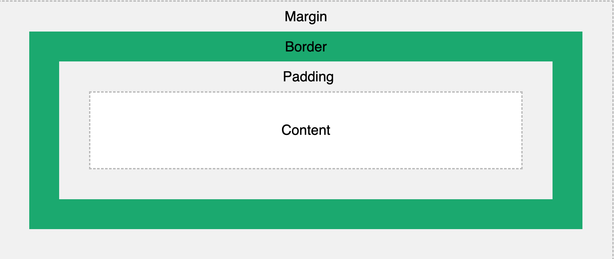
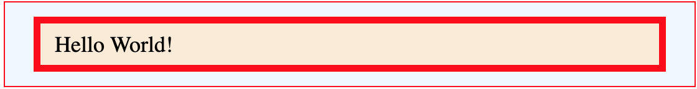
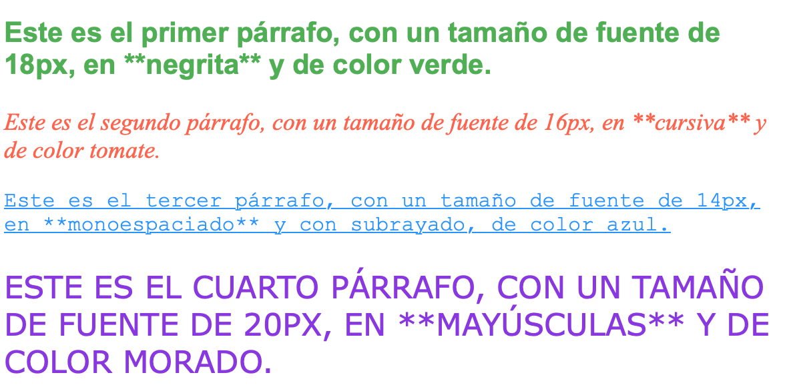
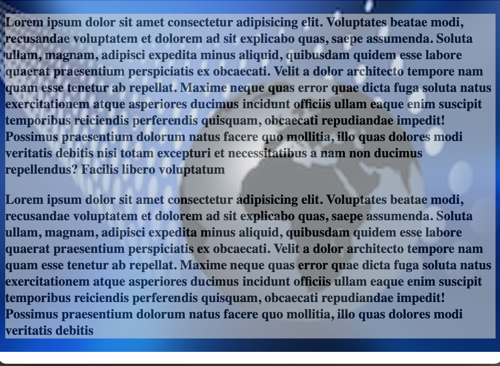
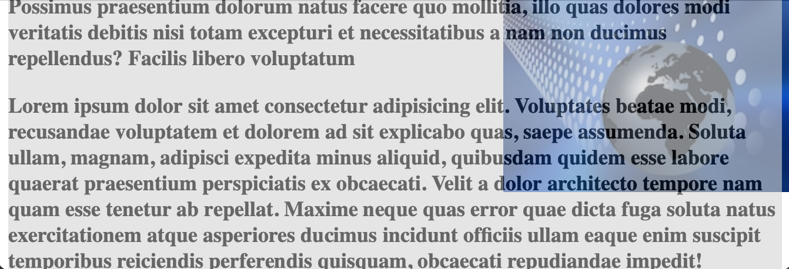
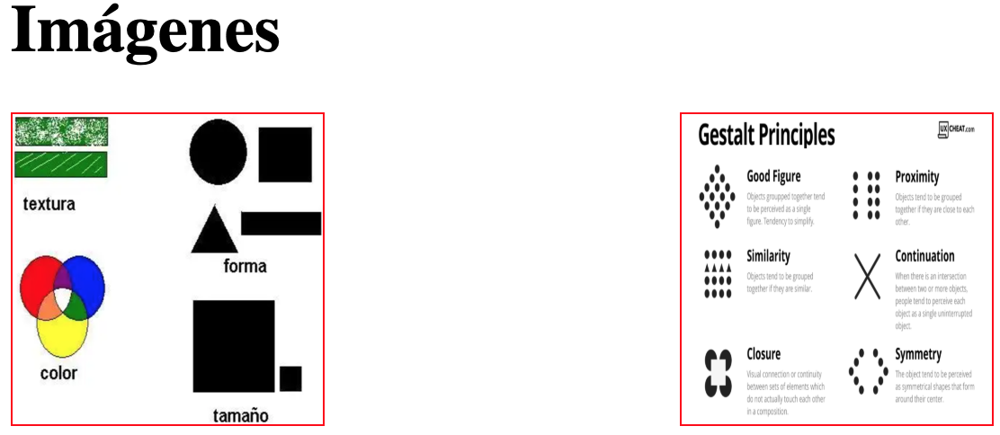
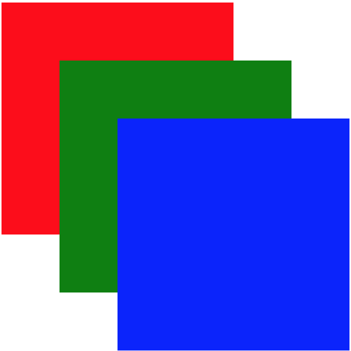
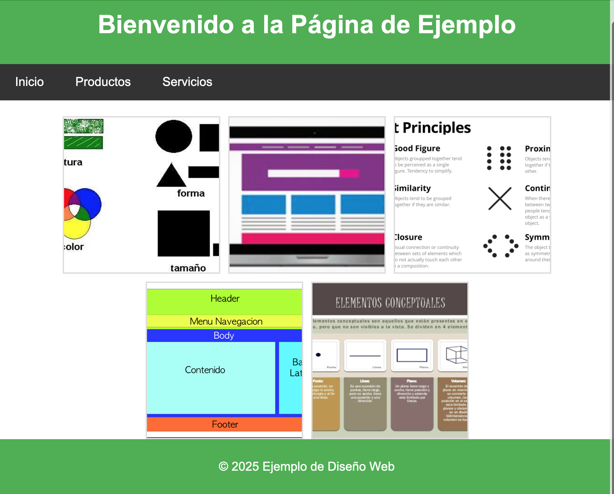
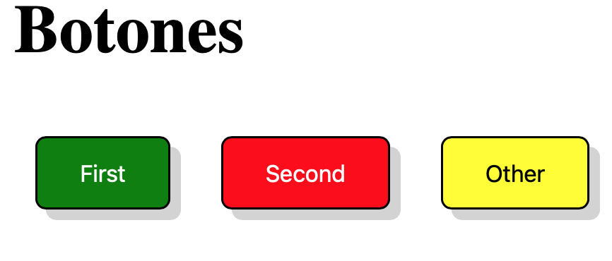

# **Introducción a CSS (Cascading Style Sheets)**

**CSS** es un lenguaje de estilos que se usa para definir la presentación de un documento HTML o XML. Con CSS podemos darle formato a las páginas web, definiendo aspectos visuales como **colores**, **tipografías**, **espaciado**, **disposición de los elementos** y muchos más. En este primer contacto con CSS, nos enfocaremos en los aspectos básicos que los alumnos deben conocer para comenzar a aplicar estilos en una página web.

## **1. Añadir Estilos a un Documento con CSS**

Existen varias formas de agregar estilos CSS a una página web:

### **1.1 Estilos en línea (Inline CSS)**

Los estilos en línea se aplican directamente en el atributo `style` de los elementos HTML.

```html
<p style="color: red; font-size: 16px;">
  Este es un texto con estilo en línea.
</p>
```

### **1.2 Estilos internos (Internal CSS)**

Los estilos internos se colocan dentro de una etiqueta `<style>` en la sección `<head>` del documento HTML.

```html
<head>
  <style>
    p {
      color: blue;
      font-size: 18px;
    }
  </style>
</head>
<body>
  <p>Este es un texto con estilo interno.</p>
</body>
```

### **1.3 Estilos externos (External CSS)**

Los estilos externos se definen en un archivo separado con extensión `.css`, y se vinculan al documento HTML mediante el atributo `link`.

```html
<head>
  <link rel="stylesheet" type="text/css" href="styles.css" />
</head>
<body>
  <p>Este es un texto con estilo externo</p>
</body>
```

```css
p {
  color: blue;
  font-size: 18px;
}
```

---

## **2. Conceptos Clave de CSS**

### **2.1 Estructura y Herencia en CSS**

CSS es un lenguaje basado en **reglas de estilo**. Cada regla consta de un **selector** (elemento al que se aplica) y una **declaración** (propiedad y valor). Además, los elementos en CSS pueden heredar propiedades de sus elementos padres.

Sintaxis:

```text
    selector {
        prop1: valor1;
        prop2: valor2;
        ...
        ...
        propn:valorn;
    }
```

En el ejemplo siguiente los elementos `<p>`serán hijos de `<body>`y por tanto heredarán sus reglas.

```html
/* Ejemplo de herencia en CSS */
<html>
  <head>
    <style>
      body {
        font-family: Arial, sans-serif;
      }
      p {
        font-size: 16px; /* Los párrafos heredarán esta fuente */
      }
    </style>
  </head>
  <body>
    <h1>Herencia</h1>
    <p>Este párrafo tiene las propiedades CSS de body y de p</p>
  </body>
</html>
```

### **2.2 Reglas de Estilo en Conflicto (Especificidad)**

La **especificidad** en CSS es un sistema que determina qué reglas se aplican a un elemento cuando hay varias reglas que podrían coincidir con el mismo. Este concepto es fundamental para **resolver conflictos** entre reglas CSS. En otras palabras, si hay dos o más reglas que podrían aplicarse al mismo elemento, el navegador utiliza un sistema de **especificidad** para decidir cuál aplicar.

### **¿Cómo se calcula la especificidad?**

La especificidad de una regla se calcula tomando en cuenta los **tipos de selectores** que la componen. La regla de especificidad se mide con un **puntaje** basado en diferentes categorías de selectores. Cuanto mayor sea el puntaje, más específica será la regla y, por tanto, tendrá **mayor prioridad**.

La **especificidad** se calcula de la siguiente manera:

1. **Selectores de ID**: Cada selector de ID (`#id`) tiene un valor de **100**.
2. **Selectores de clase, atributos y pseudoclases**: Cada selector de clase (`.clase`), atributos (`[attr=value]`) o pseudoclase (`:hover`) tiene un valor de **10**.
3. **Selectores de elementos y pseudoelementos**: Cada selector de tipo de elemento (`div`, `p`, `a`) o pseudoelemento (`::before`, `::after`) tiene un valor de **1**.
4. **Selectores universales** (`*`) y combinadores como `+` o `>` tienen **0** de especificidad.

El puntaje final de una regla de CSS es una combinación de estos valores, representada en formato **(a, b, c, d)**, donde:

- **a** es el número de ID.
- **b** es el número de clases, pseudoclases y atributos.
- **c** es el número de elementos y pseudoelementos.
- **d** es el valor de selectores universales o combinadores, que siempre es **0**.

### **Ejemplos de especificidad**

1. **Selector de tipo de elemento**

   ```css
   p {
     color: red;
   }
   ```

   La especificidad es **(0, 0, 1, 0)** porque es un **selector de tipo de elemento** (el `<p>`).

2. **Selector de clase**

   ```css
   .mi-clase {
     color: blue;
   }
   ```

   La especificidad es **(0, 1, 0, 0)** porque es un **selector de clase** (`.mi-clase`).

3. **Selector de ID**

   ```css
   #mi-id {
     color: green;
   }
   ```

   La especificidad es **(1, 0, 0, 0)** porque es un **selector de ID** (`#mi-id`).

4. **Combinación de selectores**

   ```css
   div.mi-clase p {
     color: yellow;
   }
   ```

   La especificidad es **(0, 1, 1, 0)** porque hay un **selector de clase** (`.mi-clase`) y un **selector de tipo de elemento** (`div`, `p`).

5. **Uso de `!important`**  
   Aunque **`!important`** no afecta la especificidad numérica, **aumenta la prioridad** de la regla sin tener en cuenta la especificidad.

   ```css
   #mi-id {
     color: purple !important;
   }
   ```

   La especificidad es **(1, 0, 0, 0)**, pero como tiene **`!important`**, esta regla tiene la **máxima prioridad**, incluso si hay otras reglas más específicas.

### **¿Qué pasa cuando las reglas tienen la misma especificidad?**

Cuando dos reglas tienen la misma especificidad, la **última** regla en el archivo CSS o en la hoja de estilos será la que se aplique. Esto es lo que se conoce como el **orden de aparición**.

```css
p {
  color: green;
}

p {
  color: red;
}
```

En este caso, el color de los párrafos será **rojo**, porque la segunda regla se encuentra después de la primera, **a pesar de que ambas tienen la misma especificidad**.

### **Ejemplo de cómo se calcula la especificidad**

#### **Ejemplo 1:**

```css
#menu a {
  color: green;
}

.menu a {
  color: red;
}
```

- **`#menu a`** tiene una especificidad de **(1, 0, 1, 0)**.
- **`.menu a`** tiene una especificidad de **(0, 1, 1, 0)**.

En este caso, **`#menu a`** es más específico, así que la regla de color será **verde**.

#### **Ejemplo 2:**

```css
div p {
  color: blue;
}

div p.highlight {
  color: yellow;
}
```

- **`div p`** tiene una especificidad de **(0, 0, 2, 0)**.
- **`div p.highlight`** tiene una especificidad de **(0, 1, 2, 0)**.

La regla **`div p.highlight`** será la que prevalezca, aplicando **color amarillo**.

---

### **Resumen**

La **especificidad** es un concepto clave en CSS para resolver conflictos entre reglas de estilo. El navegador siempre aplica la regla con **mayor especificidad**. Si dos reglas tienen la misma especificidad, la última definida es la que se aplica. Además, el uso de **`!important`** puede sobrescribir cualquier regla, independientemente de su especificidad.

---

### **2.3 Selectores en CSS**

Los **selectores** en CSS permiten elegir qué elementos HTML queremos estilizar. Los tipos más comunes son:

- **Selectores de Elemento**: Selecciona todos los elementos de un tipo específico.

```css
p {
  color: green;
}
```

- **Selectores Contextuales**: Seleccionan un elemento solo si está dentro de otro.

```css
article p {
  color: purple;
}
```

- **Selectores de Clase e ID**: Seleccionan los elementos con una clase o ID específica.

```css
/* Selector de clase */
.miClase {
  color: orange;
}
/* Selector de ID */
#miId {
  color: red;
}
```

---

#### 2.3.1 **Pseudoselectores en CSS**

Los **pseudoselectores** son selectores especiales que permiten seleccionar un **estado específico** de un elemento o elementos que cumplen con ciertos criterios, sin tener que agregar clases adicionales. Son muy útiles para aplicar estilos de manera más eficiente y dinámica, y se utilizan en varias situaciones comunes.

**1. Tipos de Pseudoselectores en CSS**

**1.1 `:hover`**

El pseudoselector `:hover` se utiliza cuando el **usuario pasa el ratón** sobre un elemento, permitiendo cambiar su estilo. Es muy utilizado para **botones**, **enlaces** y **imágenes**.

**Ejemplo**: Cambiar el color de un enlace al pasar el ratón por encima.

```css
/* Cambiar el color de los enlaces al pasar el ratón */
a:hover {
  color: red;
}
```

**1.2 `:active`**

El pseudoselector `:active` se aplica cuando un elemento está siendo **activado por el usuario**, generalmente durante la interacción, como cuando un botón es presionado.

**Ejemplo**: Cambiar el color de un botón cuando se hace clic en él.

```css
/* Cambiar el color de un botón al ser presionado */
button:active {
  background-color: green;
}
```

**1.3 `:focus`**

El pseudoselector `:focus` se aplica a un elemento cuando recibe el **foco de entrada**. Es muy útil para estilizar elementos interactivos como **campos de formulario** y **botones de búsqueda**.

**Ejemplo**: Cambiar el borde de un campo de texto cuando está enfocado.

```css
/* Cambiar el borde de un campo de texto cuando tiene el foco */
input:focus {
  border-color: blue;
  outline: none;
}
```

**1.4 `:nth-child()`**

El pseudoselector `:nth-child()` selecciona elementos en función de su **posición** dentro de su **padre**. Puedes usarlo para seleccionar un elemento en una posición específica o crear patrones con los elementos.

**Ejemplo**: Seleccionar el primer párrafo dentro de un contenedor y darle un estilo diferente.

```css
/* Estilizar el primer párrafo dentro de un contenedor */
div p:nth-child(1) {
  color: orange;
}
```

Puedes usar valores como **`odd`** (impares) o **`even`** (pares), o incluso expresar una **fórmula** como `2n+1` para seleccionar elementos específicos en una secuencia.

**1.5 `:first-child`**

El pseudoselector `:first-child` selecciona el **primer hijo** de un elemento padre. Es útil cuando quieres aplicar un estilo solo al primer elemento dentro de un contenedor.

**Ejemplo**: Seleccionar el primer elemento de una lista y darle un estilo diferente.

```css
/* Estilizar el primer ítem de una lista */
ul li:first-child {
  font-weight: bold;
}
```

**1.6 `:last-child`**

El pseudoselector `:last-child` selecciona el **último hijo** de un elemento padre.

**Ejemplo**: Cambiar el estilo del último párrafo de un contenedor.

```css
/* Estilizar el último párrafo dentro de un contenedor */
div p:last-child {
  font-style: italic;
}
```

**1.7 `:nth-of-type()`**

El pseudoselector `:nth-of-type()` es similar a `:nth-child()`, pero solo selecciona elementos de un tipo específico (por ejemplo, `<p>`, `<div>`, etc.), ignorando otros tipos de elementos dentro del mismo contenedor.

**Ejemplo**: Seleccionar el segundo párrafo de un contenedor que solo tiene párrafos.

```css
/* Seleccionar el segundo párrafo en un contenedor */
div p:nth-of-type(2) {
  color: blue;
}
```

**1.8 `:not()`**

El pseudoselector `:not()` permite excluir ciertos elementos de un conjunto de selecciones. Es útil para aplicar estilos a todos los elementos, excepto a los que coinciden con un determinado selector.

**Ejemplo**: Seleccionar todos los párrafos excepto los de clase `.excluir`.

```css
/* Aplicar estilos a todos los párrafos, excepto los de clase `.excluir` */
p:not(.excluir) {
  color: green;
}
```

[tabla maquetada con pseudoselectores](./img/img14.png)

??? example "Tabla maquetada con pseudoselectores"
```html linenums=1 title="tabla maquetada"
<!DOCTYPE html>
<html lang="es">
<head>
<meta charset="UTF-8">
<meta name="viewport" content="width=device-width, initial-scale=1.0">
<title>Tabla de Alumnos</title>
<style>
table {
width: 100%;
border-collapse: collapse;
}

            th, td {
                padding: 8px;
                text-align: center;
                border: 1px solid #ddd;
            }

            th {
                background-color: #4CAF50;
                color: white;
            }

            tr:nth-child(even) {
                background-color: #f2f2f2;
            }

            tr:nth-child(odd) {
                background-color: #ffffff;
            }

            tr:last-child {
                background-color: #f4e1c1;
                font-weight: bold;
            }

            tr:last-child td {
                background-color: #f4e1c1;
            }

            tr:last-child td:first-child::before {
                content: "Subtotal: ";
                font-weight: normal;
            }

        </style>
    </head>
    <body>

    <table>
        <thead>
            <tr>
                <th>ID</th>
                <th>Nombre</th>
                <th>CSS</th>
                <th>HTML</th>
                <th>JS</th>
                <th>Media</th>
            </tr>
        </thead>
        <tbody>
            <tr>
                <td>1</td>
                <td>Ana García</td>
                <td>8</td>
                <td>7</td>
                <td>9</td>
                <td>8</td>
            </tr>
            <tr>
                <td>2</td>
                <td>José Martínez</td>
                <td>6</td>
                <td>7</td>
                <td>6</td>
                <td>6.33</td>
            </tr>
            <tr>
                <td>3</td>
                <td>Pedro Fernández</td>
                <td>9</td>
                <td>8</td>
                <td>9</td>
                <td>8.67</td>
            </tr>
            <tr>
                <td>4</td>
                <td>Laura Rodríguez</td>
                <td>7</td>
                <td>6</td>
                <td>8</td>
                <td>7</td>
            </tr>
            <tr>
                <td>5</td>
                <td>Carlos López</td>
                <td>6</td>
                <td>6</td>
                <td>7</td>
                <td>6.33</td>
            </tr>
            <tr>
                <td></td>
                <td><b>Total</b></td>
                <td>36</td>
                <td>34</td>
                <td>39</td>
                <td>7.47</td>
            </tr>
        </tbody>
    </table>

    </body>
    </html>
    ```

---

#### Ejemplo Práctico: Cambiar el color de un elemento al pasar el ratón por encima\*\*

**HTML Base**

```html
<!DOCTYPE html>
<html lang="es">
  <head>
    <meta charset="UTF-8" />
    <meta name="viewport" content="width=device-width, initial-scale=1.0" />
    <title>Ejemplo de Pseudoselectores</title>
    <style>
      /* Cambiar color de los elementos al pasar el ratón por encima */
      .miElemento:hover {
        color: red;
      }
    </style>
  </head>
  <body>
    <h1>Prueba de Pseudoselectores</h1>
    <p class="miElemento">
      Pasa el ratón sobre este texto para cambiar su color.
    </p>
  </body>
</html>
```

En este ejemplo, se usa el pseudoselector **`:hover`** para cambiar el color del texto a **rojo** cuando el usuario pasa el ratón sobre el elemento con la clase `.miElemento`.

**Explicación**:

- **`p.miElemento:hover`**: Aquí, el pseudoselector **`:hover`** aplica el estilo cuando el ratón pasa sobre el párrafo con la clase `miElemento`.
- **`color: red;`**: Cambia el color del texto a **rojo**.

Este ejemplo es **simple y directo**, permitiendo a los alumnos ver cómo los pseudoselectores pueden ser usados para crear interactividad en una página web de manera fácil y eficiente.

---

## **Resumen**

Los pseudoselectores en CSS son herramientas poderosas para aplicar estilos específicos a los elementos según su estado o posición en el DOM. Al comprender cómo utilizar **`:hover`**, **`:focus`**, **`:nth-child()`**, y otros, los alumnos podrán crear interfaces web más dinámicas e interactivas, mejorando la **experiencia del usuario**.

---

### **2.4 La palabra clave `!important`**

La palabra clave `!important` fuerza la aplicación de una regla, incluso si existe una regla más específica.

```css
p {
  color: black !important;
}
```

---

## **3. El Modelo de Cajas de CSS**

El **modelo de cajas** es un concepto esencial en CSS. Cada elemento en una página web se representa como una caja rectangular que consta de varias partes:



En CSS, cada elemento en la página web se representa como una **caja rectangular**. Cada caja se compone de varias áreas que controlan su **tamaño, espaciado y posición**. En este punto ampliamos la explicación de las propiedades más importantes que definen cómo se organizan estos espacios, además de cómo se utilizan las propiedades **top, right, bottom y left** para controlar la **ubicación** de los elementos.

## **3.1 Área de Contenido y Relleno (Padding)**

El **contenido** es la parte principal del elemento (por ejemplo, el texto o la imagen), y el **relleno** (padding) es el espacio entre el contenido y el borde del elemento. Esto permite que el contenido no esté directamente contra el borde del contenedor, dándole un respiro visual.

### **Propiedad `padding`**

La propiedad `padding` puede tener uno o más valores. Si solo se define un valor, este se aplica de manera uniforme a los cuatro lados del elemento.

```css
div {
  padding: 10px;
  border: 1px solid black;
  width: 200px;
  height: 100px;
}
```

Este código aplica **10px de relleno** alrededor del contenido, y un borde de **1px de color negro**. La propiedad `width` y `height` definen las dimensiones del contenedor.

Si se desea aplicar diferentes valores de relleno a cada lado del elemento, podemos usar la siguiente sintaxis:

### **Propiedad `padding` con valores separados**

```css
div {
  padding: 10px 20px 30px 40px;
}
```

En este caso, el orden de los valores es:

- **top**: 10px
- **right**: 20px
- **bottom**: 30px
- **left**: 40px

De esta manera, puedes ajustar el **relleno** en cada lado del contenedor.

## **3.2 Bordes (Border)**

El borde rodea el contenido y el relleno de un elemento. Se puede personalizar su **grosor**, **estilo** y **color**. El borde está **por fuera del padding**, lo que lo convierte en una zona visual importante para separar elementos.

### **Propiedad `border`**

```css
div {
  border: 2px solid blue;
}
```

Este código aplica un **borde de 2px** de grosor y **color azul**. Los valores de la propiedad `border` son:

- **Grosor**: `2px`
- **Estilo**: `solid` (puede ser `dotted`, `dashed`, `double`, etc.)
- **Color**: `blue`

Si deseas aplicar cada propiedad por separado, puedes usar las siguientes propiedades: `border-width`, `border-style`, `border-color`.

```css
div {
  border-width: 2px;
  border-style: solid;
  border-color: blue;
}
```

### **Propiedades para bordes de cada lado**

Al igual que con el padding, podemos aplicar **bordes individuales** a cada lado del elemento. Esto se hace con las propiedades `border-top`, `border-right`, `border-bottom`, y `border-left`.

```css
div {
  border-top: 2px solid red;
  border-right: 1px dashed green;
  border-bottom: 3px dotted blue;
  border-left: 5px double black;
}
```

## **3.3 Márgenes (Margin)**

El **margen** es el espacio **exterior** de la caja, separando el elemento de otros elementos. Al igual que el **padding**, se puede aplicar de manera uniforme o con valores diferentes para cada lado.

### **Propiedad `margin`**

```css
div {
  margin: 20px;
}
```

Este código aplica **20px de margen** alrededor de un elemento, separándolo de los elementos cercanos.

### **Propiedad `margin` con valores separados**

```css
div {
  margin: 10px 20px 30px 40px;
}
```

Aquí el orden de los valores es el mismo que para **padding**:

- **top**: 10px
- **right**: 20px
- **bottom**: 30px
- **left**: 40px



??? example "CSS Box"
```html linenumbers=1 title="CSS Box"
<!DOCTYPE html>
<html lang="en">
<head>
<meta charset="UTF-8">
<meta name="viewport" content="width=device-width, initial-scale=1.0">
<title>Document</title>
<style>
#container {
border: 1px solid red;
background-color: aliceblue;
}
#content {  
 background-color: antiquewhite;
border: 5px solid red;
padding: 5px 10px;
margin: 10px 20px;
}
</style>
</head>
<body>

        <div id="container">
            <div id="content">
                Hello World!
            </div>
        </div>
    </body>
    </html>
    ```

---

## **3.4 Propiedades de Posicionamiento: top, right, bottom, left**

Las propiedades **`top`**, **`right`**, **`bottom`** y **`left`** se utilizan en el contexto de **elementos posicionados** con la propiedad **`position`**. Estas propiedades **mueven un elemento dentro de su contenedor** en función de su tipo de **posición**.

### **3.4.1 Propiedades de Posicionamiento**

Las propiedades de **posición** como **`top`**, **`right`**, **`bottom`** y **`left`** definen la ubicación de los elementos respecto a su contenedor o a otros elementos en la página. Estas propiedades solo se aplican si el elemento tiene una propiedad `position` distinta a `static` (por defecto). Las opciones más comunes son **`relative`**, **`absolute`**, y **`fixed`**.

#### **`top` y `left` con `position: absolute`**

Cuando un elemento tiene la propiedad `position: absolute`, sus valores de `top`, `right`, `bottom` y `left` se utilizan para mover el elemento respecto a su contenedor más cercano con `position: relative`.

```css
div {
  position: absolute;
  top: 50px;
  left: 100px;
}
```

En este ejemplo, el **elemento `div`** será posicionado **50px** desde la parte superior y **100px** desde la parte izquierda de su contenedor más cercano con `position: relative`.

#### **`top` y `left` con `position: relative`**

Cuando un elemento tiene la propiedad `position: relative`, se mueve respecto a su **ubicación original**.

```css
div {
  position: relative;
  top: 20px;
  left: 30px;
}
```

Aquí, el **elemento `div`** se moverá **20px hacia abajo** y **30px hacia la derecha** desde su **posición inicial** en el flujo de la página.

### **3.4.2 Orden de las Propiedades**

En CSS, podemos **definir varias propiedades en una sola línea**. Esto ayuda a escribir código más limpio y eficiente. Cuando se combinan propiedades de **márgenes, relleno y bordes**, los valores siguen un orden estándar:

1. **`top`, `right`, `bottom`, `left`**: Si definimos estas propiedades por separado, lo hacemos en este orden, de arriba a abajo.
2. **`margin` y `padding`**: Si se definen las propiedades por separado, el orden es: `top`, `right`, `bottom`, `left`.

### **Ejemplo de sintaxis combinada**

```css
div {
  margin: 20px 30px 40px 50px; /* top right bottom left */
  padding: 10px 15px; /* top-bottom left-right */
  border: 2px solid red;
}
```

Aquí, `margin` y `padding` se definen con valores en **sentido horario** (comenzando desde la parte superior) y las **dimensiones del borde** son independientes de este orden.

---

### Resumen

En CSS, podemos utilizar las propiedades **padding**, **border** y **margin** para controlar el espaciado y el borde de los elementos. Las propiedades **top**, **right**, **bottom** y **left** permiten ubicar los elementos en el contenedor, mientras que se pueden definir de manera individual o conjunta, dependiendo de las necesidades del diseño.

Puedes ampliar contenido en [w3Schools](https://www.w3schools.com/css/css_boxmodel.asp)

---

## **3.5 Unidades de Medida en CSS**

En CSS, las **unidades de medida** son esenciales para definir **tamaños** de elementos, márgenes, rellenos y otros estilos. Existen diferentes tipos de unidades que se pueden utilizar, y la elección de la unidad adecuada depende de la **situación** y el **diseño** que queremos implementar.

### **3.5.1 Unidades Absolutas**

Las **unidades absolutas** están basadas en un valor fijo y no cambian en función del dispositivo o de la resolución de la pantalla.

- **px (píxeles)**: Es la unidad más común y se utiliza para establecer tamaños de elementos fijos. Un píxel es la unidad de medida básica para las pantallas, pero su tamaño puede variar ligeramente en dispositivos con pantallas de alta resolución (como los dispositivos Retina).

  ```css
  div {
    width: 300px;
  }
  ```

- **cm, mm (centímetros, milímetros)**: Estas unidades están basadas en el tamaño físico y se utilizan muy poco en la web.

  ```css
  div {
    width: 10cm;
  }
  ```

- **in (pulgadas)**: Similar a cm y mm, se utiliza poco en la web, pero puede ser útil cuando trabajamos con medios físicos como impresión.

  ```css
  div {
    width: 2in;
  }
  ```

### **3.5.2 Unidades Relativas**

Las **unidades relativas** son más flexibles y se ajustan a factores como el tamaño de la pantalla, el tamaño de fuente o el contenedor del elemento.

- **% (porcentaje)**: El porcentaje se utiliza en relación con el **elemento contenedor**. Por ejemplo, si un contenedor tiene un ancho del 100%, un elemento con `width: 50%` tendrá la mitad del ancho del contenedor.

  ```css
  div {
    width: 50%;
  }
  ```

- **em**: Esta unidad está relacionada con el tamaño de la **fuente** del elemento. `1em` es igual al tamaño de la fuente del elemento en el que se utiliza. Si el tamaño de la fuente es de 16px, entonces `1em` equivale a 16px.

  ```css
  p {
    font-size: 2em; /* 32px si la fuente base es 16px */
  }
  ```

- **rem (root em)**: Similar a `em`, pero en lugar de basarse en el tamaño de la fuente del elemento, `rem` se basa en el tamaño de la fuente raíz (`<html>`). Esto lo hace más predecible y fácil de usar en toda la página.

  ```css
  div {
    width: 10rem; /* 160px si la fuente raíz es 16px */
  }
  ```

- **vw y vh (viewport width y height)**: Estas unidades están basadas en el **tamaño de la ventana del navegador**. `1vw` es el **1% del ancho de la ventana** y `1vh` es el **1% de la altura de la ventana**.

  ```css
  div {
    width: 50vw; /* 50% del ancho de la ventana del navegador */
  }
  ```

---

## **3.6 Propiedades de Tamaño: width, height, left y right**

En CSS, **`width`**, **`height`**, **`left`** y **`right`** son propiedades fundamentales que permiten definir las **dimensiones** de los elementos y su **ubicación** en el diseño.

### **3.6.1 Definir width y height**

- **`width`**: Especifica el ancho de un elemento.

  ```css
  div {
    width: 200px;
  }
  ```

- **`height`**: Especifica la altura de un elemento.

  ```css
  div {
    height: 100px;
  }
  ```

### **3.6.2 Unidades para width y height**

Puedes usar cualquier unidad de medida que hemos visto (px, %, em, etc.) para estas propiedades.

#### Ejemplo: Usando diferentes unidades para `width` y `height`:

```css
div {
  width: 50%; /* 50% del contenedor */
  height: 10em; /* 10 veces el tamaño de la fuente */
}
```

### **3.6.3 Definir left y right**

Las propiedades **`left`** y **`right`** se utilizan para **posicionar un elemento** en relación con su contenedor (usualmente con **position: absolute** o **position: relative**).

- **`left`**: Define la distancia entre el borde izquierdo de un elemento y el borde izquierdo de su contenedor.
- **`right`**: Define la distancia entre el borde derecho de un elemento y el borde derecho de su contenedor.

#### Ejemplo: Usando `left` y `right` para posicionar un elemento:

```css
div {
  position: absolute;
  left: 20px; /* 20px desde el borde izquierdo del contenedor */
  right: 20px; /* 20px desde el borde derecho del contenedor */
  top: 50px;
  height: 100px;
}
```

### **3.6.4 Definir dimensiones de manera separada**

En algunas situaciones, podemos querer definir solo algunas de las dimensiones de un elemento, sin tener que especificar todas.

#### **1. Definir solo `width` y `height`**

Puedes definir únicamente `width` o `height`, y el otro valor tomará el valor por defecto. Por ejemplo, si solo defines el ancho de un elemento y no defines la altura, el navegador ajustará la altura automáticamente según el contenido.

#### Ejemplo:

```css
div {
  width: 200px;
  /* La altura será automática según el contenido */
}
```

#### **2. Definir `top`, `left`, `right` o `bottom`**

Cuando un elemento está posicionado de manera **absoluta** o **relativa**, solo necesitas definir las propiedades de **ubicación** (`top`, `left`, `right`, `bottom`) que quieras usar. Las otras propiedades no se necesitarán.

#### Ejemplo:

```css
div {
  position: absolute;
  top: 10px; /* 10px desde el borde superior */
  left: 20px; /* 20px desde el borde izquierdo */
}
```

---

### **Resumen**

En CSS, podemos utilizar diferentes unidades de medida para adaptar los estilos a diferentes dispositivos y situaciones. Es importante entender cómo utilizar **unidades relativas** como **`em`, `rem`, `%`** y **unidades absolutas** como **`px`, `cm`** para lograr un diseño flexible. Además, el uso de las propiedades `width`, `height`, `left`, y `right` junto con diferentes unidades nos permite crear diseños dinámicos y adaptables a cualquier pantalla.

---

# **4.1 Propiedades de Fuente**

Las **propiedades de fuente** controlan la tipografía del texto. Son esenciales para definir la apariencia del texto y hacerlo más **legible** y **atractivo**. A continuación, veremos cómo se configuran estas propiedades y qué valores pueden tomar.

### **`font-family`**

La propiedad `font-family` se utiliza para definir la **familia tipográfica** del texto. Puedes especificar una lista de fuentes como alternativas, de modo que si la primera fuente no está disponible, el navegador utilizará la siguiente de la lista.

#### **Valores de `font-family`**

- **Nombres de fuentes**: Se especifican como cadenas de texto. Ejemplo: `'Arial'`, `'Times New Roman'`, etc.
- **Fuentes genéricas**: Si no se encuentra la fuente exacta, se puede recurrir a fuentes genéricas como `serif`, `sans-serif`, `monospace`, etc.

```css
p {
  font-family: "Arial", sans-serif;
}
```

En este ejemplo, si **Arial** no está disponible, se utilizará una fuente **sans-serif** como alternativa.

### **`font-size`**

La propiedad `font-size` define el **tamaño de la fuente** del texto. Los valores pueden ser especificados en varias unidades de medida.

#### **Valores de `font-size`**

- **px (píxeles)**: Una unidad absoluta, muy común en CSS.
- **em**: Relativo al tamaño de la fuente del elemento padre.
- **rem**: Relativo al tamaño de la fuente raíz (`<html>`).
- **%**: Relativo al tamaño de la fuente del elemento contenedor.
- **vw/vh**: Relativo al tamaño de la ventana del navegador.

```css
h1 {
  font-size: 24px;
}
```

### **`font-weight`**

La propiedad `font-weight` controla el **grosor** de la fuente. Los valores que puede tomar son:

#### **Valores de `font-weight`**

- **normal**: El grosor predeterminado de la fuente.
- **bold**: Fuente en negrita.
- **lighter**: Fuente más delgada que el valor `normal`.
- **bolder**: Fuente más gruesa que `normal`.
- **Números**: Se puede usar un valor numérico entre 100 y 900, donde `100` es la más delgada y `900` es la más gruesa.

```css
p {
  font-weight: bold;
}
```

---

# **4.2 Propiedades de Texto**

Estas propiedades afectan el comportamiento y la apariencia del texto, permitiendo modificar **alineación**, **espaciado entre líneas** y **transformación de texto**.

### **`text-align`**

La propiedad `text-align` se utiliza para alinear el texto dentro de su contenedor. Los valores disponibles son:

| Valor     | Descripción                                                                             |
| --------- | --------------------------------------------------------------------------------------- |
| `left`    | Alinea el texto a la izquierda (valor predeterminado).                                  |
| `right`   | Alinea el texto a la derecha.                                                           |
| `center`  | Alinea el texto al centro.                                                              |
| `justify` | Alinea el texto de manera justificada (se distribuye a lo largo de todo el contenedor). |

#### **Ejemplo de `text-align`**

```css
h1 {
  text-align: center;
}
```

Este ejemplo centra el texto del encabezado `h1`. Si el contenido del `h1` fuera un párrafo largo, se alinearía de manera centrada en su contenedor.

### **`line-height`**

La propiedad `line-height` controla la **altura de las líneas** de texto. Es muy útil para mejorar la **legibilidad** de un bloque de texto, especialmente en párrafos con mucho contenido.

#### **Valores de `line-height`**

- **Número**: El valor de `line-height` será multiplicado por el tamaño de la fuente.
- **Unidad**: Puede ser un valor en **px**, **em**, **rem**, etc.
- **Porcentaje**: Se calcula como un porcentaje del tamaño de la fuente.

```css
p {
  line-height: 1.5; /* 1.5 veces el tamaño de la fuente */
}
```

### **`text-transform`**

La propiedad `text-transform` permite modificar la **transformación** del texto (mayúsculas, minúsculas, etc.).

| Valor        | Descripción                                             |
| ------------ | ------------------------------------------------------- |
| `uppercase`  | Convierte todo el texto a mayúsculas.                   |
| `lowercase`  | Convierte todo el texto a minúsculas.                   |
| `capitalize` | Convierte la primera letra de cada palabra a mayúscula. |

#### **Ejemplo de `text-transform`**

```css
h1 {
  text-transform: uppercase;
}
```

Este ejemplo convierte todo el texto dentro del `h1` a **mayúsculas**.



??? example "Texto"
```html linenumbers=1 title="Texto"
<!DOCTYPE html>
<html lang="es">
<head>
<meta charset="UTF-8">
<meta name="viewport" content="width=device-width, initial-scale=1.0">
<title>Estilos de Texto</title>
<style>
p:nth-child(1) {
font-size: 18px;
font-family: 'Arial', sans-serif;
font-weight: bold;
color: #4CAF50;
}

            p:nth-child(2) {
                font-size: 16px;
                font-family: 'Times New Roman', serif;
                font-style: italic;
                color: #FF6347;
            }

            p:nth-child(3) {
                font-size: 14px;
                font-family: 'Courier New', monospace;
                text-decoration: underline;
                color: #1E90FF;
            }

            p:nth-child(4) {
                font-size: 20px;
                font-family: 'Verdana', sans-serif;
                text-transform: uppercase;
                color: #8A2BE2;
            }
        </style>
    </head>
    <body>

        <p>Este es el primer párrafo, con un tamaño de fuente de 18px, en **negrita** y de color verde.</p>

        <p>Este es el segundo párrafo, con un tamaño de fuente de 16px, en **cursiva** y de color tomate.</p>

        <p>Este es el tercer párrafo, con un tamaño de fuente de 14px, en **monoespaciado** y con subrayado, de color azul.</p>

        <p>Este es el cuarto párrafo, con un tamaño de fuente de 20px, en **mayúsculas** y de color morado.</p>

    </body>
    </html>

    ```

---

### **Resumen**

- **`font-family`** se usa para seleccionar la tipografía que se aplicará al texto.
- **`font-size`** define el tamaño de la fuente, pudiendo utilizarse en diferentes unidades.
- **`font-weight`** controla el grosor de la fuente, y puede tomar valores como `bold`, `normal` o valores numéricos.
- **`text-align`** se usa para alinear el texto dentro de su contenedor, con valores como `left`, `right`, `center`, y `justify`.
- **`line-height`** es útil para definir el espaciado entre las líneas de texto.
- **`text-transform`** permite transformar el texto a mayúsculas, minúsculas o capitalizar cada palabra.

---

# **5. Propiedades de Colores y Fondos**

En este punto, abordamos cómo aplicar **colores** y **fondos** a los elementos de una página web. Estas propiedades son fundamentales para darle estilo a los elementos, asegurando que se vean atractivos y sean fácilmente legibles. Vamos a profundizar en cómo se manejan los **colores**, las **imágenes de fondo**, y sus propiedades asociadas para crear una web atractiva.

## **5.1 Colores en CSS**

En CSS, los colores pueden ser definidos de diferentes maneras. Algunas de las más comunes son: **nombres**, **valores hexadecimales**, **rgb** y **rgba**.

### **Métodos para definir colores**

1. **Nombres de colores**: CSS permite utilizar nombres predefinidos para los colores. Algunos ejemplos son **`red`**, **`blue`**, **`green`**, entre otros.

```css
h1 {
  color: red;
}
```

2. **Valores hexadecimales**: Esta forma de definir colores utiliza el sistema hexadecimal. El formato es **#RRGGBB**, donde **RR**, **GG**, y **BB** son valores hexadecimales para el rojo, verde y azul.

```css
h2 {
  color: #3498db; /* Azul claro */
}
```

3. **rgb()**: El formato **rgb()** define el color utilizando valores enteros para los tres componentes de color: **rojo**, **verde** y **azul**. Los valores van de **0 a 255**.

```css
h3 {
  color: rgb(52, 152, 219); /* Azul claro en RGB */
}
```

4. **rgba()**: El formato **rgba()** es similar a **rgb()**, pero agrega un cuarto parámetro de **opacidad**, lo que permite crear colores semitransparentes. Este valor va de **0 (completamente transparente)** a **1 (completamente opaco)**.

```css
h4 {
  color: rgba(52, 152, 219, 0.5); /* Azul claro con 50% de opacidad */
}
```

### **Colores con nombre más comunes**

Algunos colores con nombre más comunes en CSS incluyen:

| Color    | Código de color |
| -------- | --------------- |
| `red`    | #FF0000         |
| `green`  | #008000         |
| `blue`   | #0000FF         |
| `white`  | #FFFFFF         |
| `black`  | #000000         |
| `gray`   | #808080         |
| `yellow` | #FFFF00         |
| `orange` | #FFA500         |
| `pink`   | #FFC0CB         |
| `purple` | #800080         |
| `brown`  | #A52A2A         |
| `cyan`   | #00FFFF         |

---

## **5.2 Fondos en CSS**

El fondo de un elemento se puede definir utilizando las propiedades **`background-color`**, **`background-image`**, entre otras. A continuación, veremos cómo podemos controlar estos fondos y qué opciones tenemos disponibles.

### **Propiedad `background-color`**

La propiedad `background-color` establece el **color de fondo** de un elemento.

```css
body {
  background-color: lightblue;
}
```

### **Propiedad `background-image`**

La propiedad `background-image` se utiliza para establecer una **imagen de fondo**. Puedes definir la imagen usando una URL que apunte a una imagen, ya sea en línea o alojada en tu servidor.

```css
body {
  background-image: url("background.jpg");
}
```

### **Propiedades adicionales de fondo**

Además de `background-color` y `background-image`, hay varias otras propiedades que nos permiten controlar el comportamiento del fondo.

- **`background-position`**: Define la posición de la imagen de fondo. Se pueden usar valores en **px**, **%**, o palabras clave como `top`, `right`, `bottom`, `left`, o `center`.

```css
body {
  background-image: url("background.jpg");
  background-position: center center;
}
```

- **`background-size`**: Controla el tamaño de la imagen de fondo. Los valores más comunes son `cover` (cubre todo el contenedor) y `contain` (ajusta la imagen al tamaño del contenedor).

```css
body {
  background-image: url("background.jpg");
  background-size: cover;
}
```

- **`background-attachment`**: Define si la imagen de fondo se mueve con el contenido al hacer scroll o si permanece fija. Los valores son `scroll` (predeterminado) o `fixed` (fija).

```css
body {
  background-image: url("background.jpg");
  background-attachment: fixed;
  background-size: cover;
}
```

---

## **5.3 Repetición de la Imagen de Fondo**

En muchos casos, las imágenes de fondo se repiten para llenar el área disponible. Sin embargo, también puedes **detener** la repetición y ajustar la imagen de fondo de acuerdo a las necesidades del diseño.

### **Propiedad `background-repeat`**

La propiedad **`background-repeat`** controla si la imagen de fondo se repite en las direcciones **horizontal** o **vertical**, o si no se repite en absoluto.

| Valor       | Descripción                                                       |
| ----------- | ----------------------------------------------------------------- |
| `repeat`    | La imagen de fondo se repite tanto horizontal como verticalmente. |
| `no-repeat` | La imagen de fondo no se repite.                                  |
| `repeat-x`  | La imagen se repite solo horizontalmente.                         |
| `repeat-y`  | La imagen se repite solo verticalmente.                           |

```css
body {
  background-image: url("background.jpg");
  background-repeat: no-repeat;
  background-position: center;
}
```

Este ejemplo muestra una imagen de fondo centrada que **no se repite**.

---

## **5.4 Fondo Fijo**

En algunos casos, querrás que la imagen de fondo se mantenga fija mientras se desplaza el contenido. Esto se puede lograr utilizando la propiedad **`background-attachment`**.

### **Propiedad `background-attachment`**

| Valor    | Descripción                                                |
| -------- | ---------------------------------------------------------- |
| `scroll` | La imagen de fondo se desplaza con el contenido.           |
| `fixed`  | La imagen de fondo permanece fija mientras se hace scroll. |

```css
body {
  background-image: url("background.jpg");
  background-attachment: fixed;
  background-size: cover;
}
```

En este ejemplo, la imagen de fondo permanecerá fija incluso cuando el usuario haga scroll en la página.

Ahora os dejo deos ejemplos y el código para que podáis practicar:

**fondo que ocupa ajustandose todo el ancho de la ventana**



??? example "fondo cover"
`html linenums=1 title="fondo cover"
    <!DOCTYPE html>
    <html lang="en">
    <head>
        <meta charset="UTF-8">
        <meta name="viewport" content="width=device-width, initial-scale=1.0">
        <title>Document</title>
        <style>
            body {
                background-image: url(../img/fondo.jpg);
                background-size: cover;
            }
            div {
                background-color: lightgray;
                opacity: 0.60;
            }
            p {
                color:black;
                font-weight: bold;
            }
        </style>
    </head>
    <body>
        <div>
        <p>Lorem ipsum dolor sit amet consectetur adipisicing elit. Voluptates beatae modi, recusandae voluptatem et dolorem ad sit explicabo quas, saepe assumenda. Soluta ullam, magnam, adipisci expedita minus aliquid, quibusdam quidem esse labore quaerat praesentium perspiciatis ex obcaecati. Velit a dolor architecto tempore nam quam esse tenetur ab repellat. Maxime neque quas error quae dicta fuga soluta natus exercitationem atque asperiores ducimus incidunt officiis ullam eaque enim suscipit temporibus reiciendis perferendis quisquam, obcaecati repudiandae impedit! Possimus praesentium dolorum natus facere quo mollitia, illo quas dolores modi veritatis debitis nisi totam excepturi et necessitatibus a nam non ducimus repellendus? Facilis libero voluptatum 
        </p>
        <p>Lorem ipsum dolor sit amet consectetur adipisicing elit. Voluptates beatae modi, recusandae voluptatem et dolorem ad sit explicabo quas, saepe assumenda. Soluta ullam, magnam, adipisci expedita minus aliquid, quibusdam quidem esse labore quaerat praesentium perspiciatis ex obcaecati. Velit a dolor architecto tempore nam quam esse tenetur ab repellat. Maxime neque quas error quae dicta fuga soluta natus exercitationem atque asperiores ducimus incidunt officiis ullam eaque enim suscipit temporibus reiciendis perferendis quisquam, obcaecati repudiandae impedit! Possimus praesentium dolorum natus facere quo mollitia, illo quas dolores modi veritatis debitis 
        </p>
        </div>
    </body>
    </html>
    `

\*\*fondo fijo en la parte lateral izquierda y arriba



??? example "fondo"
`html linenums=1 title="fondo"
        <!DOCTYPE html>
    <html lang="en">
    <head>
        <meta charset="UTF-8">
        <meta name="viewport" content="width=device-width, initial-scale=1.0">
        <title>Document</title>
        <style>
            body {
                background-image: url(../img/fondo.jpg);
                background-repeat: no-repeat;
                background-attachment: fixed;
                background-position: top right;
            }
            div {
                background-color: lightgray;
                opacity: 0.60;
            }
            p {
                color:black;
                font-weight: bold;
            }
        </style>
    </head>
    <body>
        <div>
        <p>Lorem ipsum dolor sit amet consectetur adipisicing elit. Voluptates beatae modi, recusandae voluptatem et dolorem ad sit explicabo quas, saepe assumenda. Soluta ullam, magnam, adipisci expedita minus aliquid, quibusdam quidem esse labore quaerat praesentium perspiciatis ex obcaecati. Velit a dolor architecto tempore nam quam esse tenetur ab repellat. Maxime neque quas error quae dicta fuga soluta natus exercitationem atque asperiores ducimus incidunt officiis ullam eaque enim suscipit temporibus reiciendis perferendis quisquam, obcaecati repudiandae impedit! Possimus praesentium dolorum natus facere quo mollitia, illo quas dolores modi veritatis debitis nisi totam excepturi et necessitatibus a nam non ducimus repellendus? Facilis libero voluptatum 
        </p>
        <p>Lorem ipsum dolor sit amet consectetur adipisicing elit. Voluptates beatae modi, recusandae voluptatem et dolorem ad sit explicabo quas, saepe assumenda. Soluta ullam, magnam, adipisci expedita minus aliquid, quibusdam quidem esse labore quaerat praesentium perspiciatis ex obcaecati. Velit a dolor architecto tempore nam quam esse tenetur ab repellat. Maxime neque quas error quae dicta fuga soluta natus exercitationem atque asperiores ducimus incidunt officiis ullam eaque enim suscipit temporibus reiciendis perferendis quisquam, obcaecati repudiandae impedit! Possimus praesentium dolorum natus facere quo mollitia, illo quas dolores modi veritatis debitis 
        </p>
        </div>
    </body>
    </html>
    `

---

## **Resumen**

- **Colores**: Puedes definir colores usando **nombres**, **hexadecimales**, **rgb** o **rgba**, lo que te permite flexibilidad en el diseño. Además, **`rgba()`** permite incluir opacidad en los colores.
- **Fondos**: CSS permite trabajar con **colores de fondo**, **imágenes de fondo**, y controlar su **posición**, **tamaño** y **repetición**.
- **Repetición de Fondo**: Controla cómo la imagen de fondo se repite usando la propiedad **`background-repeat`**.
- **Fondo Fijo**: Utiliza la propiedad **`background-attachment`** para fijar la imagen de fondo durante el desplazamiento de la página.

## **6. Opacidades**

La propiedad **`opacity`** permite definir la opacidad de un elemento (desde 0.0, completamente transparente, hasta 1.0, completamente opaco).

```css
div {
  opacity: 0.5;
}
```

---

Parece que la herramienta se ha desactivado, pero aquí tienes el contenido ampliado sobre **Posicionamiento en CSS** y el ejemplo completo para que puedas copiarlo directamente.

---

# **7. Posicionamiento**

En este punto, vamos a profundizar en las principales propiedades de **posicionamiento** en CSS, las cuales nos permiten **ubicarnos** de manera precisa dentro del diseño de una página web. También veremos cómo **ubicar elementos dentro de un contenedor** para crear diseños más flexibles, como por ejemplo un **layout de imágenes** que se ajusta dinámicamente al tamaño de la pantalla.

## **7.1 Flotar (float y clear)**

La propiedad **`float`** permite que un elemento se desplace a la izquierda o derecha dentro de su contenedor, permitiendo que otros elementos fluyan alrededor de él. Esto es útil para crear diseños como **galerías de imágenes** o **textos que rodean una imagen**.

### **Propiedad `float`**

La propiedad **`float`** se usa comúnmente para colocar imágenes o elementos en una **fila** dentro de su contenedor, y los elementos que vienen después fluyen a su alrededor.

#### **Valores de `float`**:

- **`left`**: El elemento se coloca a la izquierda del contenedor.
- **`right`**: El elemento se coloca a la derecha del contenedor.
- **`none`**: El elemento no flota (valor predeterminado).

#### **Ejemplo de `float`**: Usar `float` para alinear imágenes


```css
img {
  float: left;
  margin-right: 10px;
  width: 150px;
  height: 150px;
  border: 1px solid red;
}
```

```html
<div>
  
  
  
</div>
```

Aquí, las imágenes se alinearán a la izquierda y quedarán juntas, **fluyendo a la izquierda** dentro de su contenedor. La propiedad `margin-right` separa las imágenes.

### **Propiedad `clear`**

La propiedad **`clear`** se utiliza para evitar que otros elementos floten alrededor de un determinado elemento. Por lo general, se usa para "limpiar" el flujo de los elementos flotantes y garantizar que un contenedor no se solape con los elementos flotantes anteriores.

#### **Valores de `clear`**:

- **`both`**: El elemento no puede estar a la izquierda o derecha de ningún otro elemento flotante.
- **`left`**: El elemento no puede estar a la izquierda de ningún elemento flotante.
- **`right`**: El elemento no puede estar a la derecha de ningún elemento flotante.

#### **Ejemplo de `clear`**: Usar `clear` para evitar que los elementos floten alrededor de un contenedor.

```css
.clearfix {
  clear: both;
}
```

```html
<div class="clearfix">
  <p>Este párrafo no flotará alrededor de los elementos flotantes.</p>
</div>
```

---

## **7.2 Display**

La propiedad **`display`** controla cómo se muestra un elemento en el flujo de la página. Dependiendo de su valor, se determina si el elemento ocupa una **línea completa**, se coloca de manera **inline** (en línea) o se organiza de otra manera.

### **Valores de `display`**:

| Valor          | Descripción                                                                           |
| -------------- | ------------------------------------------------------------------------------------- |
| `block`        | El elemento ocupa todo el ancho disponible, y comienza en una nueva línea.            |
| `inline`       | El elemento se muestra **en línea**, es decir, no genera un salto de línea.           |
| `inline-block` | El elemento se muestra en línea, pero permite definir **dimensiones** (ancho y alto). |
| `none`         | El elemento no se muestra en absoluto (no ocupa espacio en el diseño).                |

#### **Ejemplo de `display`**: Usar `inline` para colocar imágenes en línea

```css
img {
  display: inline;
  width: 150px;
  height: 150px;
}
```

Aquí las imágenes se mostrarán **en línea** una al lado de la otra, sin generar saltos de línea.

---

## **7.3 Position**

La propiedad **`position`** es crucial para controlar la ubicación de los elementos en una página. Dependiendo de su valor, un elemento se puede ubicar de manera **relativa**, **absoluta**, **fija** o en su posición predeterminada.

### **Valores de `position`**:

- **`static`**: Es la **posición predeterminada** para todos los elementos. Los elementos se colocan en el flujo normal del documento.
- **`relative`**: El elemento se coloca en su ubicación original, pero se puede mover **relativamente** a su posición mediante las propiedades `top`, `right`, `bottom` o `left`.
- **`absolute`**: El elemento se coloca en relación con el contenedor más cercano que tiene `position: relative` o `position: absolute`. Se puede mover utilizando `top`, `right`, `bottom`, `left`.
- **`fixed`**: El elemento se coloca en relación con la ventana del navegador. Permanece fijo incluso cuando el usuario hace scroll.
- **`sticky`**: El elemento se comporta como `relative` hasta que se desplaza fuera de su contenedor, momento en el que se comporta como `fixed`.

#### **Ejemplo de `position`**: Posicionar un elemento de manera absoluta

```css
div {
  position: absolute;
  top: 50px;
  left: 50px;
}
```

Aquí, el **elemento `div`** se colocará **50px desde la parte superior** y **100px desde la izquierda** de su contenedor más cercano con `position: relative`.


??? example "propiedad 'position:sticky'

```html linenums=1
<!DOCTYPE html>
<html>
  <head>
    <style>
      div.sticky {
        position: sticky;
        top: 0;
        padding: 5px;
        background-color: #cae8ca;
        border: 2px solid #4caf50;
      }
    </style>
  </head>
  <body>
    <p>
      Try to <b>scroll</b> inside this frame to understand how sticky
      positioning works.
    </p>

    <div class="sticky">I am sticky!</div>

    <div style="padding-bottom:2000px">
      <p>
        In this example, the sticky element sticks to the top of the page (top:
        0), when you reach its scroll position.
      </p>
      <p>Scroll back up to remove the stickyness.</p>
      <p>
        Some text to enable scrolling.. Lorem ipsum dolor sit amet, illum
        definitiones no quo, maluisset concludaturque et eum, altera fabulas ut
        quo. Atqui causae gloriatur ius te, id agam omnis evertitur eum. Affert
        laboramus repudiandae nec et. Inciderint efficiantur his ad. Eum no
        molestiae voluptatibus.
      </p>
      <p>
        Some text to enable scrolling.. Lorem ipsum dolor sit amet, illum
        definitiones no quo, maluisset concludaturque et eum, altera fabulas ut
        quo. Atqui causae gloriatur ius te, id agam omnis evertitur eum. Affert
        laboramus repudiandae nec et. Inciderint efficiantur his ad. Eum no
        molestiae voluptatibus.
      </p>
    </div>
  </body>
</html>
```

---

## **7.4 Visibility**

La propiedad **`visibility`** permite **ocultar** un elemento sin eliminarlo del flujo del documento, lo que significa que el espacio del elemento sigue estando reservado en la página, aunque el contenido no se vea.

### **Valores de `visibility`**:

| Valor      | Descripción                                                                                               |
| ---------- | --------------------------------------------------------------------------------------------------------- |
| `visible`  | El elemento es visible (valor predeterminado).                                                            |
| `hidden`   | El elemento está oculto, pero sigue ocupando espacio en el diseño.                                        |
| `collapse` | Similar a `hidden`, pero en el caso de las tablas, también elimina el espacio reservado para el elemento. |

```css
p {
  visibility: hidden;
}
```



En este caso, el **párrafo** estará **oculto**, pero seguirá ocupando espacio en el diseño de la página.

---

## **7.5 Z-index**

El **`z-index`** se usa para controlar el **apilamiento de los elementos**. Es útil cuando los elementos están posicionados de manera absoluta o relativa, y queremos que un elemento esté por encima de otro.

### **Valores de `z-index`**:

- El **valor** de `z-index` puede ser cualquier número entero. Los elementos con valores más altos estarán apilados **por encima** de los elementos con valores más bajos.

#### **Ejemplo de `z-index`**:

```css
div {
  position: relative;
  z-index: 10;
}
```

Aquí, el **elemento `div`** se apilará encima de otros elementos con un `z-index` más bajo (o sin `z-index`).

Veamos un ejemplo:



??? example "Divs superpuestos"
  ```html linenums=1
  <!DOCTYPE html>
  <html lang="es">
  <head>
      <meta charset="UTF-8">
      <meta name="viewport" content="width=device-width, initial-scale=1.0">
      <title>Ejemplo de Superposición con z-index</title>
      <style>
          .div1, .div2, .div3 {
              position: absolute;
              width: 200px;
              height: 200px;
          }

          .div1 {
              background-color: red;
              top: 50px;
              left: 50px;
              z-index: 1; /* El div rojo está en el fondo */
          }

          .div2 {
              background-color: green;
              top: 100px;
              left: 100px;
              z-index: 2; /* El div verde está encima del rojo */
          }

          .div3 {
              background-color: blue;
              top: 150px;
              left: 150px;
              z-index: 3; /* El div azul está encima de los otros dos */
          }
      </style>
  </head>
  <body>

      <div class="div1"></div>
      <div class="div2"></div>
      <div class="div3"></div>

  </body>
  </html>
  ```

---

## **Ejemplo práctico: Diseño de una página con imágenes en línea**

Vamos a crear un ejemplo con un **layout simple** que tenga una serie de imágenes dentro de un contenedor. Las imágenes se alinearán en línea mientras haya espacio, y cuando no quepan, pasarán a la siguiente línea.

### **HTML Base:**



??? example "Imagenes eb linea"
  ```html
  <!DOCTYPE html>
  <html lang="es">
    <head>
      <meta charset="UTF-8" />
      <meta name="viewport" content="width=device-width, initial-scale=1.0" />
      <title>Ejemplo de Diseño Web</title>
      <style>
        body {
          font-family: Arial, sans-serif;
        }

        header,
        footer {
          background-color: #4caf50;
          color: white;
          text-align: center;
          padding: 10px;
        }

        nav {
          background-color: #333;
          overflow: hidden;
        }

        nav a {
          color: white;
          padding: 14px 20px;
          text-decoration: none;
          float: left;
        }

        nav a:hover {
          background-color: #ddd;
          color: black;
        }

        .imagenes-container {
          display: flex;
          flex-wrap: wrap;
          justify-content: center;
          gap: 10px;
          margin-top: 20px;
        }

        .imagenes-container div {
          width: 200px;
          height: 200px;
          border: 2px solid #ddd;
          box-sizing: border-box;
          display: flex;
          justify-content: center;
          align-items: center;
        }

        img {
          width: 100%;
          height: 100%;
          object-fit: cover;
        }
      </style>
    </head>
    <body>
      <header>
        <h1>Bienvenido a la Página de Ejemplo</h1>
      </header>

      <nav>
        <a href="#">Inicio</a>
        <a href="#">Productos</a>
        <a href="#">Servicios</a>
      </nav>

      <div class="imagenes-container">
        <div></div>
        <div></div>
        <div></div>
        <div></div>
        <div></div>
      </div>

      <footer>
        <p>© 2025 Ejemplo de Diseño Web</p>
      </footer>
    </body>
  </html>
  ```

---

En este ejemplo, hemos usado **flexbox** para hacer que las imágenes se alineen en una fila cuando haya espacio suficiente y, cuando no quepan, se moverán a la siguiente línea. También hemos usado un menú de navegación y un pie de página para completar el diseño.

---


## 8 CSS Grid

El CSS Grid Layout es un sistema de diseño bidimensional que permite organizar los elementos de una página en una cuadrícula. Grid facilita la creación de diseños complejos con una estructura de filas y columnas, proporcionando un control preciso sobre cómo se disponen los elementos dentro de un contenedor.

Con CSS Grid, podemos crear diseños responsivos, alineación de elementos y controlar la distribución de espacios de manera muy eficiente. En este punto, vamos a profundizar en cómo se configura un contenedor de Grid, cómo definir las filas y las columnas, y cómo organizar los elementos dentro de esta cuadrícula.

El módulo de diseño de `Grid` ofrece un sistema de diseño basado en cuadrícula, con filas y columnas. El módulo de diseño de `Grid` permite a los desarrolladores crear fácilmente diseños web complejos.
El módulo de diseño de `Grid` facilita el diseño de una estructura de diseño adaptable, sin utilizar flotación ni posicionamiento.

Las propiedades de `Grid` CSS son compatibles con todos los navegadores modernos.

!!! note "Grid vs Flexbox"
El diseño de `Grid` CSS debe usarse para diseños bidimensionales, con filas Y columnas.
El diseño CSS `Flexbox` debe usarse para un diseño unidimensional, con filas O columnas.

Ejemplo de maquetación con `CSS Grid`:


!!! example "Página maquetada con Grid"

```html linenums="1" title="CSS Grid"
<!DOCTYPE html>
<html>
  <head>
    <style>
      .container {
        display: grid;
        grid-template-areas:
          "header header"
          "menu content"
          "footer footer";
        grid-template-columns: 1fr 3fr;
        gap: 5px;
        background-color: #2196f3;
        padding: 5px;
      }
      .container > div {
        background-color: rgba(255, 255, 255, 0.8);
        padding: 10px;
      }
      .container > div.header {
        grid-area: header;
        text-align: center;
      }
      .container > div.menu {
        grid-area: menu;
      }
      .container > div.content {
        grid-area: content;
      }
      .container > div.footer {
        grid-area: footer;
      }
    </style>
  </head>
  <body>
    <h1>CSS Grid Layout</h1>

    <p>
      The Grid Layout Module offers a grid-based layout system, with rows and
      columns.
    </p>
    <p>
      The Grid Layout Module makes it easy to design complex and responsive web
      pages without using floats and positioning:
    </p>

    <div class="container">
      <div class="header"><h2>My Header</h2></div>
      <div class="menu">
        <a href="#">Link 1</a><br /><a href="#">Link 2</a><br /><a href="#"
          >Link 3</a
        >
      </div>
      <div class="content">
        <h3>Lorem Ipsum</h3>
        <p>
          Lorem ipsum odor amet, consectetuer adipiscing elit. Ridiculus sit
          nisl laoreet facilisis aliquet. Potenti dignissim litora eget montes
          rhoncus sapien neque urna. Cursus libero sapien integer magnis ligula
          lobortis quam ut.
        </p>
      </div>
      <div class="footer"><h4>Footer</h4></div>
    </div>
  </body>
</html>
```

---

### **8.1 Definición de un Contenedor Grid**

Un contenedor **Grid** es el elemento al que se le aplican las propiedades del sistema de cuadrícula. Para declarar un contenedor **Grid**, usamos la propiedad **`display`** con el valor `grid`.

```css
.container {
  display: grid;
}
```

Esto convierte el **contenedor `.container`** en un contenedor **Grid**. A partir de aquí, podemos definir las filas y las columnas que componen la cuadrícula.

---

## **8.2 Definiendo Filas y Columnas**

Las filas y columnas se definen con las propiedades **`grid-template-rows`** y **`grid-template-columns`**. Estas propiedades nos permiten crear una cuadrícula con un número específico de filas y columnas.

### **8.2.1 `grid-template-columns`**

La propiedad **`grid-template-columns`** define el número de columnas y sus tamaños. Los valores que puede tomar son las unidades de medida **`px`**, **`em`**, **`fr`** (fracción de espacio disponible), y **`%`**.

#### **Ejemplo de columnas**

```css
.container {
  display: grid;
  grid-template-columns: 200px 1fr 2fr;
}
```

En este caso:

- La **primera columna** tiene un **ancho fijo de 200px**.
- La **segunda columna** ocupa **1 fracción del espacio restante** (1fr).
- La **tercera columna** ocupa **2 fracciones del espacio restante** (2fr).

---

### **8.2.2 `grid-template-rows`**

De manera similar, la propiedad **`grid-template-rows`** define las filas del grid. El formato es el mismo que para las columnas, pudiendo usar valores como **`px`**, **`fr`**, y **`auto`** (para tamaños automáticos basados en el contenido).

#### **Ejemplo de filas**

```css
.container {
  display: grid;
  grid-template-rows: 100px auto 200px;
}
```

En este caso:

- La **primera fila** tiene una altura de **100px**.
- La **segunda fila** tiene una altura **automática**, es decir, tomará el espacio necesario según su contenido.
- La **tercera fila** tiene una altura de **200px**.

---

## **8.3 Propiedad `grid-template-areas`**

La propiedad **`grid-template-areas`** permite organizar las filas y las columnas de manera más visual, asignando nombres a las diferentes áreas de la cuadrícula. Esto facilita la creación de **diseños más intuitivos**.

#### **Ejemplo de `grid-template-areas`**

```css
.container {
  display: grid;
  grid-template-columns: 1fr 2fr;
  grid-template-rows: 100px auto 100px;
  grid-template-areas:
    "header header"
    "menu content"
    "footer footer";
}
```

En este caso, la propiedad **`grid-template-areas`** asigna nombres a las áreas de la cuadrícula, lo que facilita la colocación de los elementos dentro de la cuadrícula.

---

## **8.4 Colocación de Elementos dentro de Grid**

Una vez que hemos definido las **filas** y **columnas**, podemos colocar los elementos dentro de la cuadrícula usando las propiedades **`grid-column`** y **`grid-row`**.

### **8.4.1 `grid-column`**

La propiedad **`grid-column`** nos permite especificar **en qué columnas debe aparecer un elemento**. Podemos usar dos valores: el **índice de la columna inicial** y el **índice de la columna final**.

#### **Ejemplo de `grid-column`**

```css
.item {
  grid-column: 1 / 3;
}
```

En este caso, el **elemento `.item`** ocupará **las columnas 1 y 2**.

### **8.4.2 `grid-row`**

La propiedad **`grid-row`** funciona de manera similar, pero para las **filas**. Nos permite definir en qué fila debe comenzar un elemento y en qué fila debe terminar.

#### **Ejemplo de `grid-row`**

```css
.item {
  grid-row: 1 / 2;
}
```

Este ejemplo coloca el **elemento `.item`** en la **primera fila**.

---

## **8.5 Ejemplo Completo de una Página Web con Grid**

En este ejemplo, vamos a crear una página web simple que contenga un **encabezado**, un **menú horizontal**, un **cuerpo con una sección lateral** y un **pie de página**. Usaremos **CSS Grid** para organizar todos los elementos de manera estructurada.

### **HTML Base**

```html
<!DOCTYPE html>
<html lang="es">
  <head>
    <meta charset="UTF-8" />
    <meta name="viewport" content="width=device-width, initial-scale=1.0" />
    <title>Página con CSS Grid</title>
    <style>
      /* Contenedor principal */
      .container {
        display: grid;
        grid-template-columns: 200px 1fr; /* Menú lateral y contenido principal */
        grid-template-rows: 100px auto 100px; /* Encabezado, cuerpo y pie */
        grid-template-areas:
          "header header"
          "menu content"
          "footer footer";
        gap: 10px; /* Espacio entre los elementos */
      }

      header {
        grid-area: header;
        background-color: #4caf50;
        color: white;
        text-align: center;
        padding: 20px;
      }

      nav {
        grid-area: menu;
        background-color: #333;
        color: white;
        padding: 15px;
      }

      .content {
        grid-area: content;
        background-color: #f4f4f4;
        padding: 20px;
      }

      footer {
        grid-area: footer;
        background-color: #4caf50;
        color: white;
        text-align: center;
        padding: 10px;
      }

      nav a {
        display: block;
        color: white;
        padding: 8px;
        text-decoration: none;
      }

      nav a:hover {
        background-color: #ddd;
        color: black;
      }
    </style>
  </head>
  <body>
    <div class="container">
      <header>
        <h1>Mi Página Web</h1>
      </header>
      <nav>
        <a href="#">Inicio</a>
        <a href="#">Productos</a>
        <a href="#">Servicios</a>
        <a href="#">Contacto</a>
      </nav>
      <div class="content">
        <h2>Contenido Principal</h2>
        <p>
          Este es el cuerpo de la página donde iría la información principal de
          la web. Usamos CSS Grid para organizar los elementos.
        </p>
      </div>
      <footer>
        <p>© 2025 Mi Página Web</p>
      </footer>
    </div>
  </body>
</html>
```

---

### **Explicación del ejemplo:**

- **`grid-template-columns`**: Define dos columnas. La primera columna tiene un ancho fijo de **200px** (para el menú lateral) y la segunda columna ocupa el resto del espacio disponible (**1fr**).
- **`grid-template-rows`**: Define tres filas. La primera fila tiene una altura de **100px** (encabezado), la segunda fila tiene una altura **automática** (el contenido) y la tercera fila es para el pie de página (**100px**).
- **`grid-template-areas`**: Organiza los elementos en áreas nombradas, lo que facilita su disposición dentro de la cuadrícula.

---

Aquí tienes el contenido ampliado sobre **CSS** con todos los puntos solicitados:

---

## **9.Imágenes, Estilos y Efectos Visuales en CSS**

En este punto vamos a aprender a manejar **imágenes**, **gradientes**, **sombras** y **botones** con CSS. Además, veremos cómo implementar un sistema de **paginación** y finalmente, vamos a crear un **menú de navegación interactivo** que responda al paso del ratón. Todos estos conceptos son esenciales para mejorar la **experiencia visual** y la **interactividad** en una página web.

### **9.1. Imágenes**

Las imágenes juegan un papel crucial en el diseño de una página web. Con CSS podemos modificar su presentación de manera dinámica, mejorando la interacción y el diseño general.

#### **9.1.1 Estilos de Imágenes**

Las imágenes pueden ser modificadas con diferentes propiedades en CSS, permitiendo cambios en su **tamaño**, **alineación**, **bordes**, y otros aspectos visuales.

#### **Ejemplo de Alineación y Tamaño**

```css
img {
  width: 100%;
  height: auto;
  display: block;
  margin: 0 auto;
}
```

Aquí, la imagen se ajusta al **100% del ancho** del contenedor, manteniendo su proporción original gracias a `height: auto`, y se **centra** en el contenedor con `margin: 0 auto`.

#### **9.1.2 Filtros de Imágenes**

CSS ofrece varios **filtros visuales** para aplicar efectos en las imágenes, como **desenfoque**, **brillo**, **contraste**, entre otros.

| Filtro         | Descripción                              |
| -------------- | ---------------------------------------- |
| `blur()`       | Aplica desenfoque a la imagen.           |
| `brightness()` | Modifica el brillo de la imagen.         |
| `contrast()`   | Ajusta el contraste de la imagen.        |
| `grayscale()`  | Convierte la imagen a escala de grises.  |
| `sepia()`      | Aplica un filtro sepia (efecto antiguo). |
| `hue-rotate()` | Rota los colores de la imagen.           |

#### **Ejemplo de Filtro**

```css
img {
  filter: grayscale(100%) sepia(50%);
}
```

En este ejemplo, la imagen tendrá un **efecto escala de grises** y un **efecto sepia** al mismo tiempo.

#### **9.1.3 Imágenes como Figuras**

Podemos usar imágenes como figuras decorativas, con bordes redondeados o formas personalizadas.

#### **Ejemplo de Figuras**

```css
img {
  border-radius: 15px; /* Bordes redondeados */
  box-shadow: 5px 5px 15px rgba(0, 0, 0, 0.3); /* Sombra */
}
```

En este caso, **border-radius** redondea las esquinas de la imagen y **box-shadow** agrega una sombra alrededor de la imagen.

---

### **9.2. Gradientes en CSS**

Los **gradientes** son transiciones suaves entre dos o más colores. Son útiles para crear fondos dinámicos y efectos visuales en las páginas web.

#### **9.2.1 Gradiente Lineal**

El gradiente lineal crea una transición de colores a lo largo de una línea recta.

#### **Ejemplo de Gradiente Lineal**

```css
body {
  background: linear-gradient(to right, red, yellow);
}
```

Este código crea un fondo con un gradiente de color **rojo** a **amarillo**, de izquierda a derecha.

#### **9.2.2 Gradiente Radial**

El gradiente radial crea una transición circular de colores, que se irradia desde un punto central hacia el exterior.

#### **Ejemplo de Gradiente Radial**

```css
body {
  background: radial-gradient(circle, red, yellow);
}
```

Este código crea un fondo que irradia de **rojo** a **amarillo** desde el centro hacia afuera.

---

### **9.3. Sombras en CSS**

Las **sombras** se utilizan para dar profundidad a los elementos de la página web. Hay dos tipos principales: sombras para **textos** y sombras para **bloques**.

#### **9.3.1 Sombras de Texto**

Las sombras de texto permiten agregar un efecto visual en el texto, haciendo que se vea más destacado.

#### **Ejemplo de Sombra de Texto**

```css
h1 {
  text-shadow: 2px 2px 4px rgba(0, 0, 0, 0.5);
}
```

Este código agrega una sombra de texto a los elementos **`h1`**, desplazada **2px** en **horizontal** y **vertical**, con un desenfoque de **4px**.

#### **9.3.2 Sombras de Caja**

Las sombras de caja se aplican a los elementos de bloque (como divs, imágenes, etc.), creando la ilusión de profundidad.

#### **Ejemplo de Sombra de Caja**

```css
div {
  box-shadow: 10px 10px 20px rgba(0, 0, 0, 0.3);
}
```

Este código crea una sombra de caja alrededor del **div** desplazada **10px** en **horizontal** y **vertical**, con un desenfoque de **20px**.

---

### **9.4. Botones en CSS**

Los **botones** son uno de los elementos más importantes en la interacción con el usuario. A continuación, vamos a ver cómo diseñar botones atractivos y funcionales.

#### **9.4.1 Estilo Básico de Botones**

Podemos crear un botón básico con CSS, controlando su color de fondo, bordes y tipografía.

#### **Ejemplo de Botón Básico**

```css
button {
  background-color: #4caf50;
  color: white;
  padding: 10px 20px;
  border: none;
  border-radius: 5px;
  cursor: pointer;
}
```

Este código define un **botón verde** con texto blanco y bordes redondeados. La propiedad **`cursor: pointer`** cambia el cursor a una mano cuando el usuario pasa sobre el botón.

Aquíi tienes un ejemplo más elabrado con varios estilos de botones:



??? example "botones"
```html linenums=1 title="Buttons"
<!DOCTYPE html>
<html lang="en">
<head>
<meta charset="UTF-8" />
<meta name="viewport" content="width=device-width, initial-scale=1.0" />
<title>Buttons</title>
<style>

        .alert {
            background-color: red;
            color: white;
        }

        button:hover {
            background-color: gray;
        }

        button:active {
            background-color:black;
            color: white;
            transform: scale(0.95);
        }

        .warning {
            background-color: yellow;
            color: black;
        }

        .normal {
            background-color: green;
            color: white;
        }

        button {
            padding: 10px 20px;
            border: 1px solid black;
            margin: 10px;
            border-radius: 5px;
            cursor: pointer;
            box-shadow: 5px 5px lightgray;
        }
        </style>
    </head>
    <body>
        <h1>Botones</h1>
        <button class="normal">First</button>
        <button class="alert">Second</button>
        <button class="warning">Other</button>
    </body>
    </html>
    ´´´

---

### **9.5. Paginación en CSS**

La **paginación** es una forma de dividir el contenido extenso en **páginas** más pequeñas. Aquí veremos cómo crear un sistema de paginación utilizando CSS.

#### **9.5.1 Estilos de Paginación Básica**

En una interfaz de paginación típica, los enlaces de página se muestran como botones numerados. Estos botones pueden ser estilizados con **bordes**, **colores** y **espaciado**.

#### **Ejemplo de Paginación**

```html
<!DOCTYPE html>
<html lang="es">
  <head>
    <meta charset="UTF-8" />
    <meta name="viewport" content="width=device-width, initial-scale=1.0" />
    <title>Paginación con CSS</title>
    <style>
      .pagination {
        display: flex;
        justify-content: center;
        list-style: none;
        padding: 0;
      }

      .pagination a {
        padding: 8px 16px;
        margin: 0 4px;
        background-color: #f4f4f4;
        color: #333;
        text-decoration: none;
        border-radius: 5px;
      }

      .pagination a:hover {
        background-color: #ddd;
      }

      .pagination a.active {
        background-color: #4caf50;
        color: white;
      }
    </style>
  </head>
  <body>
    <ul class="pagination">
      <li><a href="#">&laquo; Anterior</a></li>
      <li><a href="#" class="active">1</a></li>
      <li><a href="#">2</a></li>
      <li><a href="#">3</a></li>
      <li><a href="#">Siguiente &raquo;</a></li>
    </ul>
  </body>
</html>
```

### **Explicación del Código**

- **HTML**: Los enlaces de paginación están envueltos dentro de un `<ul>` con la clase **`pagination`**. Cada página está representada por un enlace `<a>`, y el enlace de la página activa se marca con la clase **`active`**.
- **CSS**: El estilo de la paginación se organiza con **`display: flex;`** para alinear los elementos en línea y centrarlos. Los enlaces cambian de color al pasar el ratón y el enlace activo tiene un fondo verde.

### **Resultado Esperado**

Este código genera una barra de paginación en la que los usuarios pueden navegar entre páginas. La página activa tendrá un estilo diferente, destacando la página actual.

---

### **9.6. Ejemplo paso a paso: Menú de Navegación Interactivo (Hover)**

#### **HTML Base del Menú de Navegación:**

Vamos a crear un menú de navegación con **subniveles**. Este tipo de menú es útil cuando tenemos varias opciones dentro de una categoría principal, como por ejemplo en el menú de **Productos**, que tiene tres subcategorías: **Interior**, **Exterior**, y **Mixtos**.

### **HTML Base del Menú de Navegación con Subniveles**

```html
<!DOCTYPE html>
<html lang="es">
  <head>
    <meta charset="UTF-8" />
    <meta name="viewport" content="width=device-width, initial-scale=1.0" />
    <title>Menú de Navegación con Subniveles</title>
    <style>
      body {
        font-family: Arial, sans-serif;
        margin: 0;
        padding: 0;
      }

      nav {
        background-color: #333;
        overflow: hidden;
      }

      nav a {
        display: inline-block;
        color: white;
        padding: 14px 20px;
        text-decoration: none;
        text-align: center;
      }

      nav a:hover {
        background-color: #ddd;
        color: black;
      }

      /* Estilos para los subniveles */
      .submenu {
        display: none;
        background-color: #444;
        position: absolute;
        top: 50px;
        left: 0;
        width: 200px;
      }

      .submenu a {
        display: block;
        padding: 10px;
      }

      nav > ul > li:hover > .submenu {
        display: block;
      }

      ul {
        list-style-type: none;
        margin: 0;
        padding: 0;
      }

      li {
        position: relative;
        display: inline-block;
      }
    </style>
  </head>
  <body>
    <nav>
      <ul>
        <li><a href="#">Inicio</a></li>
        <li>
          <a href="#">Productos</a>
          <div class="submenu">
            <a href="#">Interior</a>
            <a href="#">Exterior</a>
            <a href="#">Mixtos</a>
          </div>
        </li>
        <li>
          <a href="#">Servicios</a>
          <div class="submenu">
            <a href="#">Presenciales</a>
            <a href="#">Online</a>
          </div>
        </li>
        <li>
          <a href="#">Contacto</a>
          <div class="submenu">
            <a href="#">Correo</a>
            <a href="#">Mapa</a>
          </div>
        </li>
      </ul>
    </nav>
  </body>
</html>
```

### **Explicación del Código**

- **HTML**: El menú de navegación está contenido dentro de una etiqueta `<nav>`. Cada ítem del menú se coloca dentro de una lista no ordenada `<ul>`. Los **subniveles** (por ejemplo, las opciones dentro de "Productos", "Servicios" y "Contacto") se agrupan en un `<div class="submenu">`.
- **CSS**: Se usa **`position: absolute;`** para posicionar los subniveles de manera que se muestren **bajo el ítem principal** al pasar el ratón sobre él. El **hover** sobre los elementos `<li>` de la lista activa el **`display: block;`** de los subniveles, mostrando las opciones del submenú.

### **Resultado Esperado**

## Al pasar el ratón sobre **Productos**, **Servicios** o **Contacto**, se desplegarán los subniveles correspondientes con las opciones que hemos definido.
