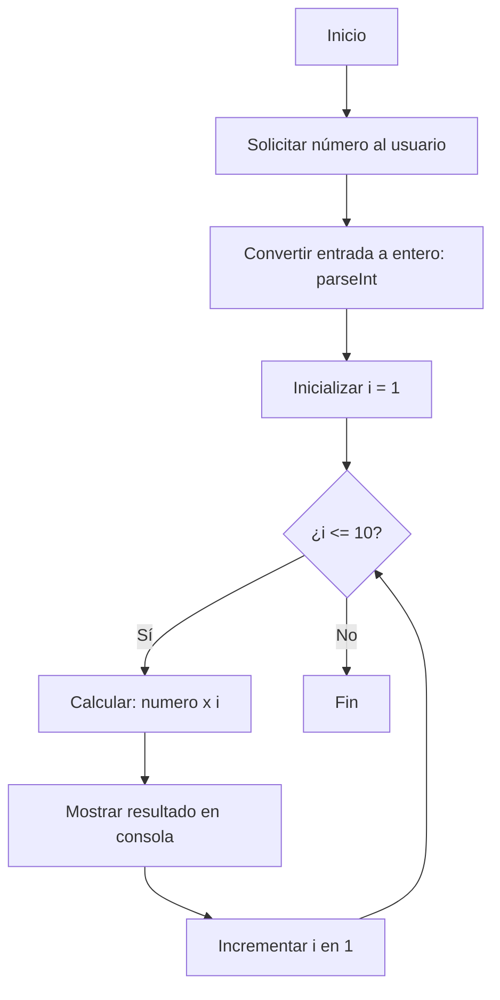

# En construcción

## Amonitions

### Nota

!!! note "Nota - note"
    Este documento está en construcción.

### Advertencia

!!! warning "Advertencia - warning"    
    Este documento está en construcción.

### Resumen

???+ abstract "Resumen - abstract" 

    Este documento está en construcción.

### Información

!!! info "Información - info"

    Este documento está en construcción.

### Pregunta

???+ question "Pregunta - question"

    Este documento está en construcción.

### Consejo

??? tip "Consejo - tip"    

    Este documento está en construcción.

### Pregunta

??? discussion "Pregunta - discussion"  

    Este documento está en construcción.

### Ejemplo

??? example "Ejemplo - example"

    Este documento está en construcción.

### Importante

???+ important "Importante - important"

    Este documento está en construcción.

## Botones

### Botón estilo 1

!!! note "Botón estilo normal"

    `[Google](https://www.google.com){.md-button}`

    [Google](https://www.google.com){.md-button}

!!! note "Botón estilo primary"

    `[Google](https://www.google.com){.md-button .md-button--primary}`

    [Google](https://www.google.com){.md-button .md-button--primary}

!!! note "Botón estilo secondary"

    `[Google](https://www.google.com){.md-button .md-button--secondary}`

    [Google](https://www.google.com){.md-button .md-button--secondary}

!!! note "Botón estilo success con icono"

    !!! Warning "No funciona, no saca el icono"
        
        `[Send :fontawesome-solid-paper-plane:](https://www.google.com){.md-button}`

        [Send :fontawesome-solid-paper-plane:](https://www.google.com){.md-button}


## Codigo

Este ejemplo pide un número y muestra su tabla de multiplicar.

```javascript linenums="1" title="Tabla de multiplicar"
let numero = parseInt(prompt("Ingrese un número: "));
for (let i = 1; i <= 10; i++) {
    console.log(`${numero} x ${i} = ${numero * i}`);
}
```

## Mermaid

Ejemplo con mermaid.



## Juntar código y diagrama utilizando pestañas `tabs`

En este ejemplo, mostramos cómo funciona un bucle `while` para sumar números del 1 al 5. Puedes alternar entre el ordinograma y el código usando las pestañas.


???+ example "Código de ejemplo"

    === "Código Python" 

        ```python linenums="1" title="Suma de números del 1 al 5"
            total = 0
            num = 1
            while num <= 5:
                total += num
                num += 1
            print("La suma es:", total)
        ```   

    === "Ordinograma" 

        ```mermaid 
            flowchart TD
                Start([Inicio])
                Check{¿num <= 5?}
                Incremento[Incrementar num en 1]
                Suma[total += num]
                End([Fin])

            Start --> Check
            Check -->|Sí| Suma --> Incremento --> Check
            Check -->|No| End
        ```        

    

---


