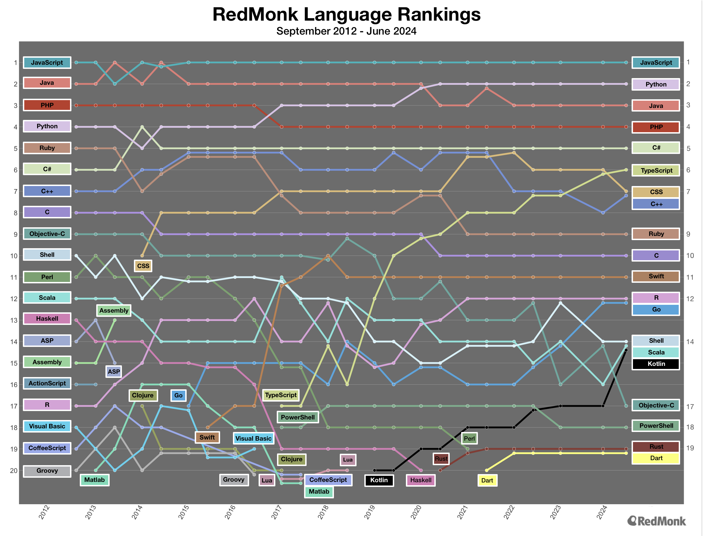

# IFCD0211 SISTEMAS DE GESTION DE INFORMACION
# Certificado de Profesionalidad: Sistemas de Gestión de Información (IFCD0211)

## Normativa

- [Normativa General](normativa19/IFCD0211.md)

Módulos:

- [MF0966_3: Consulta y manipulación de información contenida en gestores de datos](normativa19/MF0966_3.md)
- [MF0967_3: Creación y gestión de repositorios de contenidos](normativa19/MF0967_3.md)
- [MF0968_3: Administración de sistemas de gestión de información](normativa19/MF0968_3.md)
- [MP0459: Prácticas Profesionales No Laborales](normativa19/MP0459.md)

Unidades de Competencia:

- [Unidades de Competencia](normativa19/ucs.md)

## Estado del arte

### Lenguajes de programación

### Frameworks backend

Los frameworks de backend son fundamentales para aplicaciones web y móviles, contribuyendo a mejorar rendimiento, escalabilidad y seguridad. Responsables de la lógica del servidor, configuración, interacción con bases de datos y autenticación, estos frameworks ofrecen diversas ventajas en el desarrollo de aplicaciones. La elección adecuada puede potenciar la velocidad y seguridad. 

[Frameworks más utilizados](https://profile.es/blog/frameworks-backend-2024/)

### CMS más utilizados

Del estudio que veremos en la web de WPBeginner, se puede ver que WordPress sigue siendo el CMS más utilizado en el mundo. Pero quiero destacar algunos puntos de este estudio:

- En 2011, alrededor del 76% de todos los sitios web estaban codificados a mano. A finales de 2022, esta cifra se había reducido a alrededor del 33 %, lo que indica una disminución media anual de aproximadamente el 3,91 % al año.
- En la actualidad, más de 80 millones de sitios web utilizan un sistema de gestión de contenidos.

Ahora pensad que la normativa de este curso es de 2013 [BOE-A-2013-9707](https://www.boe.es/diario_boe/txt.php?id=BOE-A-2013-9707). Esto hace bastante dificial daptar los contenidos del curso a la realidad actual. Algunos ejemplos:

    - La mayoría de los frameworks de backend más utilizados no existían en 2013.
    - Hoy en día el uso de frameworks tanto en frontend como en backend es muy común.
    - La adaptación de contenidos a los diferentes dispositivos móviles no era tan importante como ahora.
    - Hoy en día, la mayoría de los sitios web utilizan un CMS, lo que no era tan común en 2013.

[Estudio de los CMS más utilizados](https://www.wpbeginner.com/es/research/cms-market-share-report-latest-trends-and-usage-stats/#aioseo-cms-usage-statistics-2022)

